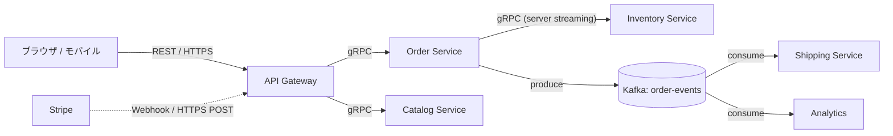
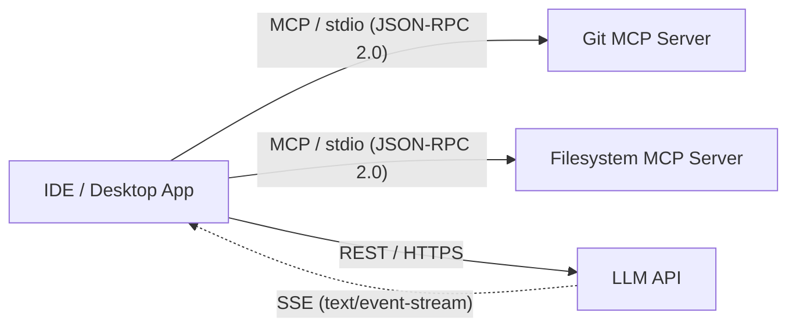
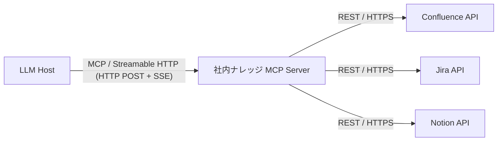
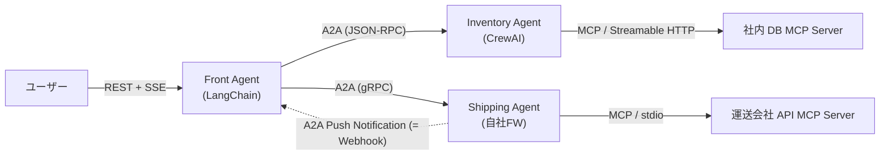
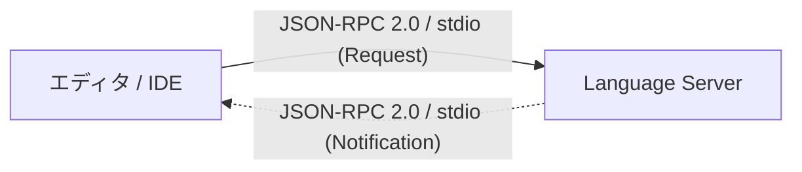
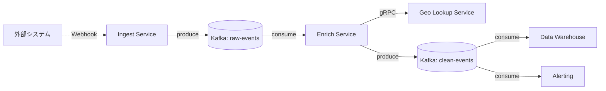

## はじめに — なぜ主役4つと周辺4つを並べるのか

ここ1〜2年、AI エージェントや LLM 連携の文脈で **MCP (Model Context Protocol)** や **A2A (Agent2Agent Protocol)** という名前をよく聞くようになりました。一方で、従来から使われている **REST** や **gRPC**、その足元にある **JSON-RPC** との関係は曖昧で、「結局、どれを使えばいいのか」が判断しづらい状況です。

さらに実システムでは **SSE / WebSocket / Webhook / メッセージキュー** といった、RPC とは少し毛色の違う通信パターンも必ず同居します。これらを切り離して議論すると絵が完成しません。

本記事は **「主役4つ + 周辺4つ」** という枠組みで通信パターンを横断整理します。

- **主役4つ（RPC / API 系）**: REST / JSON-RPC(+MCP) / gRPC / A2A
- **周辺4つ（ストリーミング・イベント・非同期系）**: SSE / WebSocket / Webhook / メッセージキュー (Pub-Sub)

8つは対立関係ではなく **レイヤと用途の違い** で整理できます。結論を先に言うと以下の位置づけです。

| 分類 | プロトコル | 役割 |
|---|---|---|
| 主役: RPC系 | REST | リソース指向、Web 標準 |
| 主役: RPC系 | gRPC | 高性能サービス間通信 |
| 主役: RPC系 | JSON-RPC 2.0 | 最小の手続き呼び出し土台 |
| 主役: AIエージェント系 | MCP | LLM ↔ ツール（垂直） |
| 主役: AIエージェント系 | A2A | エージェント ↔ エージェント（水平） |
| 周辺: ストリーム | SSE | HTTP 上の片方向ストリーム |
| 周辺: ストリーム | WebSocket | HTTP 上の双方向ストリーム |
| 周辺: イベント | Webhook | 逆方向の HTTP POST |
| 周辺: 非同期 | メッセージキュー | 疎結合・永続化・時系列 |

以下ではそれぞれを **同じ比較軸** で見ていきます。

---

# Part 1: 主役4つ — RPC / API 系プロトコル

## REST — リソース中心・ステートレスな標準

REST は Roy Fielding の博士論文で定義されたアーキテクチャスタイルで、以下 6 つの制約を満たすものを指します[^rest-fielding][^rest-constraints]。

1. **Client-server** — 関心事の分離
2. **Stateless** — 各リクエストは自己完結
3. **Cacheable** — レスポンスはキャッシュ可否を明示
4. **Uniform Interface** — リソース識別 / 表現による操作 / 自己記述メッセージ / HATEOAS
5. **Layered System** — 中間プロキシやゲートウェイを透過的に挟める
6. **Code on Demand**（optional）— クライアントに実行コードを送れる

ステートレス制約により、サーバー側はセッション親和性を気にせず水平スケールしやすいのが大きな利点です[^rest-constraints]。

**強み**: HTTP という最も広いエコシステム。OpenAPI、API Gateway、CDN、OAuth などの周辺ツールチェーンが桁違いに豊富。
**弱み**: 型契約が他プロトコルより緩い（OpenAPI で補う運用）。ストリーミングは HTTP Chunked / SSE などで「後付け」のため、双方向リアルタイム通信には向きにくい。

## JSON-RPC 2.0 — 手続き呼び出しの最小プロトコル

JSON-RPC 2.0 は「名前付き手続きを呼び出す」ことだけに特化した、極めて薄いプロトコルです[^jsonrpc-spec]。

```json
{"jsonrpc": "2.0", "method": "subtract", "params": [42, 23], "id": 1}
```

レスポンスは `result` か `error` のどちらかで、エラーは `code` / `message` / `data` の 3 フィールド。HTTP ステータスコードとは独立です[^jsonrpc-spec]。

仕様上のポイント:

- **Notification**: `id` を含まないリクエストは通知扱いで、サーバーは応答を返してはいけません（MUST NOT）
- **Batch**: 複数リクエストを配列でまとめて送信可能、任意順序で並行処理 OK
- **トランスポート非依存**: HTTP / WebSocket / stdio など好きな経路に載る

**強み**: 仕様が小さい、トランスポートを選ばない。
**弱み**: 型スキーマも発見機構もない。

## MCP — LLM 向けの JSON-RPC 上位プロファイル

**Model Context Protocol (MCP)** は Anthropic 主導で策定されている、LLM アプリケーションと外部のツール・データソースを繋ぐためのオープンプロトコルです[^mcp-spec-latest]。

### 3つの役割

- **Host**: LLM アプリケーション本体（IDE、チャット UI など）。接続を開始する側
- **Client**: Host 内部のコネクタ。1 Server ごとに 1 つ存在
- **Server**: コンテキストや機能を提供する外部プロセス

### JSON-RPC 2.0 が基盤

すべての Client ↔ Server 通信は JSON-RPC 2.0 に **MUST 準拠** です[^mcp-spec-basic]。ただし MCP 固有の追加制約として、リクエスト `id` は `string`/`number` 必須で `null` は MUST NOT、同一セッション内での再利用も MUST NOT です。

### 機能の分担（Primitives）

Server が提供できる primitive[^mcp-spec-latest]:
- **Resources** — AI モデルやユーザー向けのコンテキストデータ
- **Prompts** — テンプレート化された会話
- **Tools** — AI モデルが呼び出せる関数

Client が提供できる primitive:
- **Sampling** — Server から Host 側の LLM を呼び戻す
- **Roots** — ファイルシステムや URI の境界を教える
- **Elicitation** — ユーザーに追加情報を問い合わせる

### トランスポートと Capability Negotiation

2 種類の transport が定義されています[^mcp-architecture]。

- **Stdio** — ローカルプロセス間、オーバーヘッド最小
- **Streamable HTTP** — HTTP POST + **Server-Sent Events**。リモート前提

重要な事実として、MCP の Streamable HTTP は **周辺パターンの SSE をそのまま利用** しています。MCP は JSON-RPC を「語彙」に、SSE を「ストリーム搬送」に使い、両者を組み合わせた複合体と捉えると理解が早いです。

## gRPC — HTTP/2 + Protobuf の高性能 RPC

gRPC は Google 発の RPC フレームワークで、3 つの要素が特徴です。

- **HTTP/2** をトランスポートに採用[^grpc-http2]
- **Protocol Buffers** でメッセージをバイナリ直列化[^grpc-robotics]
- `.proto` からクライアント/サーバースタブを多言語自動生成

### 4 つの RPC パターン[^grpc-core]

1. **Unary** — 1 リクエスト → 1 レスポンス
2. **Server streaming** — 1 → 多
3. **Client streaming** — 多 → 1
4. **Bidirectional streaming** — 多 ↔ 多

双方向ストリーミングは 2 本の独立ストリームで、任意順序に読み書きできます。

**強み**: 厳格な型契約、ネイティブなストリーミング、多言語スタブ生成。
**弱み**: ブラウザから直接叩けない（gRPC-Web が必要）。HTTP/2 前提のためプロキシ対応が要る。

## A2A — エージェント間相互運用の標準

**Agent2Agent Protocol (A2A)** は、異なるフレームワーク・ベンダーで作られた AI エージェント同士が協調動作するためのオープンプロトコルです。2025 年 4 月に Google が発表し、50 以上のパートナー企業と共に立ち上げました[^a2a-blog]。現在は **Linux Foundation が housing** しています[^a2a-ibm]。

### AgentCard による自己宣言

A2A のエージェントは `/.well-known/agent.json` で **AgentCard** を公開します[^a2a-codelab]。

- `AgentCapabilities` — ストリーミング対応や push notification 対応の宣言
- `AgentSkill` — エージェントが持つスキル
- `InputOutputModes` — 対応する入出力モダリティ
- `Url` — 通信エンドポイント

### データモデル[^a2a-spec]

- **Task** — 作業単位
- **Message** — Task に紐づく会話メッセージ
- **Part** — Message や Artifact を構成する最小単位（テキスト / ファイル参照 / 構造化データ）
- **Artifact** — エージェントが生成した成果物

### 3 つのトランスポートバインディング

A2A は **アプリケーション層を transport-agnostic に定義し、下回りを複数選べる** のが特徴です[^a2a-github]。

- **JSON-RPC**
- **gRPC**
- **HTTP+JSON**

Protobuf が data model の source of truth で、他シリアライゼーションはそこから派生します。

### ストリーミングと Push Notifications[^a2a-spec]

- **Streaming** — Task の状態変化や Artifact のチャンクをリアルタイム配信
- **Push Notifications** — 長時間ジョブや切断時に、サーバーからクライアント提供の webhook URL へ HTTP POST

ここでも周辺パターンの **Webhook** がそのまま利用されている点に注目してください。

---

# Part 2: 周辺4つ — ストリーミング・イベント・非同期パターン

主役4つが「リクエスト/レスポンス型の RPC」だったのに対し、周辺4つは **別の方向性** を補う役割です。

## SSE (Server-Sent Events) — HTTP 上の片方向ストリーム

SSE は WHATWG HTML Living Standard で定義される、**サーバーからクライアントへの片方向** ストリーミングプロトコルです[^sse-whatwg]。

- MIME タイプ **`text/event-stream`** でサーバーがイベント列を返す
- メッセージは `data:` フィールド、イベント種別は `event:` フィールド
- ブラウザは標準 API **`EventSource`** で購読[^sse-mdn]
- クライアントは **切断時に自動再接続**、再接続時に **`Last-Event-ID`** ヘッダーで続きから[^sse-w3c]
- ストリームは常に UTF-8 固定[^sse-whatwg]
- HTTP/1.1 下では **ブラウザのドメイン当たり同時接続数 6 制限** を受ける。HTTP/2 なら多重化で緩和[^sse-mdn]

**典型ユース**: LLM のトークンストリーム（OpenAI / Anthropic / Azure OpenAI）、MCP Streamable HTTP、A2A streaming、ダッシュボードのライブ更新。

**位置づけ**: REST の延長線上。双方向性が要らないなら WebSocket より **軽量で、HTTP の資産をそのまま使える**。

## WebSocket — HTTP 上の双方向ストリーム

WebSocket は **RFC 6455** で定義される、単一 TCP 接続上の **フルデュプレックス** 通信プロトコルです[^ws-protocol]。

- クライアントが `Upgrade: websocket` ヘッダー付き HTTP GET を送信
- サーバーが **HTTP 101 Switching Protocols** で応答すると HTTP から WebSocket へ切り替わる[^ws-mdn]
- `Sec-WebSocket-Key` からサーバー側が `Sec-WebSocket-Accept` を派生してハンドシェイク完了
- テキスト/バイナリ両フレームに対応、フレームオーバーヘッドは 2〜14 バイトと小さい[^ws-http]
- URI スキームは **`ws://`**（平文）、**`wss://`**（TLS）
- ハンドシェイク後は **両側が任意のタイミングで送受信**

**典型ユース**: チャット、ゲーム、ライブ通知、**OpenAI Realtime API**、金融ティック。

**位置づけ**: SSE より強力だが重い。**真に双方向が必要な時だけ選ぶ**。gRPC bidi streaming のブラウザ代替としても使われる。

## Webhook — 逆方向の HTTP POST

Webhook は仕様ではなく **業界で定着した慣習** です。サーバー側がイベント発生時に、事前登録されたクライアントの URL に HTTP POST する形です[^webhook-hookdeck]。

- **URL を事前登録** → サーバーがイベント発生時に push
- エンドポイントは **素早く 2xx を返す** 必要あり（処理は後回し）[^webhook-stripe]
- **HMAC 署名** をヘッダーで送ってきて、受信側が検証するのが一般的（Stripe など）[^webhook-stripe-go]
- **再送ポリシー**: 4xx は再送なし、5xx は再送対象。受信側は **冪等性** を担保する必要あり[^webhook-stripe]
- GitHub / Stripe / Slack / Zoom などほぼ同じパターン[^webhook-hookdeck]

**典型ユース**: 決済通知（Stripe）、Git push 通知（GitHub）、外部サービスのイベント購読、**A2A の Push Notifications**。

**位置づけ**: REST の「逆方向」。サーバーが能動的に何かを起こすための最小の仕組み。長時間ジョブの完了通知や、外部イベントの取り込みに使う。

## メッセージキュー / Pub-Sub — 疎結合と永続化

Kafka に代表される Pub-Sub 系は、**同期 RPC とはパラダイムが異なります**。送信側と受信側が時間的にも空間的にも疎結合になります。

Kafka の主要概念[^kafka-intro]:

- **Topic** は複数の **Partition** に分割。各パーティション内では **完全順序** が保証
- **Consumer Group** 単位で購読。同一グループ内では各パーティションを 1 コンシューマーが処理（負荷分散）、別グループなら独立に消費（multi-subscriber）
- **Offset** ベースで各コンシューマーの読み進み位置を管理。定期チェックポイントで障害復旧可能[^kafka-design]
- **Heartbeat / Rebalance**: `heartbeat.interval.ms` は `session.timeout.ms` の 1/3 以下が推奨[^kafka-consumer-configs]
- **運用**: `kafka-consumer-groups.sh` で `CURRENT-OFFSET` / `LOG-END-OFFSET` / `LAG` を確認[^kafka-ops]

**典型ユース**: ドメインイベント駆動、ログ集約、ストリーム処理、マイクロサービス間の非同期連携、機械学習パイプライン。

**位置づけ**: 主役4つが「呼び出して返事を待つ」関係なのに対し、MQ は「投げ込んだら忘れる」関係。**リプレイ可能・永続化** という性質も RPC 系にはない。

---

# Part 3: 横並び比較

## 主役4つ: 7 軸比較

| 軸 | REST | JSON-RPC 2.0 | MCP | gRPC | A2A |
|---|---|---|---|---|---|
| **通信主体** | Client ↔ HTTP Server | Peer ↔ Peer | Host ⊃ Client ⟷ Server | Client ⟷ Service | Agent ⟷ Agent |
| **トランスポート** | HTTP/1.1 or 2 | 不問（HTTP / WS / stdio…） | Stdio / Streamable HTTP | HTTP/2 固定 | JSON-RPC / gRPC / HTTP+JSON |
| **型・スキーマ** | JSON/XML、OpenAPI で補強 | JSON のみ、型契約なし | JSON + Primitives 語彙 | Protobuf（必須） | Protobuf source of truth |
| **ストリーミング** | Chunked / SSE（後付け） | 標準機構なし | SSE（Streamable HTTP 時） | HTTP/2 ネイティブ（4 RPC 全て） | Streaming + Push Notifications |
| **発見機構** | OpenAPI / HATEOAS | なし | Capability negotiation | `.proto` + スタブ生成 | AgentCard (`/.well-known/agent.json`) |
| **状態** | Stateless | プロトコル的に stateless | Stateful connection | Stateful channel | Task 単位の state を持つ |
| **認証・認可** | HTTP 標準（OAuth / API Key） | 規定なし | HTTP トランスポートなら OAuth / Bearer | mTLS / Service Account | HTTP 認証 + webhook 署名 |

## 周辺4つ: 5 軸比較

| 軸 | SSE | WebSocket | Webhook | メッセージキュー |
|---|---|---|---|---|
| **方向** | 片方向（Server → Client） | 双方向 | 片方向（Server → Client の逆呼び出し） | 多対多（Pub-Sub） |
| **同期性** | 同期的ストリーム（接続維持） | 同期的ストリーム（接続維持） | **非同期**（都度 HTTP POST） | **非同期**（疎結合） |
| **接続長** | 長時間 HTTP 接続 | 長時間 TCP 接続 | リクエストごと | なし（ブローカー経由） |
| **典型ユース** | LLM トークン、ダッシュボード | チャット、ゲーム、Realtime API | 決済通知、イベント購読 | ドメインイベント、ログ、ストリーム処理 |
| **主役との組み合わせ** | MCP Streamable HTTP、A2A streaming、REST 拡張 | gRPC bidi のブラウザ代替 | A2A Push Notifications、REST 資産の再利用 | どの主役とも直交。別パラダイム |

**主役と周辺の関係** を一言で言うなら: **周辺はしばしば主役の内部で利用される**（MCP Streamable HTTP の中身は SSE、A2A Push Notifications の実体は Webhook）。これが「切り離して議論できない」理由です。

---

# Part 4: 具体例 — システム設計図で見る「どこで何が使われるか」

仕様の話はここまでです。実際の設計でどのプロトコルが「どの線」に現れるかを、簡易アーキテクチャ図で見ていきます。**通信を主役に、他の詳細は省略** します。同じプロトコルが複数の例に登場するのは、むしろ使い所が複数あることを示しています。

## 例1: EC サイト（REST + gRPC + Kafka + Webhook）

> **想定シナリオ**: 中規模の EC 事業者が Web / スマホ向け公開 API、社内マイクロサービス、注文イベント連携、外部決済プロバイダ（Stripe 等）の通知を1つのシステムに載せるケース。



- **外向きに REST**: ブラウザから直接叩ける、CDN / OAuth / API Gateway エコシステムが豊富
- **サービス間に gRPC**: 型契約・HTTP/2 多重化・サーバーストリーミング[^grpc-core][^grpc-http2]
- **Kafka**: 注文イベントを発生元（Order Service）と利用側（発送・分析）で **時間的に疎結合** にする。発送が一時停止しても注文は受けられる[^kafka-intro]
- **Webhook**: Stripe など外部 SaaS からの支払い完了通知は、**こちらが受け身で受け取る** 必要がある。Stripe は HMAC 署名付き HTTP POST で送ってくる[^webhook-stripe]

## 例2: IDE 統合の AI アシスタント（MCP stdio + SSE + REST）

> **想定シナリオ**: Claude Desktop / Cursor / Continue などのローカル LLM クライアントで、開発者が git 操作・ファイル編集・シェル実行を AI に任せながらコーディングするケース。



- **MCP / stdio**: ローカルツールは capability negotiation で自動発見、サブプロセス隔離で権限制御[^mcp-architecture]
- **IDE → LLM API は REST**: OpenAI / Anthropic 等の LLM プロバイダはほぼ REST で公開
- **LLM → IDE は SSE**: トークンごとの逐次返答は `text/event-stream` で返される。`EventSource` で簡単に購読でき、切断時は `Last-Event-ID` で復帰[^sse-whatwg][^sse-w3c]

**なぜ WebSocket でないか**: 返答はサーバー → クライアントの片方向で十分。双方向は不要なので、より軽い SSE で済む。

## 例3: リモート社内ナレッジ検索 AI（MCP Streamable HTTP + SSE + REST）

> **想定シナリオ**: Confluence / Jira / Notion に散らばる社内情報を、社員が自然言語で横断検索したい。各開発者の PC に MCP サーバーを立てず、部門共通の MCP サーバーを社内クラウドに集中ホストするケース。



- **MCP / Streamable HTTP**: 部門共通の MCP サーバーを集中ホスト。ここの **ストリーム部分の正体が SSE** です。長時間の全文検索を段階的に返せる[^mcp-architecture][^sse-whatwg]
- **背後の REST**: Confluence / Jira / Notion の既存 API。MCP サーバーはここの **アダプタ** として働く

## 例4: 異種フレームワーク AI エージェントの協調（A2A + MCP + Webhook + SSE）

> **想定シナリオ**: 顧客対応を自動化したい企業で、既に LangChain で作った顧客対応エージェントと、別チームが CrewAI で作った在庫確認エージェント、自社内製フレームワークの配送手配エージェントを連携させるケース。



- **ユーザー ↔ Front は REST + SSE**: 入口は REST、LLM 応答を逐次返すのは SSE
- **A2A**: 別フレームワークのエージェントでも AgentCard で能力発見[^a2a-codelab]。トランスポートは JSON-RPC / gRPC / HTTP+JSON から選べる[^a2a-github]
- **MCP**: 各エージェントが自分のツールを使う（垂直方向）。A2A（水平方向）と役割分担
- **A2A の Push Notifications は Webhook そのもの**: 長時間タスク完了を webhook URL への HTTPS POST で非同期通知[^a2a-spec][^webhook-hookdeck]

## 例5: LSP 風の言語支援サーバー（JSON-RPC / stdio）

> **想定シナリオ**: VS Code などのエディタで、言語固有の補完・定義ジャンプ・型エラー表示を提供したい。Pyright や TypeScript Language Server のような言語サーバーをエディタが子プロセスとして起動するケース。



- **双方向で Request / Notification が流れる**: 補完要求 (Request) と診断プッシュ (Notification) を同じプロトコルで両方向に流せるのは JSON-RPC の強み[^jsonrpc-spec]
- **stdio を選ぶ理由**: サブプロセス起動が自然、ポートも認証も不要
- **型契約は上位プロトコル側**: LSP のスキーマで決まるので、JSON-RPC 自体は薄いまま

MCP はこの LSP と似た構造（JSON-RPC + stdio）を採り、AI 向けに再設計したものと捉えると位置づけが掴みやすいです。

## 例6: イベント駆動パイプライン（Kafka + gRPC + Webhook）

> **想定シナリオ**: 外部の決済プロバイダ・物流トラッカー・IoT センサーから毎秒大量に発生するイベントを取り込み、リアルタイムに加工してデータウェアハウスへ投入し、同時に異常検知アラートを出すケース。

同期 RPC がほとんど登場しない、**非同期パラダイム主体** の例です。



- **入口は Webhook**: 外部 SaaS のイベント受信。こちらから取りに行くのではなく **送りつけられる**
- **Kafka**: 段階的な処理パイプライン。各ステージが独立してスケール可能、リプレイも可能[^kafka-intro][^kafka-design]
- **Enrich → Geo は gRPC**: 同期的に補完情報を取得する必要がある部分だけ RPC
- **同期 RPC は必要最小限**: 主軸は非同期。これが Kafka 系の典型設計

---

例1〜6を俯瞰すると、**1つの会社のシステムで主役4つも周辺4つも全部使われる** のが現実です。どれか一つを選ぶのではなく、**通信の境界ごとに最適なものを乗せる** のが実務上の答えになります。

---

# Part 5: 使い分けガイド

## 主役4つ: シナリオ別推奨

- **社外公開 API・Web フロントエンド連携** → **REST**
- **社内マイクロサービス間の高頻度通信・双方向ストリーミング** → **gRPC**
- **軽量な RPC 基盤、独自プロトコルの土台** → **JSON-RPC 2.0**
- **LLM にツール・コンテキストを供給する** → **MCP**
- **別ベンダーの AI エージェント同士を連携** → **A2A**

## 周辺4つ: パターン別の判断

判断は **4 つの質問** に収束します。

1. **サーバーからクライアントへリアルタイムに流したい？**
   - 片方向で十分 → **SSE**（軽量、HTTP 標準、自動再接続）
   - 双方向が必要 → **WebSocket**
2. **外部サービスからイベントを受け取りたい？（自分からは取りに行かない）**
   - → **Webhook**（URL 登録 + HMAC 検証 + 冪等性）
3. **送信元と受信先を時間的・空間的に疎結合にしたい？永続化・リプレイも欲しい？**
   - → **メッセージキュー / Pub-Sub**（Kafka 等）
4. **単純なリクエスト/レスポンスで足りる？**
   - → 主役4つのどれかで済む

## MCP と A2A の住み分け

混乱しやすいので最後にもう一度整理します。

- **MCP** は **垂直方向**: LLM ↔ ツール/データソース
- **A2A** は **水平方向**: エージェント ↔ エージェント

両者は補完関係で、A2A 対応エージェントの内部が MCP サーバー群を使うのは典型構成です。A2A の公式ブログも「A2A は MCP を補完する」と明記しています[^a2a-blog]。

---

# まとめ

- 通信プロトコルは **対立ではなくレイヤ** で捉える
- **主役4つ** は RPC / API 系: REST / JSON-RPC(+MCP) / gRPC / A2A
- **周辺4つ** はそれを補う: SSE / WebSocket / Webhook / メッセージキュー
- MCP は JSON-RPC を再利用した上位プロファイル、A2A は JSON-RPC / gRPC / HTTP+JSON の上位プロトコル、どちらも **内部で SSE や Webhook を活用** する
- 1 つの会社のシステムに 8 つすべてが登場するのが普通
- 選定の出発点は「**誰と誰が何をするための通信か**」を言語化すること

自分で選ぶ時は、まず「通信主体」「方向性」「同期/非同期」を紙に書き出してみると、どのプロトコルに乗せるのが自然か見えてきます。

---

## 参考文献

### 主役4つ
[^rest-fielding]: [Architectural Styles and the Design of Network-based Software Architectures (Roy T. Fielding, 2000)](https://roy.gbiv.com/pubs/dissertation/rest_arch_style.htm)
[^rest-constraints]: [REST Architectural Constraints](https://restfulapi.net/rest-architectural-constraints/)
[^jsonrpc-spec]: [JSON-RPC 2.0 Specification](https://www.jsonrpc.org/specification)
[^mcp-spec-latest]: [Model Context Protocol Specification (2025-11-25)](https://modelcontextprotocol.io/specification/2025-11-25)
[^mcp-spec-basic]: [MCP Base Protocol Overview](https://modelcontextprotocol.io/specification/2025-03-26/basic)
[^mcp-architecture]: [MCP Architecture overview](https://modelcontextprotocol.io/docs/learn/architecture)
[^grpc-http2]: [gRPC on HTTP/2 Engineering a Robust, High-performance Protocol](https://grpc.io/blog/grpc-on-http2/)
[^grpc-core]: [gRPC Core concepts, architecture and lifecycle](https://grpc.io/docs/what-is-grpc/core-concepts/)
[^grpc-robotics]: [gRPC in Robotics](https://grpc.io/blog/robotics/)
[^a2a-blog]: [Announcing the Agent2Agent Protocol (A2A) — Google Developers Blog](https://developers.googleblog.com/en/a2a-a-new-era-of-agent-interoperability/)
[^a2a-spec]: [Agent2Agent (A2A) Protocol Specification](https://a2a-protocol.org/latest/specification/)
[^a2a-github]: [a2aproject/A2A on GitHub](https://github.com/a2aproject/A2A)
[^a2a-codelab]: [Getting Started with Agent2Agent (A2A) Protocol — Google Codelabs](https://codelabs.developers.google.com/intro-a2a-purchasing-concierge)
[^a2a-ibm]: [What is A2A protocol (Agent2Agent)? — IBM](https://www.ibm.com/think/topics/agent2agent-protocol)

### 周辺4つ
[^sse-whatwg]: [Server-sent events — HTML Living Standard (WHATWG)](https://html.spec.whatwg.org/multipage/server-sent-events.html)
[^sse-mdn]: [EventSource — MDN Web Docs](https://developer.mozilla.org/en-US/docs/Web/API/EventSource)
[^sse-w3c]: [Server-Sent Events — W3C Working Draft](https://www.w3.org/TR/2011/WD-eventsource-20110310/)
[^ws-protocol]: [WebSocket Protocol Guide — websocket.org](https://websocket.org/guides/websocket-protocol/)
[^ws-mdn]: [Protocol upgrade mechanism — MDN Web Docs](https://developer.mozilla.org/en-US/docs/Web/HTTP/Guides/Protocol_upgrade_mechanism)
[^ws-http]: [WebSocket vs HTTP — websocket.org](https://websocket.org/comparisons/http/)
[^webhook-hookdeck]: [Webhooks vs Callbacks — Hookdeck](https://hookdeck.com/webhooks/guides/webhooks-callbacks)
[^webhook-stripe]: [Receive Stripe events in your webhook endpoint](https://docs.stripe.com/webhooks)
[^webhook-stripe-go]: [Stripe Webhooks Quickstart (Go)](https://docs.stripe.com/webhooks/quickstart?lang=go)
[^kafka-intro]: [Apache Kafka — Introduction](https://kafka.apache.org/10/getting-started/introduction)
[^kafka-design]: [Apache Kafka — Design](https://kafka.apache.org/42/design/design)
[^kafka-consumer-configs]: [Apache Kafka — Consumer Configs](https://kafka.apache.org/10/configuration/consumer-configs/)
[^kafka-ops]: [Apache Kafka — Basic Operations](https://kafka.apache.org/42/operations/basic-kafka-operations)
