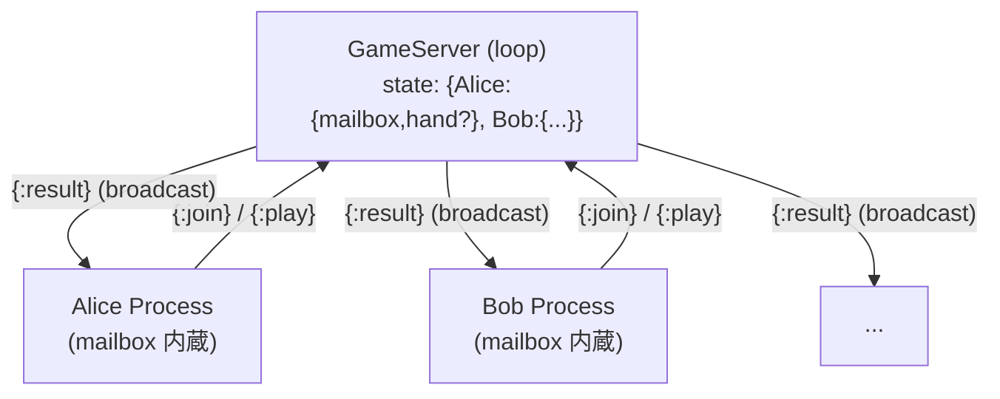

## Elixirを始めました

筆者は、Elixir は名前と「アクターモデルらしい」程度しか知らない状態でした。以前から気になっていた言語だったので、小さなサンプルを通して学ぶことにしました。本記事は、その学習過程で得た「Python / Go ユーザーから見た Elixir の見え方」をまとめたものです。

Elixir は「BEAM上のアクターモデル」「軽量プロセス」「不変データ」「パターンマッチ」など、他言語経験者でも初見では1ファイルに複数の未知概念が同時に出てくる言語です。文法だけ眺めても、何が利点となるのかが掴みづらい部分があります。

そこで本記事では、140行以下の小さなじゃんけんサーバーを題材に、**全く同じ機能を Python と Go でも書き起こした上で**、Elixir の特徴を5つの観点で並列に対比します。Hello World ではなく「メッセージで動く小さなサーバー」という具体例を3言語で並べることで、Elixir の書き味と設計の重心が浮かび上がります。

- **想定読者**: Python / Go / TypeScript などで並行処理を一度は書いたことがあり、Elixir は未経験〜入門段階の方
- **書き味の比較**に焦点を当てます。性能・本番運用・OTPの深い部分には踏み込みません

:::message
筆者自身が Elixir 入門段階のため、本記事では「BEAMのプロセスは軽量だ」程度の一般論にとどめ、「数百万プロセス起動できる」などのベンチ的な断定は避けています。実数値については Erlang/OTP 公式ドキュメントを参照してください。記述に誤りがあればコメントでご指摘いただけると助かります。
:::

## Elixir / BEAM / アクターモデルの30秒イントロ

具体例に入る前に、本記事を読む上で必要な前提だけ最小限に押さえます。

- **Elixir**: Erlang/OTP の上に構築された関数型・動的型付け言語。Erlang は1980年代に通信交換機向けに作られた言語で、長時間止まらないシステムを書くための堅牢性が設計の中心にある。
- **BEAM**: Erlang/Elixir のコードを動かす仮想マシン（JVM のような実行基盤）。OSスレッドより遥かに軽い独自の「BEAMプロセス」を、複数のOSスレッドにM:Nスケジューリングして実行する。
- **BEAMプロセス**: OSのプロセスでもスレッドでもない、BEAM 上の論理的な実行単位。各プロセスは独立したメモリと**mailbox（受信箱）**を持ち、外部とは**メッセージ送信のみ**で通信する。
- **アクターモデル**: 「mailbox を内蔵した独立プロセス同士がメッセージのみで通信する」並行モデル。共有メモリを使わないので、ロックや競合状態の心配がない。

### 3言語の並行モデル早見表

| 観点 | Elixir | Python | Go |
|---|---|---|---|
| 実行単位 | BEAMプロセス（OSスレッドではない） | OSスレッド（`threading`） | goroutine |
| スケジューリング | BEAM が M:N | OS 任せ | Go ランタイムが M:N |
| 通信手段 | メッセージ送信（mailbox はプロセスに内蔵） | `queue.Queue` を自前で渡す | channel を自前で渡す |
| 状態管理 | 不変データ＋関数引数 | 可変オブジェクト | 可変な struct / map |
| 障害伝播 | リンク／監視で親へ伝搬可能 | 例外は自スレッド内で完結 | panic は自 goroutine 内で完結 |
| 並列性能 | コアを跨いで真に並列 | GIL（後述）により純Pythonコードは並列化されない | コアを跨いで真に並列 |

これら全体が**1つの設計思想として噛み合っている**のが Elixir で、Python / Go ではそれぞれの仕組みを別々の道具で組み合わせる、というのが本記事を通して見えてくる構図です。

### Elixir の構文ミニ早見表

以降のコードを読むのに必要な最小限の表記だけ示します。

| 表記 | 意味 |
|---|---|
| `:foo` | **アトム**。それ自体が値である定数シンボル（Ruby のシンボルに近い）。 |
| `{:join, pid, name}` | **タプル**。固定長の異種コンテナ。先頭にアトムを置いてメッセージ種別を表すのが慣習。 |
| `%{name: "Alice"}` | **マップ**。キーバリュー集合。 |
| `fn x -> x + 1 end` | **無名関数**。 |
| `def` / `defp` | 関数定義（`defp` はモジュール外から見えない private 版）。 |
| `pid` | プロセス識別子（process identifier）。`spawn` が返す値で、`send` の宛先となる。 |

## 題材 — じゃんけんサーバー

複数の独立した「プレイヤー」プロセスが、中央の「ゲームサーバー」にメッセージで参加し、手を送信し、全員揃ったらサーバーが結果を全プレイヤーに broadcast する、というシンプルなモデルです。

3言語のソースは次の3つのディレクトリにあります（リポジトリは [`fdshg693/ZENN`](https://github.com/fdshg693/ZENN)）。

| 言語 | ディレクトリ |
|---|---|
| Elixir | [`resources/src/simple_rpg/`](https://github.com/fdshg693/ZENN/tree/main/resources/src/simple_rpg) |
| Python | [`resources/src/simple_rpg_python/`](https://github.com/fdshg693/ZENN/tree/main/resources/src/simple_rpg_python) |
| Go | [`resources/src/simple_rpg_go/`](https://github.com/fdshg693/ZENN/tree/main/resources/src/simple_rpg_go) |

3言語とも構成を1対1で対応させています。

| 役割 | Elixir | Python | Go |
|---|---|---|---|
| 起点・対話入力 | [`lib/rps_game.ex`](https://github.com/fdshg693/ZENN/blob/main/resources/src/simple_rpg/lib/rps_game.ex) | [`main.py`](https://github.com/fdshg693/ZENN/blob/main/resources/src/simple_rpg_python/main.py) | [`main.go`](https://github.com/fdshg693/ZENN/blob/main/resources/src/simple_rpg_go/main.go) |
| ゲームサーバー | [`lib/game_server.ex`](https://github.com/fdshg693/ZENN/blob/main/resources/src/simple_rpg/lib/game_server.ex) | [`game_server.py`](https://github.com/fdshg693/ZENN/blob/main/resources/src/simple_rpg_python/game_server.py) | [`game_server.go`](https://github.com/fdshg693/ZENN/blob/main/resources/src/simple_rpg_go/game_server.go) |
| プレイヤー | [`lib/player.ex`](https://github.com/fdshg693/ZENN/blob/main/resources/src/simple_rpg/lib/player.ex) | [`player.py`](https://github.com/fdshg693/ZENN/blob/main/resources/src/simple_rpg_python/player.py) | [`player.go`](https://github.com/fdshg693/ZENN/blob/main/resources/src/simple_rpg_go/player.go) |

### アーキテクチャ

各プレイヤーは自分専用の mailbox（受信箱）を持ち、サーバーは参加時にその参照を保管しておく、というのが共通の骨格です。



#### 登場プロセスと役割

- **GameServer**: 中央の審判役。1つだけ起動される。内部状態として「誰が参加していて、誰が何の手を出したか」を Map で持ち続け、メッセージを受け取るたびに状態を更新する。全員の手が揃った瞬間に勝敗を判定し、結果を全プレイヤーへ broadcast する責務を負う。
- **Player プロセス**: 各プレイヤーに1つずつ起動される。自分自身の mailbox を持ち、GameServer から届く `{:result, ...}` を待ち受けて画面に表示する。手の入力（ユーザー操作）は別途、起点プロセスから `play/3` 経由で GameServer に送られる。
- **起点プロセス**（`rps_game.ex` / `main.py` / `main.go`）: 対話入力をさばく入口。ユーザーが「join Alice」「play Alice rock」と打つたびに、対応するメッセージを生成して GameServer に流す。

#### 典型シナリオ（Alice と Bob が1回じゃんけんする場合）

1. 起点プロセスが GameServer を起動 → 空の state `{}` を持った loop が走り始める。
2. `join Alice` → Alice 用の Player プロセスを spawn し、その `pid`（または mailbox 参照）を `{:join, pid, "Alice"}` として GameServer に送信。GameServer の state が `{Alice: {pid, hand: nil}}` に更新される。
3. `join Bob` → 同様に state が `{Alice: ..., Bob: ...}` になる。
4. `play Alice rock` → 起点プロセスが `{:play, "Alice", :rock}` を GameServer に送信。state の Alice 側の hand が `:rock` で埋まる。Bob はまだ `nil` なので、GameServer は何もせず次のメッセージを待つ。
5. `play Bob scissors` → 全員の hand が揃ったので、GameServer が勝敗を判定し、`{:result, "Alice wins"}` を Alice と Bob 両方の mailbox に broadcast する。
6. 各 Player プロセスは自分の mailbox で `{:result, ...}` を受け取り、結果を表示する。

以降の各章では、**この一連の流れのどの瞬間のコードを切り出して比較しているか**を冒頭に明記します。

Elixir 以外の言語では「プロセスに内蔵された mailbox」が存在しないため、`queue.Queue` や channel を自前で作って受け渡す形になります。この差が、以降の対比のあちこちに表れます。

---

## 対比1: プロセスを起こす — `spawn_link` vs `Thread` vs `go`

**じゃんけんの流れで言うと**: シナリオの 1 と 2 にあたる箇所です。`start_link` がゲーム開始時に GameServer プロセスを1つ起こす役割、`join` が「Alice が参加します」と言われたときに Alice 用の Player プロセスを新規に起こし、その存在を GameServer に通知する役割を担います。つまり「ループする実行単位を新規に生み出す」ためのコードです。

**Elixir** ([`game_server.ex`](https://github.com/fdshg693/ZENN/blob/main/resources/src/simple_rpg/lib/game_server.ex), [`player.ex`](https://github.com/fdshg693/ZENN/blob/main/resources/src/simple_rpg/lib/player.ex))

```elixir
def start_link do
  {:ok, spawn_link(fn -> game_loop(%{}) end)}
end

def join(game_server, name) do
  player_pid = spawn_link(fn -> player_loop(name) end)
  send(game_server, {:join, player_pid, name})
  player_pid
end
```

コードを文章で追うと、`start_link` は「空の Map `%{}` を初期状態として `game_loop` を実行する新プロセスを起こし、その `pid` を返す」だけのことをしています。`join` はもう少しだけ手数が多く、(a) Alice 用の loop を回す新プロセスを起こす、(b) 起こしたばかりの `player_pid` を `{:join, pid, name}` というタプルに詰めて GameServer に送信する、(c) 呼び出し元にも `pid` を返す、の3ステップです。

ここで `spawn_link` は「新しい BEAM プロセスを起こし、かつ呼び出し側プロセスと**リンク**を張る」関数です。リンクで繋がった2つのプロセスは、片方が異常終了するともう片方に終了シグナルが伝わります。`pid` は新たに起こしたプロセスの識別子で、後述する `send/2` の宛先になります。

**Python** ([`game_server.py`](https://github.com/fdshg693/ZENN/blob/main/resources/src/simple_rpg_python/game_server.py), [`player.py`](https://github.com/fdshg693/ZENN/blob/main/resources/src/simple_rpg_python/player.py))

```python
def start_link(self) -> "GameServer":
    self._thread = threading.Thread(target=self._game_loop, args=({},), daemon=True)
    self._thread.start()
    return self

@staticmethod
def join(game_server, name):
    mailbox = queue.Queue()
    threading.Thread(target=Player._player_loop, args=(name, mailbox), daemon=True).start()
    game_server.send(("join", mailbox, name))
    return mailbox
```

Python では Elixir の `pid` に相当するものが言語に存在しないので、**自前で `queue.Queue` を作って mailbox 役にする**必要があります。`join` の最初の行で Alice 用の Queue を作り、その Queue を `_player_loop` への引数として渡しつつ Thread を起動。さらに同じ Queue を `("join", mailbox, name)` というタプルに詰めて GameServer に送り、「これが Alice の連絡先です」と教えています。一連の流れの中で **mailbox の参照が3箇所（Player 側・GameServer 側・呼び出し元）を行き来している**ことに注目してください。

**Go** ([`game_server.go`](https://github.com/fdshg693/ZENN/blob/main/resources/src/simple_rpg_go/game_server.go), [`player.go`](https://github.com/fdshg693/ZENN/blob/main/resources/src/simple_rpg_go/player.go))

```go
func StartGameServer() chan<- Message {
    mailbox := make(chan Message, 16)
    go gameLoop(mailbox, map[string]playerState{})
    return mailbox
}

func JoinPlayer(server chan<- Message, name string) chan Result {
    mailbox := make(chan Result, 1)
    go playerLoop(name, mailbox)
    server <- Message{Kind: MsgJoin, Name: name, PlayerMailbox: mailbox}
    return mailbox
}
```

Go も Python と同じく **channel を自分で作って手渡す**スタイルです。`StartGameServer` は GameServer 用の入力 channel をバッファ16で作り、goroutine として `gameLoop` を起動、その channel を呼び出し元に返します。`JoinPlayer` は Alice 用の結果受信 channel を作って Player の goroutine を起こし、その channel への参照を含めた `MsgJoin` を GameServer に流します。`chan<- Message`（送信専用）と `chan Result`（双方向）の使い分けで「方向」を型に持たせている点が、Python 版との大きな違いです。

**何が違うか**

| 軸 | Elixir | Python | Go |
|---|---|---|---|
| 実行単位 | BEAM プロセス（OSスレッドではない） | OSスレッド | goroutine（複数の goroutine を少数のOSスレッドにランタイムが M:N でスケジュールする） |
| 起動コスト | 軽い（言語の設計上、大量に起こす前提） | 重い | 軽い |
| 障害の伝播 | `spawn_link` で**親子が死を伝え合う** | なし（自分で例外監視） | なし（自分で `recover` / `context`） |

Elixir の `spawn_link` が他言語より一段上にあるのは、障害が黙って握りつぶされない点です。Python の Thread や Go の goroutine は、内部で例外や panic を起こしても親側は気づきません。`spawn_link` ならリンクで繋がった相手の終了が自分にも伝搬し、`Supervisor`（子プロセスを監視し、落ちたら定義された戦略で再起動する OTP 標準の仕組み）を組めば再起動戦略まで宣言できます。なお **OTP** とは Erlang/Elixir 標準で提供される設計原則とライブラリ群の総称ですが、本記事ではこれ以上深入りしません。

なお Python の `threading` は **GIL**（Global Interpreter Lock。1プロセス内で同時にPythonバイトコードを実行できるスレッドを1本に制限する仕組み）の影響で、純Pythonコードの「同時並列実行」にはなりません。本記事は書き味の対比が目的なので、ここでは並列性能ではなく「並行モデルの記述」を比べていると捉えてください。

---

## 対比2: メッセージパッシング — `send`/`receive` vs `Queue` vs `chan`

**じゃんけんの流れで言うと**: シナリオの 4「Alice が rock を出す」場面で、起点プロセスから GameServer へ `{:play, "Alice", :rock}` を流す送信側と、GameServer 側の loop がそれを取り出して種別ごとに分岐する受信側の、ちょうど境目を切り出しています。前章ではプロセスを「起こす」だけでしたが、ここではそのプロセス同士が**実際にやり取りする**部分です。

**Elixir**

```elixir
# 送信側（player.ex）
def play(game_server, name, hand) do
  send(game_server, {:play, name, hand})
end

# 受信側（game_server.ex）
defp game_loop(players) do
  receive do
    {:join, player_pid, name} -> ...
    {:play, name, hand}       -> ...
  end
end
```

`play/3` は単に `{:play, name, hand}` という3要素タプルを組み立て、`send` で GameServer の `pid` 宛に投函するだけ。受信側の `receive` は mailbox に積まれたメッセージを1つ取り出し、「`{:join, ...}` の形なら参加処理、`{:play, ...}` の形なら手の処理」と**メッセージの形そのもの**で分岐します。送り手は宛先 `pid` 以外に何も知らなくていいのが特徴です。

**Python**

```python
# 送信側（player.py）
def play(game_server, name, hand):
    game_server.send(("play", name, hand))

# 受信側（game_server.py）
def _game_loop(self, players):
    while True:
        message = self.mailbox.get()
        match message:
            case ("join", player_mailbox, name): ...
            case ("play", name, hand): ...
```

Python では `game_server.send(...)` の実体は内部的に GameServer が持つ `queue.Queue.put` を呼んでいるだけ、受信側の `self.mailbox.get()` はその Queue から1件取り出すブロッキング呼び出しです。Elixir では mailbox がプロセスに自動で備わるのに対し、ここでは GameServer インスタンスが `self.mailbox` というフィールドを自分で持っている点に注目してください。

**Go**

```go
// 送信側（player.go）
func PlayHand(server chan<- Message, name string, hand int) {
    server <- Message{Kind: MsgPlay, Name: name, Hand: hand}
}

// 受信側（game_server.go）
for {
    select {
    case msg := <-mailbox:
        switch msg.Kind { ... }
    }
}
```

Go の `server <- Message{...}` は「`server` という channel に `Message` 構造体を1つ送る」操作で、Elixir の `send` と同じ送信1行に相当します。受信側は `for { select { ... } }` という Go 並行処理の定型句で、channel から値を取り出すまでブロックします。Elixir / Python と違い、メッセージが**型付きの構造体**であるため、種別は `Kind` フィールドを見て判定します（タプルの先頭要素で判定する Elixir / Python とは情報の持ち方が逆方向）。

**何が違うか**

ポイントは「mailbox がどこに属しているか」です。

- **Elixir**: mailbox は**プロセス自身に内蔵**されている。`send(pid, msg)` と書けば送り先プロセスの mailbox に積まれる。プログラマは別途 Queue を用意して受け渡す必要がない。
- **Python**: `threading.Thread` には mailbox がない。`queue.Queue` を**明示的に作り**、相手に「これがあなたのメールボックスです」と渡す必要がある（本記事の Python 版でも、プレイヤーは自前の `Queue` を作って join 時にサーバーへ参照を渡している）。
- **Go**: 同じく channel を**明示的に作って渡す**。Elixir と違い channel には所有者という概念がない（誰でも送受信できる）ため、所有権を設計時に取り決める必要がある。

「mailbox がプロセスに付属する」というモデルが、Elixir の `send` をこれほど簡潔に書ける理由です。

---

## 対比3: 受信時のパターンマッチ — `receive do … end` vs `match` vs `select`

メッセージは構造化データ（タプル）として送られ、受信側は「形」で分岐します。

**じゃんけんの流れで言うと**: GameServer が3種類のメッセージ（`:join` で誰かが参加、`:play` で誰かが手を出した、`:quit` で終了）を**1つの受信箇所**で振り分けている、まさに中央の交通整理部分です。シナリオ 2〜5 はどれもこのパターンマッチを経由してそれぞれの分岐に流れ込みます。

**Elixir**

```elixir
receive do
  {:join, player_pid, name} ->
    new_players = Map.put(players, name, %{pid: player_pid, hand: nil})
    game_loop(new_players)

  {:play, name, hand} ->
    updated = put_in(players[name][:hand], hand)
    check_and_announce(updated)

  :quit ->
    :ok
end
```

各節は「メッセージの形」→「やること」の対です。`{:join, ...}` を受け取った節では、`player_pid` と `name` が**マッチと同時にローカル変数として束縛**され、その2つを使って Map に新しいエントリ（hand はまだ `nil`）を足し、更新後の Map で自分を呼び直しています。`{:play, ...}` の節は対象プレイヤーの hand を埋めて勝敗判定ヘルパへ進み、`:quit` を受け取れば `:ok` を返して loop を抜けます。

**Python**（3.10以降で導入された**構造的パターンマッチ**。`match` / `case` 文で、値の型や形状そのものに対して分岐できる構文。）

```python
match message:
    case ("join", player_mailbox, name):
        players = {**players, name: {"mailbox": player_mailbox, "hand": None}}
    case ("play", name, hand):
        players = {**players, name: {**players[name], "hand": hand}}
        if self._all_hands_ready(players):
            ...
    case ("quit",):
        return
```

Python 3.10+ の `match` は構文的にかなり Elixir に近く、`("join", player_mailbox, name)` のように**タプルの形そのもの**で分岐でき、内部の要素が同時にローカル変数へ束縛されます。違いは「これは loop の中の1ステップ」であり、`while True` の次の反復に進むことで状態を引き継ぐ点です（→対比4で詳述）。

**Go**

```go
switch msg.Kind {
case MsgJoin:
    players[msg.Name] = playerState{mailbox: msg.PlayerMailbox}
case MsgPlay:
    p := players[msg.Name]
    h := msg.Hand
    p.hand = &h
    players[msg.Name] = p
    if allHandsReady(players) { ... }
case MsgQuit:
    return
}
```

Go では受信したメッセージは既に `Message` 型の構造体になっているので、`Kind` フィールドの定数 (`MsgJoin` / `MsgPlay` / `MsgQuit`) で `switch` する形になります。各 case の中で「自分が必要なフィールドだけを `msg` から取り出して使う」スタイルです。例えば `MsgPlay` 節は `msg.Name` と `msg.Hand` を読み、`msg.PlayerMailbox` は無視します。マッチと同時にフィールドが取り出される Elixir / Python とは異なり、**フィールドの取り出しを毎回明示的に書く**必要があります。

**何が違うか**

- **Elixir** は型なしで `{:join, pid, name}` のような**形そのもの**を直接パターンに書け、ローカル変数 `player_pid` / `name` への束縛まで1行で済みます。
- **Python 3.10+** の `match` 文は構文的にはかなり近いところまで来ています。
- **Go** は構造体 `Message` を定義し、判別用フィールド (`Kind`) を持ち、`switch` で分岐するスタイル。型安全な代わりに**メッセージの種類が増えるほどボイラープレートが増える**傾向があります。Go の言語仕様には **タグ付きunion**（複数の異なる型を1つに包んで、判別タグで中身を見分ける直和型。Rust の `enum` などが該当）が存在しないため、`Kind` フィールドと専用フィールド群を持つ「太い」構造体で代用することになります。

Elixir の `receive` は「キューを覗いてマッチするものを取り出す」という意味論なので、**マッチしないメッセージは mailbox に残る**という性質まで標準で備わっている点も Go の `select` とは異なります（本記事のサンプルでは全メッセージにマッチするため発動していません）。

---

## 対比4: 末尾再帰ループ + 不変状態 — `game_loop(players)` vs `while` + 可変辞書

ここが Elixir を読んで最初に戸惑う箇所です。Python や Go であれば「ループとは `while` / `for` で、ループの中で状態変数を上書きする」というメンタルモデルで書けるのに対し、Elixir では**変数は再代入できない**ため、状態を更新したいときは「新しい値を作って、自分自身を引数違いで再帰呼び出しする」形を取ります。

**じゃんけんの流れで言うと**: シナリオ 2 → 3 → 4 → 5 と進むにつれて GameServer の state は `{}` → `{Alice: {hand: nil}}` → `{Alice, Bob: {hand: nil}}` → `{Alice: {hand: :rock}, Bob: {hand: nil}}` → `{Alice: {hand: :rock}, Bob: {hand: :scissors}}` と変化していきます。この**状態の遷移を3言語がそれぞれどう表現するか**が本章のテーマです。同じ「players という Map を更新しながら回る loop」を、Elixir は再帰、Python / Go は代入で書きます。

**Elixir**

```elixir
defp game_loop(players) do
  receive do
    {:join, player_pid, name} ->
      new_players = Map.put(players, name, %{pid: player_pid, hand: nil})
      game_loop(new_players)         # ← 自分自身を呼び直す

    {:play, name, hand} ->
      updated = put_in(players[name][:hand], hand)
      check_and_announce(updated)    # ← 中で game_loop(...) を呼ぶ
  end
end
```

たとえば Alice が join した瞬間の動きを文章で追うと、まず `players = %{}`（空 Map）の状態で `game_loop` が走っており、`{:join, alice_pid, "Alice"}` が届いたら `Map.put` で**新しい Map** `%{"Alice" => %{pid: alice_pid, hand: nil}}` を作り、それを引数に渡して `game_loop` をもう一度呼ぶ。次に Bob が join したときは、その新しい Map がさらに `Map.put` で更新され、また自分を呼び直す……という形で、関数呼び出しの連鎖が `while` ループの代わりをしています。

`players` は引数として渡された不変な Map です。状態を更新したいときは「新しい Map を作って、自分自身を再帰呼び出しする」。通常はこれだとスタックが積み上がってしまいますが、BEAM の**末尾呼び出し最適化**（関数の末尾位置にある自己呼び出しを、スタックを消費しないジャンプに変換する仕組み）により、これがそのまま無限ループとして動きます。

**Python**

```python
def _game_loop(self, players):
    while True:                       # ← 普通のループ
        message = self.mailbox.get()
        match message:
            case ("join", mailbox, name):
                players = {**players, name: {"mailbox": mailbox, "hand": None}}
                # ↑ 不変的に新しい dict を作っているが、ローカル変数 players を再代入している
```

**Go**

```go
func gameLoop(mailbox <-chan Message, players map[string]playerState) {
    for {                             // ← 普通のループ
        select {
        case msg := <-mailbox:
            // players は map なので、要素を直接書き換えている
            players[msg.Name] = playerState{...}
        }
    }
}
```

**何が違うか**

| | Elixir | Python | Go |
|---|---|---|---|
| ループの形 | 関数の再帰 | `while True` | `for { }` |
| 状態の置き場所 | 関数引数（不変） | ローカル変数（再代入） | map / struct（書き換え） |
| 「状態遷移」の表現 | `game_loop(new_players)` という**呼び出し** | 代入 | 代入 |

**ループ変数＝関数の引数、状態遷移＝自分自身への引数違いの再呼び出し**というメンタルモデルを掴むと、Elixir の `game_loop(players)` パターンが急に読めるようになります。これは Elixir/OTP 標準の **GenServer**（状態を持つサーバープロセスの定型実装を提供するモジュール）における `handle_call(request, from, state)` → `{:reply, value, new_state}` の流れと同じ思想で、Elixir / OTP 全般に通底する設計です。

---

## 対比5: 関数節レベルのパターンマッチ — `defp beats?(1, 3), do: true`

「2つの手のうちどちらが勝つか」を判定する小さな関数です。

**じゃんけんの流れで言うと**: シナリオ 5 で全員の hand が揃った直後、GameServer が勝敗を判定するときに呼ぶ純粋なヘルパー関数です。Alice の `:rock` と Bob の `:scissors`（コード上ではそれぞれ整数 1 と 3 で表現）を渡すと、「1 は 3 に勝つか？」に対して `true` を返す、という小さな部品。じゃんけんのルール表そのものをコードに落とす方法の3言語比較です。

**Elixir** ([`game_server.ex`](https://github.com/fdshg693/ZENN/blob/main/resources/src/simple_rpg/lib/game_server.ex))

```elixir
defp beats?(1, 2), do: false  # Paper beats Rock
defp beats?(1, 3), do: true   # Rock beats Scissors
defp beats?(2, 3), do: false  # Scissors beats Paper
defp beats?(_, _), do: false
```

`beats?` という同名の関数を**4本**定義していますが、これは Elixir では1つの関数の「節（clause）」と見なされます。呼び出し時には引数の値（リテラル `1`, `2`, `3` や任意マッチの `_`）を上から順に試し、最初にマッチした節が実行されます。`beats?(1, 3)` を呼ぶと2本目が選ばれて `true` が返り、`beats?(3, 1)` を呼ぶと1〜3本目はマッチせず最後の `_, _` がワイルドカードとして拾い、`false` を返します。`if` も `case` も書いていないのに分岐できているのが要点です。

**Python**

```python
def _beats(hand1, hand2):
    table = {
        (1, 2): False,
        (1, 3): True,
        (2, 3): False,
    }
    return table.get((hand1, hand2), False)
```

**Go**

```go
func beats(h1, h2 int) bool {
    switch {
    case h1 == 1 && h2 == 2:
        return false
    case h1 == 1 && h2 == 3:
        return true
    case h1 == 2 && h2 == 3:
        return false
    }
    return false
}
```

**何が違うか**

Elixir では**関数定義そのものが入力値に対するパターンマッチ**です。同名の関数を引数違いで複数定義し、上から順にマッチした節が実行されます。条件分岐を `if` / `switch` で書かずに、「この入力ならこの出力」を表として並べる感覚です。

Python では辞書テーブル、Go では `switch` 文でほぼ同等のことができますが、Elixir のように**関数定義そのものに条件を埋め込む**ことはできません。Python の **`functools.singledispatch`**（第1引数の**型**で実装を切り替える標準ライブラリのディスパッチ機構）や Go のジェネリクスでも、ディスパッチ対象は型であり、引数の**値そのもの**で自然に分岐させるには1段階構文上の遠さがあります。

---

## おまけ: パイプ演算子 `|>` の読み心地

`find_winners` 内の「2種類の手が出たケース」の処理です。

**じゃんけんの流れで言うと**: 4人参加のじゃんけんで Alice と Carol が `:rock`、Bob と Dave が `:scissors` を出した、というような場面。勝ち手が `:rock` だと判明したあと、「rock を出していたプレイヤーの名前を抜き出してカンマ区切りに整形する」という、結果メッセージ生成の最後の一工程です。

**Elixir**

```elixir
winners = hands
  |> Enum.filter(fn {_name, h} -> h == hand1 end)
  |> Enum.map(fn {name, _} -> name end)
  |> Enum.join(", ")
```

`hands` は `[{"Alice", :rock}, {"Bob", :scissors}, {"Carol", :rock}, {"Dave", :scissors}]` のようなリスト。これを `Enum.filter` で勝ち手を出した人だけに絞り (`[{"Alice", :rock}, {"Carol", :rock}]`)、`Enum.map` で名前部分だけ取り出し (`["Alice", "Carol"]`)、`Enum.join` で `"Alice, Carol"` という文字列に整形します。`|>` のおかげで、左から右へ「絞る → 取り出す → 連結する」と**処理の流れと書き順が一致**しているのが読みやすさの肝です。

**Python**（リスト内包 + `join`）

```python
names = [name for name, h in hands.items() if h == winning_hand]
winners = ", ".join(names)
```

**Go**（1つ1つ手で書く）

```go
winners := []string{}
for _, name := range orderedNames {
    if hands[name] == winningHand {
        winners = append(winners, name)
    }
}
out := strings.Join(winners, ", ")
```

**何が違うか**

`|>` は「左側の値を、右側の関数の第1引数に渡す」だけの構文糖です。`Enum.filter` / `Enum.map` を順に流すと、処理の流れと書き順が一致します。Python のリスト内包も同等の読みやすさを実現できますが、変換が3段4段になると Elixir のパイプが優位になります。Go は標準ライブラリ的に1つ1つ手で書くスタイル（ジェネリクスを使った関数型ライブラリもあるものの、慣用ではない）です。

---

## まとめ — Elixirを読む4点セット

Elixir の並行処理コードは、以下の4点セットを意識すると一気に腑に落ちます。

1. **軽量プロセス** — `spawn_link` で起こす独立した実行単位。死は親に伝搬する
2. **メッセージング** — `send` / `receive`。mailbox はプロセスに付属するので明示的に持ち回さない
3. **不変状態 + 末尾再帰ループ** — `game_loop(state)` を `game_loop(new_state)` で呼び直す＝状態遷移
4. **パターンマッチ** — メッセージの形でも、関数定義の引数でも、両方で活躍する

Python や Go で同じことをやろうとすると、`Thread` / `Queue`、`goroutine` / `chan`、可変 dict / map、構造体 + switch のように**4つの仕組みをそれぞれ別の道具で組み立てる**必要があります。一方 Elixir はこれらが**言語の中で噛み合うように設計された1つのモデル**として提供されている、というのが本記事を通して伝えたかった点です。

実コードを並べて読みたい場合は、冒頭の表に記載した各ディレクトリを参照してください。

- Elixir: [`resources/src/simple_rpg/`](https://github.com/fdshg693/ZENN/tree/main/resources/src/simple_rpg)
- Python: [`resources/src/simple_rpg_python/`](https://github.com/fdshg693/ZENN/tree/main/resources/src/simple_rpg_python)
- Go: [`resources/src/simple_rpg_go/`](https://github.com/fdshg693/ZENN/tree/main/resources/src/simple_rpg_go)
