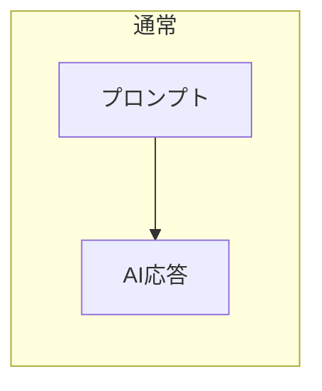
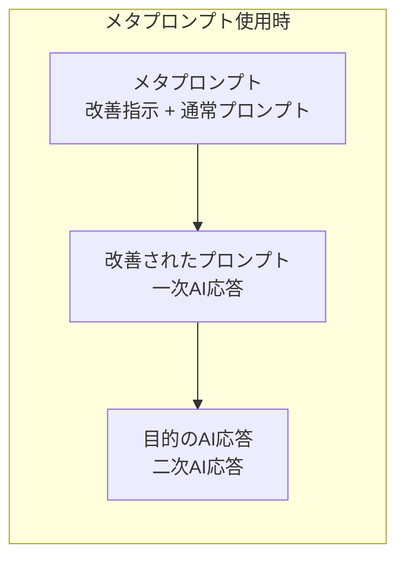
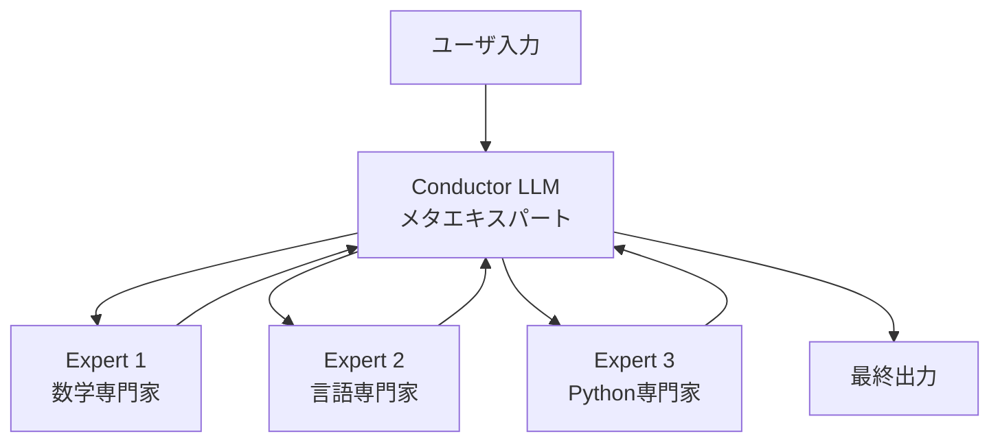
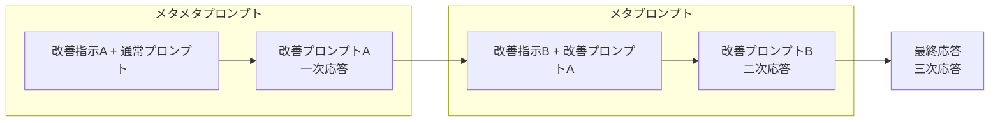
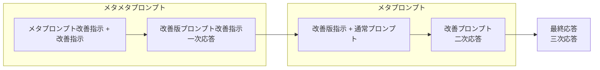
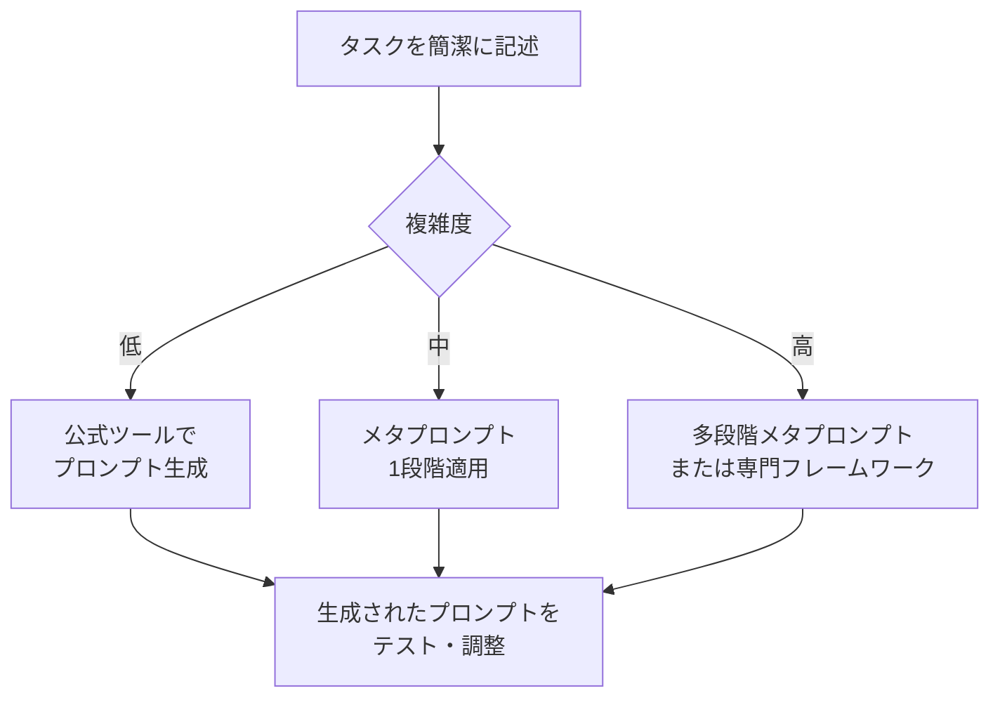

## TL;DR（結論）

- **メタプロンプトとは**: AIにプロンプトを生成・改善させる高次のプロンプト技術
- **主なメリット**: 低コストで構造化・明確化されたプロンプトを得られる
- **実用性**: Anthropic、OpenAIが公式ツールを提供するほど効果が実証済み
- **発展形**: Stanford/OpenAIの研究では標準プロンプトより17.1%性能向上

---

## 1. メタプロンプトとは

メタプロンプトとは、**AIに与えるプロンプトを作るための、より高次のプロンプト**です。

通常のプロンプトが「AIへの指示」であるのに対し、メタプロンプトは「AIへの指示を作るための指示」という位置づけになります。

### 通常のプロンプト vs メタプロンプト





### メタプロンプトの2つの構成要素

メタプロンプトは通常、以下の2つの部分で構成されます。

| 構成要素 | 役割 | 例 |
|---------|-----|-----|
| プロンプト改善指示 | 通常プロンプトをどう改善すべきか指示 | 「以下のプロンプトをより具体的で明確な指示を含むように改善してください」 |
| 通常プロンプト | ユーザの本来の目的を伝える | 「革新的なビジネスアイデアを5つ提案してください」 |

---

## 2. なぜメタプロンプトが効果的なのか

### 2.1 フォーマッター効果

AIは一貫したフォーマットで情報を提供することが得意です。メタプロンプトを使うことで、人間が直接作成するプロンプトに比べて**構造化されたプロンプト**が生成されます。

### 2.2 明確化効果

メタプロンプトは、AIに対して曖昧な指示を避け、より具体的で明確な指示を与えるよう促します。この過程で、ユーザ自身も**自分のプロンプトやタスクに存在していた曖昧さ**に気づくことができます。

### 2.3 低コスト

メタプロンプトのオーバーヘッドは「プロンプト改善の指示文章を考える部分」のみです。大抵の場合、極めて単純な指示で十分であり、人間が初めから明確・構造化されたプロンプトを書く手間に比べれば**遥かに低コスト**です。

### 2.4 通常プロンプトの簡略化

メタプロンプトがプロンプトの構造化・明確化を担うため、通常プロンプトは**本質的な内容に集中**できます。

### 2.5 精度の向上

精度向上は2つの側面から実現されます：

1. **明確な指示**: メタプロンプトがプロンプトの明確化を促すことで、AIはユーザの意図をより正確に理解できる
2. **AIの思考がプロンプトに含まれる**: プロンプト改善過程で、最適な手順や必要な情報がプロンプトに含まれる

---

## 3. メタプロンプトを関数として理解する

メタプロンプトの動作を、関数型プログラミングの観点から理解すると、その本質がより明確になります。

### 3.1 基本モデル

```typescript
// 型定義
type Prompt = string;
type Response = string;

// 通常のAI呼び出し
const ai: (prompt: Prompt) => Response;

// プロンプト改善関数
type PromptImprover = (prompt: Prompt) => Prompt;

// メタプロンプトの動作
function metaPrompt(
  improveInstruction: string,  // プロンプト改善指示
  userPrompt: Prompt           // 通常プロンプト
): Response {
  // Step 1: プロンプト改善指示に基づき、通常プロンプトを改善
  const improvedPrompt: Prompt = ai(improveInstruction + userPrompt);
  
  // Step 2: 改善されたプロンプトでAIを呼び出し
  const finalResponse: Response = ai(improvedPrompt);
  
  return finalResponse;
}
```

### 3.2 関数合成としての理解

```typescript
// プロンプト改善関数を合成として捉える
const improve1: PromptImprover = (p) => ai(`構造化してください: ${p}`);
const improve2: PromptImprover = (p) => ai(`具体例を追加してください: ${p}`);

// 関数合成（多段階メタプロンプト）
const compose = <T>(f: (x: T) => T, g: (x: T) => T) => (x: T) => g(f(x));
const improveAll = compose(improve1, improve2);

// 実行
const improvedPrompt = improveAll(userPrompt);
const response = ai(improvedPrompt);
```

---

## 4. 実践的なメタプロンプト手法

### 4.1 Anthropicのプロンプトジェネレーター

Anthropicは公式に[Prompt Generator](https://docs.claude.com/en/docs/build-with-claude/prompt-engineering/prompt-generator)を提供しています。

**主な特徴：**
- Chain-of-Thought（思考の連鎖）を自動組み込み
- XMLタグによるデータと指示の分離
- 変数のHandlebars記法サポート

> The prompt generator is particularly useful as a tool for solving the "blank page problem" to give you a jumping-off point for further testing and iteration.
> — [Anthropic Docs](https://docs.claude.com/en/docs/build-with-claude/prompt-engineering/prompt-generator)

### 4.2 Stanford/OpenAIのMeta-Prompting

2024年1月にStanfordとOpenAIの共同研究として発表された[Meta-Prompting](https://arxiv.org/abs/2401.12954)は、より高度なアプローチを提案しています。

**アーキテクチャ：**



**研究成果（Pythonインタープリター併用時）：**
| 比較対象 | 改善率 |
|---------|--------|
| 標準プロンプト | +17.1% |
| Expert (dynamic) プロンプト | +17.3% |
| Multi-persona プロンプト | +15.2% |

※ 上記の数値はGame of 24、Checkmate-in-One、Python Programming Puzzlesなどのタスクでの平均値

### 4.3 DSPy / TextGrad

より技術的なアプローチとして、以下のフレームワークが注目されています：

- **[DSPy](https://arxiv.org/pdf/2310.03714)**: LLMをモジュラーコンポーネントとして扱い、プロンプトをプログラム的に最適化
- **[TextGrad](https://arxiv.org/pdf/2406.07496)**: 自然言語フィードバックを「テキスト勾配」として使用し、反復的にプロンプトを改善

---

## 5. メタメタプロンプト：発展的な概念

### 5.1 概念の導入

メタプロンプトを拡張すると、**メタメタプロンプト**という概念が生まれます。これは「メタプロンプトを生成するためのプロンプト」です。

### 5.2 2つのパターン

#### パターンA: 通常プロンプトを多段階で改善



**数式表現：**

```typescript
const fn1: PromptImprover = /* 改善指示A */;
const fn2: PromptImprover = /* 改善指示B */;

// 関数合成
const improvedPrompt = fn2(fn1(userPrompt));
const response = ai(improvedPrompt);
```

**本質**: 単なる関数合成であり、反復的なプロンプト改善

#### パターンB: プロンプト改善指示自体を生成



**数式表現：**

```typescript
// 型の階層構造を明確に定義
type Prompt = string;

// Level 1: プロンプトを改善する関数
type PromptImprover = (p: Prompt) => Prompt;

// Level 2: プロンプト改善関数を改善する関数（メタメタプロンプト）
type ImproverImprover = (f: PromptImprover) => PromptImprover;

// Level 3: 理論上はさらに上の階層も存在しうる
type MetaImproverImprover = (g: ImproverImprover) => ImproverImprover;

// 実装例
const baseImprover: PromptImprover = (p) => 
  ai(`構造化してください: ${p}`);

const improverImprover: ImproverImprover = (f) => {
  // 元の改善関数を受け取り、より強化された改善関数を返す
  return (p) => {
    const firstPass = f(p);
    return ai(`以下の改善結果をさらに洗練させてください: ${firstPass}`);
  };
};

// メタメタプロンプトの適用
const enhancedImprover = improverImprover(baseImprover);
const improvedPrompt = enhancedImprover(userPrompt);
const response = ai(improvedPrompt);
```

**本質**: 高階関数の階層構造。各レベルは「1つ下のレベルの関数を改善する関数」として定義される

```
Level 0: Prompt                           （値）
Level 1: Prompt → Prompt                  （PromptImprover）
Level 2: (Prompt → Prompt) → (Prompt → Prompt)  （ImproverImprover）
Level 3: ...                              （さらに上の階層）
```

### 5.3 実用性の検討

| パターン | 実用性 | 適用場面 |
|---------|--------|---------|
| パターンA | **高** | 複雑なタスク、情報収集を伴う場合（AIコーディング支援のPlanモードなど） |
| パターンB | **中** | プロンプト改善指示のテンプレート化が難しい特殊なドメイン |

:::message
**現実的な観点**: 現在のLLMの能力では、多くの場合メタプロンプト（1段階）で十分な効果が得られます。メタメタプロンプトが有効なのは、ワークスペースからの情報収集など、複雑なコンテキスト構築が必要な場合に限られます。
:::

---

## 6. 実装例とツール

### 6.1 Anthropic Prompt Generator（公式）

Anthropicの[Developer Console](https://console.anthropic.com/)から直接利用可能です。

また、[Google Colabノートブック](https://anthropic.com/metaprompt-notebook/)でアーキテクチャを確認できます。

### 6.2 OpenAI System Instruction Generator

OpenAIの[Playground](https://platform.openai.com/playground)から利用可能です（o1モデルを除く）。

### 6.3 シンプルな実装例

```python
import anthropic

def meta_prompt(user_task: str) -> str:
    """
    メタプロンプトを使用してタスク用のプロンプトを生成
    """
    client = anthropic.Anthropic()
    
    meta_instruction = """
    以下のタスク説明を、高品質なプロンプトに変換してください。
    
    プロンプトには以下を含めてください：
    1. 明確な役割設定
    2. 具体的なタスク説明
    3. 期待する出力形式
    4. 制約条件（あれば）
    
    タスク説明:
    """
    
    # Step 1: プロンプトを生成
    response = client.messages.create(
        model="claude-sonnet-4-20250514",  # 最新のモデル名は公式ドキュメントを参照
        max_tokens=1024,
        messages=[
            {"role": "user", "content": meta_instruction + user_task}
        ]
    )
    
    return response.content[0].text
```

---

## 📋 **免責事項**

> **重要**: 本記事はClaudeとの対話で作成されており、誤りが含まれている可能性があることをご了承ください。

## 7. まとめ

### メタプロンプトの価値

1. **効率性**: 手動でプロンプトを最適化する時間を大幅に削減
2. **品質**: 構造化・明確化されたプロンプトにより、AI応答の精度が向上
3. **スケーラビリティ**: テンプレート化により、様々なタスクに適用可能

### 推奨アプローチ



### 参考リソース

- [Anthropic Prompt Engineering Docs](https://docs.claude.com/en/docs/build-with-claude/prompt-engineering/overview)
- [Meta-Prompting: Enhancing Language Models with Task-Agnostic Scaffolding (arXiv)](https://arxiv.org/abs/2401.12954)
- [PromptHub: A Complete Guide to Meta Prompting](https://www.prompthub.us/blog/a-complete-guide-to-meta-prompting)
- [Anthropic Prompt Generator Google Colab](https://anthropic.com/metaprompt-notebook/)

---

:::message alert
**注意**: メタプロンプトは万能ではありません。シンプルなタスクには通常のプロンプトで十分であり、過度な抽象化は逆効果になることがあります。タスクの複雑度に応じて適切なアプローチを選択してください。
:::
