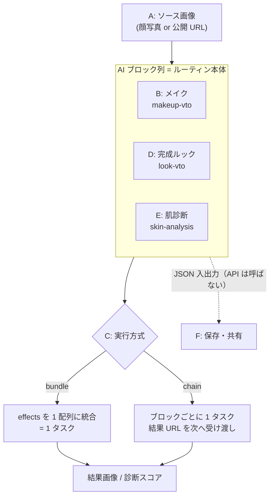
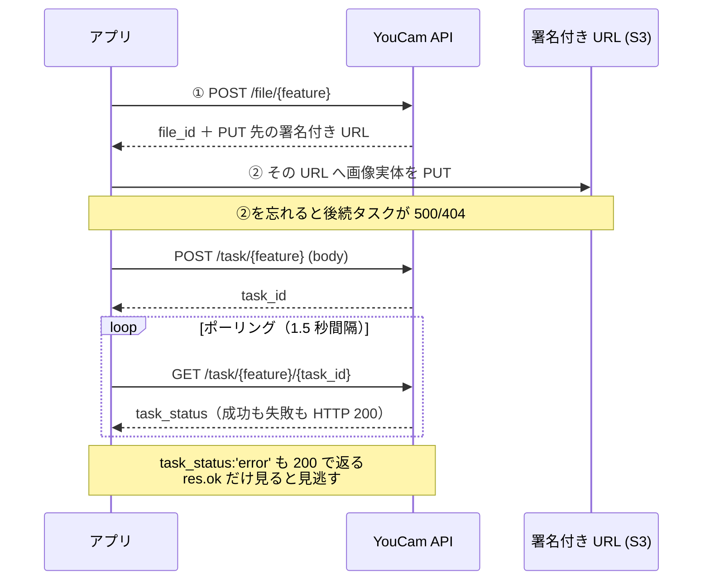
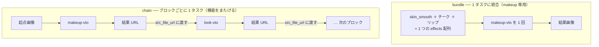
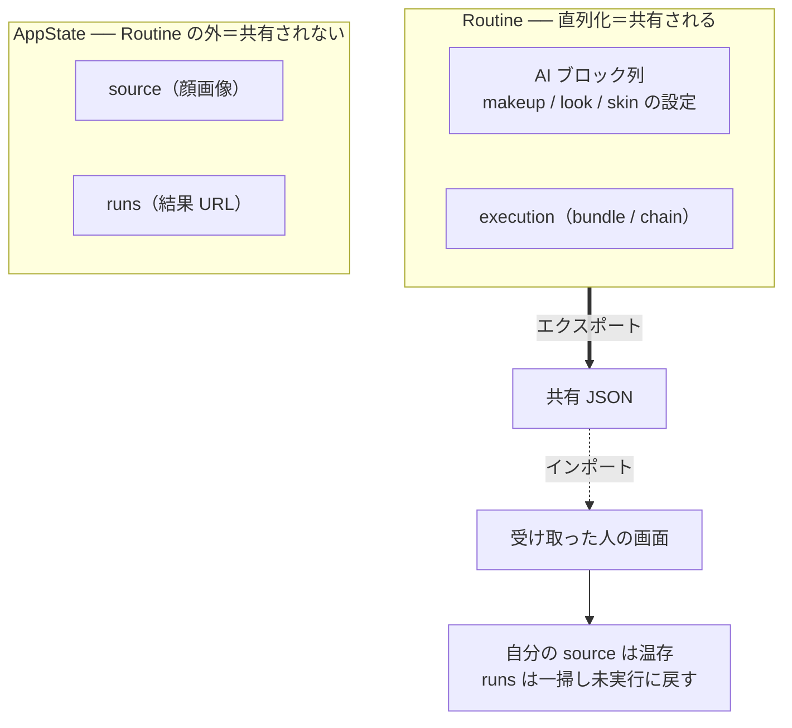

:::message
この記事は [Zenn Fes spring 2026（Perfect Corp 提供）](https://zenn.dev/contests/zennfes-spring-2026-perfect) への応募記事です。
:::

## TL;DR

[YouCam API（Perfect Corp）](https://docs.perfectcorp.com/) を使って、こんなものを作りました。

> **メイクの操作を「ブロック」として並べて手順（ルーティン）を組み、自分の顔写真でドライランし、その手順を JSON として書き出して他人に渡すと、相手が "自分の顔" で同じ手順を再生できる。**

サーバーを持たない**静的サイト**（React + TypeScript + Vite）で、ユーザーが自分の API キーを入れて動かします。

YouCam API 単体でも「肌補正＋チーク＋リップを1枚に重ねる」はできます。けれどこのアプリの主役はそこではなく、**①機能をまたいだ手順の連結（肌診断 → メイク → 完成ルック）** と **②手順そのものを配布物として共有する** という、API が標準では持っていないワークフロー層です。

この記事では、その「なぜ」と「どう作ったか（非同期タスクのチェイン、外部 JSON のランタイム検証、CORS 回避、プライバシー設計）」を両方書きます。

:::message
**ソースと設計資料**：このアプリは [GitHub リポジトリ](https://github.com/fdshg693/ZENN/tree/main/resources/youcam) で公開しています。「何を作るつもりだったか（提供機能と利用 API のプラン）」は [PLAN.md](https://github.com/fdshg693/ZENN/blob/main/resources/youcam/PLAN.md)、全体像と提供価値の整理は [README.md](https://github.com/fdshg693/ZENN/blob/main/resources/youcam/README.md)、API 調査メモは [docs/](https://github.com/fdshg693/ZENN/tree/main/resources/youcam/docs) にあります。本文では要所ごとに該当コードへのリンクを貼るので、気になった箇所は実物で確かめてください。
:::

---

## 前提：YouCam API（Perfect Corp）とは

本題に入る前に、土台となる「YouCam API」を一段だけ説明します（ご存じの方は読み飛ばしてください）。

**YouCam API は、[Perfect Corp](https://www.perfectcorp.com/) が提供する美容・AR 系の AI 機能を集めた RESTful API** です。バーチャルメイク試着・ヘア／アクセサリー試着・肌診断などを、自分のサイトやアプリから HTTP で呼び出せます（公式 [Introduction](https://docs.perfectcorp.com/develop/introduction) は「最新の AI による beautiful and true-to-life な visual effects を Web・EC・モバイルへ組み込むための standard RESTful API」と説明しています）。コスメ EC でよく見る「商品を自分の顔に乗せて試せる」機能の、API 版だと思ってもらえれば近いです。

使い方の基本は **「顔写真（と設定）を渡す → 加工済み画像、または診断スコアが返る」**。実際には画像をアップロードして非同期タスクを投げ、完了をポーリングして結果を受け取る流れですが、その骨格は後述の「3-1. 全機能に共通する『非同期タスク』の骨格」でまとめて扱います。ここでは「何ができる API か」だけ押さえれば十分です。

このアプリが使うのは、数あるカタログ（[公式リファレンス](https://docs.perfectcorp.com/reference/)）のうち次の4つだけです。これ以降に出てくる `makeup-vto` などの語は、すべてこの表のどれかを指します。

| このアプリで使う部品 | 何をするものか | 記事中の呼び名 |
| --- | --- | --- |
| **AI Makeup Virtual Try-On** | 化粧パーツ（肌補正・チーク・リップ…）を個別に指定して顔に乗せる。`effects` という**配列**で複数効果を一度に重ねられるのが特徴 | `makeup-vto` |
| **AI Look Virtual Try-On** | プロが作った「完成ルック」を `template_id` ひとつで一括適用する | `look-vto` |
| **AI Skin Analysis** | しわ・毛穴・きめ・ニキビなどを解析してスコア化する（画像加工ではなく**測定**） | `skin-analysis` |
| **File API** | タスクに渡す顔写真をアップロードするための土台（全機能で共通） | File API |

なお YouCam API のカタログにはこのほかヘア・ファッション・画像生成なども多数ありますが、本アプリの射程外です。それでは本題に入ります。

---

## 1. なぜ作ったか ── 「Playgroundで十分」と「アプリにする意味」の線引き

正直なところ、メイク効果を**自分の1枚に重ねたいだけ**なら、[API Playground](https://yce.makeupar.com/api-console/) や `curl` で足ります。`makeup-vto` は `effects` を**配列**で受け取るので、「skin_smooth + チーク + リップ」を**1リクエストで重ねて1枚に**できるからです。

ではどこからアプリにする意味が出るのか。整理するとこうなりました。

| やりたいこと | このアプリは要るか |
| --- | --- |
| メイク効果を自分の1枚に重ねたいだけ（単発・makeup のみ） | **不要**。Playground や `curl` で足りる |
| `effects` JSON を手書きせず GUI で組み、実行前に検証したい | あると楽（弱め） |
| **機能をまたいで**手順を組む（肌診断 → メイク → 完成ルック） | **要る**（後述のとおり API 1発では不可） |
| メイク手順を**他人と共有し、相手が自分の顔で再生**したい | **要る**（これが本命） |

技術的な要点は **「`effects` 配列が効くのは `makeup-vto` という1エンドポイントの中だけ」** という点です。

- **一括（bundle）**: makeup の効果同士なら1配列＝1タスクに統合できる（API がエンドポイントレベルで対応）。
- **チェイン（chain）**: `skin-analysis` / `look-vto` など**別エンドポイントをまたぐ**手順は API 1発では組めない。前タスクの結果を次の入力に渡す**連結はアプリ側のオーケストレーション**になる。

つまり存在意義は makeup 単発ではなく、**機能をまたぐ連結（C/D/E）とルーティンの共有（F）** に乗って立ち上がる、という設計です。

:::message
ベースの YouCam API の強みは描画リアリズムと肌診断であって、このアプリはそこを改善しません（API 任せ）。価値検証の射程は「誰もまとめて作っていないワークフローを提示できるか」に置いています。この線引きの詳細な検討は [docs/poc-value.md](https://github.com/fdshg693/ZENN/blob/main/resources/youcam/docs/poc-value.md)、機能と利用 API の対応は [PLAN.md](https://github.com/fdshg693/ZENN/blob/main/resources/youcam/PLAN.md) にまとめてあります。
:::

### 想定ユースケース（本命：クリエイター × ルーティン共有）

「あなたの GRWM（Get Ready With Me）を、フォロワーが**自分の顔で再生**できる」。手順を1ショット体験ではなく**配布可能なコンテンツ**に変える、という狙いです。

---

## 2. 全体像 ── 6つの機能（A〜F）

アプリは「ブロックを縦に並べる」だけのシンプルな UI で、機能を A〜F に分けて積み上げました。

| 機能 | 内容 | 利用 API |
| --- | --- | --- |
| **A** | ソース画像の用意（アップロード or URL 指定） | File API |
| **B** | メイクブロック（中核） | `makeup-vto` |
| **C** | ブロックの連結＝ルーティン実行（bundle / chain） | 上記タスク群 + 結果 URL の受け渡し |
| **D** | 完成ルックブロック（`template_id` 一発） | `look-vto` |
| **E** | 肌診断ブロック（スコア化） | `skin-analysis` |
| **F** | ルーティンの保存・共有（JSON 入出力） | **なし**（クライアント内 JSON 操作） |

機能どうしの関係を図にすると、起点画像（A）の上に AI ブロック列（B/D/E）を積み、それを実行方式（C）で結果画像へ変換し、ブロック列だけを JSON として出し入れする（F）という構造です。



ブロックの型は判別共用体で、`AiBlock = MakeupBlock | LookBlock | SkinBlock` として扱います。**この型が最初から「JSON シリアライズ可能な素直な形」を保っている**ことが、後で機能F（共有）を安く実装できた一番の効きどころでした。

```ts:src/domain/blocks.ts
/** 実行対象の AI ブロック（makeup + look + skin）。source は起点なので含めない。 */
export type AiBlock = MakeupBlock | LookBlock | SkinBlock;
```

→ 実コード: [src/domain/blocks.ts](https://github.com/fdshg693/ZENN/blob/main/resources/youcam/src/domain/blocks.ts)

UI 側は `kind` で編集フォームを出し分けるだけ。

```tsx:src/App.tsx
{aiBlocks.map((block) => (
  <div key={block.id}>
    {block.kind === 'look' ? (
      <LookEditor block={block} />
    ) : block.kind === 'skin' ? (
      <SkinEditor block={block} />
    ) : (
      <MakeupEditor block={block} />
    )}
    <RunPanel block={block} />
  </div>
))}
```

→ 実コード: [src/App.tsx](https://github.com/fdshg693/ZENN/blob/main/resources/youcam/src/App.tsx)

---

## 3. 技術的な見どころ

### 3-1. 全機能に共通する「非同期タスク」の骨格

YouCam の AI 機能はどれも同じ流れです。

```
ファイルアップロード → タスク開始(task_id) → ポーリング → 結果URL
```

機能ごとに違うのは「feature 名」と「body の形」だけ。なので**ポーリングの骨格を1つ**に集約し、各機能ファイルは feature 名と body を渡すだけにしました。

```ts:src/api/task.ts
export async function pollTask<T extends { task_status: string; error?: string }>(
  feature: string,
  body: unknown,
  { intervalMs = 1500, timeoutMs = 120_000 } = {},
): Promise<T> {
  const start = await client.post<TaskStartResponse>(`/s2s/v2.0/task/${feature}`, body);
  const taskId = start.data.task_id;

  const deadline = Date.now() + timeoutMs;
  for (;;) {
    const st = await client.get<{ data: T }>(`/s2s/v2.0/task/${feature}/${taskId}`);
    const r = st.data;
    if (r.task_status === 'success') return r;
    if (r.task_status === 'error') {
      // ★ タスクレベルのエラーは HTTP 200 で返るため client.ts の整形を通らない
      const message = describeErrorCode(r.error) ?? r.error_message ?? 'タスクが失敗しました。';
      throw new ApiError(message, r.error);
    }
    if (Date.now() > deadline) throw new ApiError('タスクがタイムアウトしました。');
    await delay(intervalMs);
  }
}
```

→ 実コード: [src/api/task.ts](https://github.com/fdshg693/ZENN/blob/main/resources/youcam/src/api/task.ts)

:::message alert
ハマりポイント：**タスクの失敗は HTTP 200 で返ってくる**（`task_status: 'error'`）。`res.ok` のチェックだけ見ていると失敗を見逃します。HTTP レベルのエラー整形（`client.ts`）とは別に、ポーリング側でステータスを見てエラーコードを読めるメッセージへ変換しています。
:::

ちなみにファイルアップロードも罠で、**2段階**です。`POST /file/{feature}` で署名付き URL を受け取り、**その URL に実体を PUT** して初めて「アップロード済み」になります（これを忘れると後続タスクが 500/404）。さらに `file_id` は **feature 単位で発行される**ため、`makeup-vto` 用と `skin-analysis` 用は別物。なので発行は「実行時にどの feature から始まるか確定してから」行っています。

この「2段階アップロード」と「失敗も HTTP 200」を1本の流れで見ると、実際のやり取りはこうなっています。



→ 実コード（2段階アップロードの隠蔽）: [src/api/files.ts](https://github.com/fdshg693/ZENN/blob/main/resources/youcam/src/api/files.ts)

### 3-2. チェイン vs バンドル ── ルーティン実行のオーケストレーション

機能Cが心臓部です。複数ブロックの実行方式を2つ用意しました。

- **bundle**: 連続する makeup の `effects` を**1配列に統合して1タスク**で実行（速い・安い・途中経過なし）。
- **chain**: ブロックごとに1タスク。**前ステップの結果 URL を次の `src_file_url` に渡す**（途中経過が見える・makeup 以外も挟める）。

両者の違いは「タスクの数」と「ブロック間で何を受け渡すか」です。chain は**結果 URL をバトンのように次へ渡して**いくのが要点です（下図）。



ここで実機検証して分かった重要事実：

:::message
`makeup-vto`（実機では `look-vto` も）は **`dst_id` を返さない**。成功レスポンスは結果画像の URL（公開 S3・約2時間有効）でした。なので機能をまたぐ受け渡しは **「結果 URL を次タスクの `src_file_url` に渡す」** のが基本になります。
:::

チェインの実装は「直近の変換結果 URL があればそれを入力に、無ければ起点画像をそのブロックの feature で解決する」というループです。肌診断（skin）は**測定**であって画像を変換しないので、作業画像を進めない点がポイントでした。

```ts:src/domain/routine.ts
async function runChain(blocks: AiBlock[], source: SourceSelection, cb: RoutineProgress) {
  let workUrl: string | null = null; // 直近の変換(image)結果。skin では更新しない
  for (const block of blocks) {
    cb.onStepStart(block.id);
    try {
      const src = workUrl
        ? { src_file_url: workUrl }                       // 前段の変換結果を入力に
        : await resolveSource(featureOf(block), source);  // まだ変換が無い→起点を解決
      const out = await runBlock(block, src);
      cb.onStepSuccess(block.id, out);
      if (out.kind === 'image') workUrl = out.resultUrl;  // 変換ブロックだけ作業画像を進める
    } catch (e) {
      cb.onStepError(block.id, e instanceof Error ? e.message : String(e));
      return; // 直列の手順なので失敗以降は中断
    }
  }
}
```

→ 実コード: [src/domain/routine.ts](https://github.com/fdshg693/ZENN/blob/main/resources/youcam/src/domain/routine.ts)

bundle は makeup 専用なので、もし look が混ざっていたら**自動で chain に切り替える安全弁**を入れています。

```ts:src/domain/routine.ts
// look は effects に統合できない。bundle 指定でも look が混ざれば自動的に chain へ
const bundlable = execution === 'bundle' && ai.every((b) => b.kind === 'makeup');
```

また実行前に**全ブロックをまとめて検証**してから API を叩きます。units（クレジット）は**成功時のみ**消費されるので、投げる前に弾けるものは弾いて無駄消費を防ぐ方針です。

### 3-3. ブラウザ直叩きの CORS と、API キーをフロントに置く割り切り

「サーバーを持たない静的サイト」なので CORS が立ちはだかります。開発時は **Vite の dev proxy** に集約して回避しました。`client.ts` の baseURL を `/api` 固定にして、proxy で本番ホストへ転送するだけです。

```ts:vite.config.ts
server: {
  proxy: {
    '/api':     { target: 'https://yce-api-01.makeupar.com', changeOrigin: true, secure: true,
                  rewrite: (p) => p.replace(/^\/api/, '') },
    '/catalog': { target: 'https://plugins-media.makeupar.com', changeOrigin: true, secure: true,
                  rewrite: (p) => p.replace(/^\/catalog/, '') }, // パターンカタログJSONは別ホスト
  },
},
```

→ 実コード: [vite.config.ts](https://github.com/fdshg693/ZENN/blob/main/resources/youcam/vite.config.ts)

レート制限（429）には [`client.ts`](https://github.com/fdshg693/ZENN/blob/main/resources/youcam/src/api/client.ts) 側で**指数バックオフ＋ジッタの自動リトライ**を入れています。

:::message alert
**API キーはフロントに乗ります**。これは「価値検証用の POC」と割り切った設計で、本番運用（鍵秘匿・サーバー経由プロキシ・課金管理）はスコープ外です。各自が自分のキーを入力して動かす前提です。
:::

### 3-4. 機能F：外部から来る JSON をどう信頼するか

機能F（共有）は**API を一切呼ばない**初めての機能で、性質が他と根本的に違います。やることは2つだけ。

1. ルーティンを JSON に直列化する（**顔画像と結果 URL は含めない**）
2. 取り込んだ JSON を **state に入れる前に実行時バリデーションする**

TypeScript の型は**コンパイル時にしか効かない**ので、外部 JSON を `as` で押し込むと壊れた値が state に侵入します。そこで「封筒（マジック＋version）→ 各ブロックの構造・enum」を段階的に検証し、例外を投げず Result 型で返すパーサを書きました。意味検証（色の形式・SD/HD 混在など）は**機能B〜Eが既に持っている `validate*` を再利用**して二重定義を避けています。

```ts:src/domain/routineFile.ts
export function parseRoutine(text: string): ParseResult {
  let raw: unknown;
  try { raw = JSON.parse(text); }
  catch { return { ok: false, error: 'JSON として読めませんでした。' }; }

  if (!isObject(raw)) return { ok: false, error: 'ルーティン JSON の形式ではありません。' };
  if (raw.app !== 'youcam-routine-share') return { ok: false, error: 'このアプリのルーティン JSON ではありません。' };
  if (raw.version !== 1) return { ok: false, error: `対応していないバージョン（version ${String(raw.version)}）です。` };
  // …execution / blocks の検証、kind ごとの構造・enum チェック、validate* への委譲…
}
```

→ 実コード（パーサと共有スキーマ）: [src/domain/routineFile.ts](https://github.com/fdshg693/ZENN/blob/main/resources/youcam/src/domain/routineFile.ts)

そして共有 JSON のスキーマには**識別子（マジック）と version** を必ず持たせました。別アプリの JSON を取り違えない／将来スキーマを変えたら弾く（or 変換する）分岐点になります。

```ts:src/domain/routineFile.ts
export interface SharedRoutine {
  app: 'youcam-routine-share'; // 別アプリの JSON を取り違えないための識別子
  version: 1;                  // スキーマ版。将来の変換 / 弾く分岐点
  execution: 'bundle' | 'chain';
  blocks: AiBlock[];           // makeup / look / skin の並び（source は含めない）
}
```

### 3-5. プライバシー設計 ── 共有しても顔写真は渡らない

「他人のルーティンを自分の顔で再生する」というコンセプト上、**共有物に顔写真が混ざってはいけません**。ここは型の構造で保証しました。

- **顔画像（source）は共有対象に含めない**。エクスポートは AI ブロックだけを直列化し、source をまるごと除外。取り込み側は**自分の既存の顔指定を温存**します。
- **結果 URL も含めない**。結果（`runs`）はそもそも `Routine` の外（`AppState`）に置いてあるので、ルーティンを直列化する限り**構造的に混入しません**。取り込み時は `runs` を一掃します。

直列化する `Routine` と、その外側に置いた `AppState`（顔画像・結果）という**状態の分割そのもの**が、共有物に顔と結果が混ざらないことを保証しています。



```ts:src/state/appState.ts
case 'LOAD_ROUTINE': {
  // 取り込み側の起点（顔写真）はそのまま。AI ブロックと execution だけ差し替える
  const source =
    state.routine.blocks.find((b): b is SourceBlock => b.kind === 'source') ?? createSourceBlock();
  return {
    ...state,
    routine: { blocks: [source, ...action.blocks], execution: action.execution },
    runs: {}, // 取り込んだブロックは未実行。古い結果を残さない
  };
}
```

→ 実コード: [src/state/appState.ts](https://github.com/fdshg693/ZENN/blob/main/resources/youcam/src/state/appState.ts)

「他人の手順 ＋ 自分の顔」が、データ構造のレベルで自然と成立する形になりました。

---

## 4. 詰まったところ・学び

- **失敗が HTTP 200 で返る**：タスクレベルのエラー（`task_status: 'error'`）は 200 なので、HTTP 整形とは別系統でハンドリングが必要だった。
- **`dst_id` は当てにできない**：ドキュメント上は `dst_id` チェインが想定だが、実機の `makeup-vto` は返さない。**結果 URL の受け渡し**を基本に据えて正解だった。
- **File API は2段階 ＋ feature 単位**：PUT 忘れと、feature をまたいだ `file_id` の使い回しでハマりやすい。実行時に feature を確定してから発行することで吸収。
- **「JSON 化しやすい型を最初から保つ」配当**：機能B〜E を実装するたびに「この型は機能F の共有単位だから素直に保つ」と決めていたおかげで、機能F は新しいドメインモデルをほぼ足さずに済んだ。**後で効く制約を前もって敷く**価値を実感。
- **API の構造的な均質さが実装を支えた**：全機能が `File → Task → Poll → Result` の同じ骨格で動き、違いは feature 名と body だけ。だからポーリングを1本（`pollTask`）に集約できた。さらに変換系（makeup / look）は**入力も出力も「画像 URL」で型がそろう**ため、チェインは「結果 URL を次の `src_file_url` に渡す」だけで済んだ。ただし `skin-analysis` は画像を返さない**測定**なので、ここだけは「作業画像を進めない」例外として扱っている ── 均質さに乗りつつ、乗り切れない部分を1か所に閉じ込めた形。

---

## 5. スコープ外（正直な限界）

POC として、以下は意図的に対象外にしています。

- **動画・ライブ試着**（GRWM 本来の主役）。本デモは静止画ベース。
- **製品（買える SKU）との連携**・EC カート・決済。
- **API キーの秘匿・本番運用**（サーバー経由プロキシ、課金管理など）。
- **描画品質そのものの改善**（API の出力をそのまま使う）。
- **共有リンク発行・アカウント・サーバー保存**（共有は JSON の import/export に限定）。

技術的な参入障壁は低い（描画は API 任せ、合成・共有は JSON 操作）アプリです。価値は「難しい技術」ではなく、**「誰もまとめていないワークフローを提示する」** 点に置いています。

---

## 6. まとめ

YouCam API の上に、API が標準では持たない**「手順（ルーティン）の合成・連結・共有」というワークフロー層**を載せた POC を作りました。

- 非同期タスクの骨格を1つに集約し、bundle / chain でブロックを連結
- `makeup-vto` が `dst_id` を返さない実機挙動に合わせ、**結果 URL の受け渡し**でチェインを実現
- 外部 JSON は**ランタイム検証**で番人を置き、**顔画像と結果 URL は構造的に共有しない**プライバシー設計

「あなたのメイク手順を、相手が自分の顔で再生できる」という体験が、データ構造のレベルで素直に成立するところまで持っていけたのが個人的な収穫でした。

ここまで読んでいただきありがとうございました。
