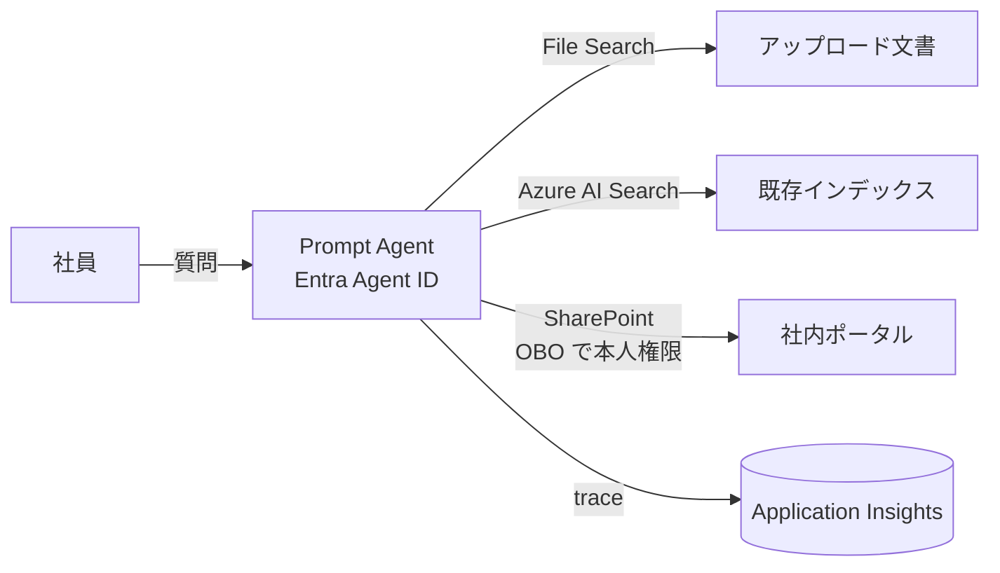
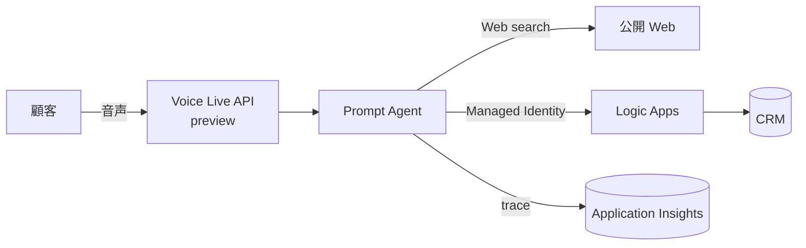
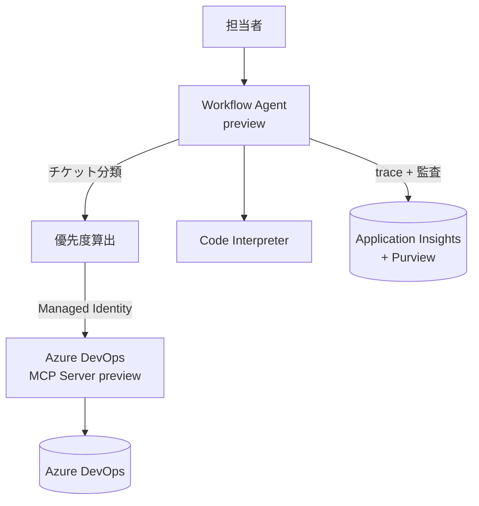
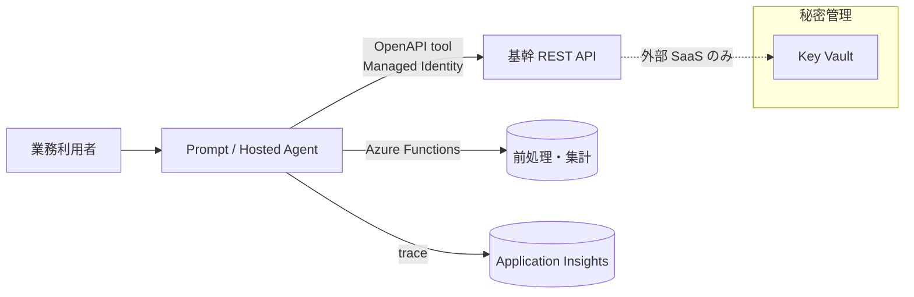
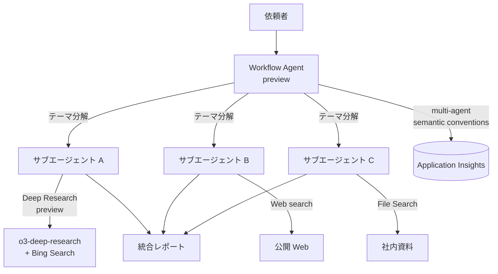

## はじめに

Microsoft Foundry(旧 Azure AI Foundry)は、生成 AI アプリと AI エージェントを「モデル選定 → 開発 → ツール連携 → 運用」までひとつのプロジェクトで扱える統合プラットフォームです。公式ドキュメントを眺めると分かる通り、機能の種類・Preview 機能・連携先が非常に多く、全部を均等に紹介するとどれも薄くなりがちです。

そこで本記事では、実務で最初に押さえるべき **4 本柱(Agent / Tool / 認証 / 監視)** に絞り、Preview や細かい制限は「一般論+箇条書き」で触れる形で全体像を整理します。

対象読者は、Azure 上で生成 AI エージェントを設計・実装するアーキテクトや実装者で、特にエンタープライズ利用を見据えて認証や可観測性の勘所を先に掴みたい方です。

:::message
Preview(プレビュー)機能は SLA なしで本番利用は推奨されません。仕様・リージョン・対応モデルも随時変わり得るため、個別機能を本番で検討する際は必ず公式ドキュメントで最新状態を確認してください。
:::

## 1. Microsoft Foundry とは何か

Microsoft 公式の位置づけでは、Foundry は「生成 AI アプリケーションを構築・カスタマイズ・管理するための統一プラットフォーム」です。モデルのデプロイ、エージェントのオーケストレーション、そして可観測性までを 1 つの面で扱えることが最大の価値です[^training]。

ドキュメント上は大きく 2 系統が併存しています。

- `learn.microsoft.com/azure/foundry/...` — 新しい Foundry Agent Service / Tool Catalog 系
- `learn.microsoft.com/azure/ai-foundry/...` と `azure/foundry-classic/...` — 旧 Azure AI Foundry / classic 系

また、旧 **Azure AI Services(Cognitive Services)は「Foundry Tools」** という名称で Foundry プラットフォーム内の構成要素に統合されています[^auth-docs]。既存の Cognitive Services 認証の知識はそのまま Foundry Tools の認証設計に流用できます。

## 2. 全体像: 覚えておくべき 4 本柱

Foundry は大きく次の 4 つの塊として捉えると、ドキュメントを読み進めやすくなります。

1. **Model Catalog** — GPT-4o、Llama、DeepSeek など多数のモデルを一カ所から扱う
2. **Agent Service** — エージェントの実行・会話・ツール呼び出しをマネージドで回すランタイム
3. **Tool エコシステム** — 組み込みツールと MCP/OpenAPI などの拡張で「できること」を広げる
4. **運用(監視・認証・ガバナンス)** — OpenTelemetry ベースの Observability と Entra による ID 管理

本記事では 2〜4 に集中し、1(モデルデプロイ)は次章で軽く触れるだけにします。

## 3. 素のモデルデプロイは軽く押さえる

Foundry Model Catalog からは GPT-4o、Llama、DeepSeek といった主要モデルをデプロイして利用できます。Agent Service 側の重要な性質として、**モデルを差し替えてもエージェントのコードを変えなくてよい**抽象レイヤーが用意されている点があります[^agents-overview]。

つまり、モデル選定は「比較検討して入れ替えるもの」であり、この層の深掘りより、次章以降の **Agent / Tool / 認証 / 監視** の設計の方が実装に効いてきます。

## 4. Agent Service(詳しめ)

Agent Service には **Agent Runtime** があり、会話履歴の管理、ツール呼び出し、エージェントのライフサイクルまで面倒を見ます[^agents-overview]。

### 4.1 3 種類の Agent

| 種別 | コード | ホスティング | オーケストレーション | 向いている用途 |
| --- | --- | --- | --- | --- |
| Prompt agents | 不要 | フルマネージド | 単一エージェント | プロトタイプ、単純タスク |
| Workflow agents (preview) | 不要(YAML 任意) | フルマネージド | マルチエージェント・分岐 | 複数ステップの自動化 |
| Hosted agents (preview) | 必要 | コンテナベース(マネージド) | 自由 | Agent Framework / LangGraph など自前フレームワークでフル制御 |

(出典: Foundry Agent Service overview[^agents-overview])

### 4.2 どれを選ぶか

ざっくりした判断軸は以下の通りです。

- まず試すなら **Prompt agents**。指示とツールを与えて no-code で動かせる
- フロー制御や複数エージェントの連携が必要なら **Workflow agents**(preview)
- 既存の Agent Framework、LangGraph、独自オーケストレーションを活かしたいなら **Hosted agents**(preview)。コンテナとして Foundry にデプロイし、端から端までテストできる

Preview 扱いの種別は SLA なしで仕様が変わり得るため、本番クリティカルなワークロードは当面 Prompt agents を軸に置くのが堅実です。

## 5. Tool エコシステム(詳しめ)

Agent が「生成」だけでなく「行動」できるようにするのが Tool です。Foundry の Tool は **組み込み(Built-in)** と **カスタム(Custom)** に大別されます[^tool-catalog]。

### 5.1 組み込みツール(代表例)

| 分類 | ツール | 役割 |
| --- | --- | --- |
| 知識を与える | Web search | 公開 Web をリアルタイム参照し引用付きで回答 |
| 知識を与える | File Search | アップロード文書をベクトル検索で参照 |
| 知識を与える | Azure AI Search | 既存 AI Search インデックスにグラウンディング |
| 知識を与える | SharePoint / Memory(preview) | 社内ドキュメントや会話記憶を統合 |
| 行動させる | Code Interpreter | Python をサンドボックスで実行 |
| 行動させる | Azure Logic Apps | ローコードで外部ワークフローを発火 |
| 行動させる | Browser Automation | 自然言語指示でブラウザ操作 |
| 研究 | Deep Research(preview) | `o3-deep-research` と Bing Search による深掘り調査 |

組み込みツールの多くは **Foundry Agent Service 経由で認証が自動で通る** のが大きな利点です。外部データソースに繋ぐもの(Azure AI Search、SharePoint 等)は Foundry プロジェクトに作った Connection を経由して認証します[^tool-catalog]。

### 5.2 カスタムツール(拡張ポイント)

組み込みで足りない場面に備え、次の 3 系統が用意されています[^tool-catalog]。

- **MCP サーバー** — Model Context Protocol のエンドポイントに接続。複数エージェントで共通利用するツールや、別チームが保守するツール群を扱うのに向く
- **A2A / Agent-to-Agent(preview)** — 他のエージェントを A2A 互換エンドポイントとして呼び出す
- **OpenAPI ツール** — OpenAPI 3.0/3.1 仕様の HTTP API を直接ツール化

MCP は Foundry ポータルの **Add Tools カタログ** から追加でき、例えば Azure DevOps MCP Server(preview)は組織を接続するだけで使えるようになります。**どのアクションをエージェントに許すかをカタログ側で絞り込める** ため、権限最小化の設計ポイントになります[^agents-overview]。

### 5.3 ツール設計の勘所

- まずは組み込みで要件を満たせないかを確認する(認証・運用負荷が段違いに軽い)
- 複数エージェントで共用されるなら MCP、1 対 1 で既存 API を繋ぐだけなら OpenAPI
- MCP は独自実装できるぶん自由度が高い一方、**Tool 呼び出しに使う認証方式を明示的に選ぶ必要** がある(次章)

## 6. 認証モデル(詳しめ)

Foundry の認証は慣れないと混乱しがちですが、**「エージェント自体の ID」と「エージェントが呼ぶ Tool の認証」** の 2 層に分けると整理できます。

### 6.1 エージェント自体の ID: Entra Agent ID と Agent Identity

Foundry は、AI エージェント専用の ID 型 **agent identity** を Microsoft Entra ID 上に用意します[^agent-identity]。高レベルな仕組みは次の通りです。

1. Foundry が **agent identity blueprint** と、そこから派生する **agent identity** を Entra ID に作成
2. agent identity に対して RBAC ロール(あるいはターゲットシステム側の権限モデル)を割り当て
3. エージェントがツール呼び出しをする際、Foundry がダウンストリームサービス向けのアクセストークンを取得し、ツール呼び出しの認証に利用

この仕組みは **public preview の Microsoft Entra Agent ID** として公式にアナウンスされています。Foundry Agent Service や Copilot Studio で作ったエージェントに、人間ユーザーと同じ一級の ID を自動付与し、Entra ディレクトリ上でアクセス制御・監査ができるようになります[^entra-agent-id]。

ポイントは以下です。

- **秘密をプロンプトやコード、接続文字列に埋め込まずに** ダウンストリームへ認証できる
- dev / 統合テスト / 本番 / 固有の権限セットなど、**目的別に複数の agent identity を切れる**
- 将来的には Conditional Access、MFA、RBAC まで人間ユーザーと同様に適用予定
- **Defender と Purview に統合** されるので、セキュリティと準拠性のポリシーを「人間 ID と同じ枠組み」で運用できる

### 6.2 Tool 呼び出しの認証方式

Tool カタログのドキュメントと Foundry Tools 認証ドキュメントを合わせると、実務で選ぶ認証方式は次のように整理できます[^tool-catalog][^auth-docs]。

| 方式 | 主な用途 |
| --- | --- |
| サービス管理資格情報 | 多くの Built-in tool のデフォルト。設定不要 |
| Managed Identity(Microsoft Entra) | Azure リソース上で動く Tool / OpenAPI / MCP 向け。秘密を持たず運用できる最推奨 |
| OAuth / OBO(identity passthrough) | ユーザー文脈が必要な Tool。初回にユーザー同意を取り、以降はユーザーとして呼び出す |
| API キー / ベアラートークン | 外部 SaaS など Entra 連携が無いツール。プロジェクト接続に保存して参照 |
| `AgenticIdentityToken` | 公開済みエージェントからリモート MCP サーバーへ呼び出す際の専用トークン。audience で宛先サービスを明示 |

組み込みツールのドキュメントでもヒントが示されている通り、**MCP の認証で迷ったらまず Managed Identity(Entra)を選ぶ** のが原則です。秘密を保持せず、トークンのローテーションも自動で済みます[^tool-catalog]。

### 6.3 Foundry Tools(旧 Cognitive Services)側の認証

Foundry Tools にリクエストを投げるときの基本手段も押さえておくと、Tool 実装時のトラブルシュートがスムーズです[^auth-docs]。

- **リソースキー** を `Ocp-Apim-Subscription-Key` ヘッダーに載せる最小構成
- リソースキーを **JWT アクセストークン** に交換し、`Authorization: Bearer ...` で送る方式(トークンは 10 分有効)
- **Microsoft Entra ID** による認証(サービスプリンシパル、ユーザープリンシパル、Managed Identity)
- 秘密管理は **Azure Key Vault** に寄せ、アプリ側にクレデンシャルを埋め込まない

エージェントの ID 設計と Tool 側の認証設計は別物ですが、「秘密を持たず、Entra を中心に組む」という方針は共通です。

## 7. 可観測性・監視

エージェント運用は「ワンショットのテストで OK」にはならず、継続的な計測が前提です。Foundry Control Plane 上の **Observability は GA**(一般提供)に達しており、AI ライフサイクルを通じた性能評価を体系的に行えます[^preview-blog]。

### 7.1 何をトレースできるか

Foundry Agent tracing は、エージェント実行中の以下を捕捉します[^trace-concept]。

- 入力・出力
- ツール呼び出し(どのツールが、いつ、何を返したか)
- リトライ
- レイテンシ
- コスト

実行順に並んだトレースを見ることで、複雑化しがちなエージェントの挙動をデバッグ可能な形にします。

:::message
Agent tracing は **Prompt agents では GA**、**Workflow / Hosted / Custom agents では preview** です。本番化ロードマップにはこの GA/preview ラインを必ず織り込んでください[^trace-concept]。
:::

### 7.2 OpenTelemetry ベース + マルチエージェント semantic conventions

監視基盤は **OpenTelemetry + W3C Trace Context** に準拠しており、Microsoft は Cisco Outshift と共同で **マルチエージェント向け semantic conventions** を策定しました[^trace-concept]。これは次の環境に統合済みです。

- Microsoft Foundry
- Microsoft Agent Framework
- LangChain / LangGraph
- OpenAI Agents SDK

このため、Foundry で組んだエージェントと別フレームワークのエージェントを混在させても、品質・パフォーマンス・安全性・コスト・ツール呼び出しを統一的に計測できます。

### 7.3 トレースの保存先

Foundry のトレースは **Azure Monitor Application Insights** に出力されます[^trace-concept]。既存の Azure 運用と合流できるため、アラート・ダッシュボード・クエリ(KQL)を既存の枠組みで作れるのが利点です。

> 設計の鉄則: 監視は後付けにせず、**最初から OpenTelemetry 経由で Application Insights に流す前提**で組む。

## 8. 注目の Preview 機能(箇条書きで軽く)

主要な Preview を簡潔に押さえておきます。深追いは個別ドキュメントに譲ります。

- **Voice Live API 連携** — 音声をエージェントの第一級チャネルにするリアルタイム音声 API[^preview-blog]
- **Prompt Optimizer** — パラグラフ単位で理由付きに指示文を改善、1 クリックで適用[^preview-blog]
- **Palo Alto Networks Prisma AIRS 連携** — ポリシー駆動で入出力をランタイム検査し、プロンプトインジェクションや有害応答を検出[^preview-blog]
- **Deep Research tool** — `o3-deep-research` モデルと Bing Search を組み合わせた深掘り調査パイプライン[^tools-classic]
- **Workflow agents / Hosted agents** — それぞれマルチエージェント分岐 / コンテナ自前フレームワーク向け[^agents-overview]
- **Memory tool / Agent-to-Agent(A2A) / Azure DevOps MCP Server** — 記憶、エージェント間連携、DevOps 連携[^tool-catalog][^agents-overview]
- **Microsoft Entra Agent ID** — エージェントを Entra 上の一級 ID として扱う、将来的に Conditional Access/MFA まで射程[^entra-agent-id]

:::message
Preview は SLA なし・機能制限あり・予告なく変わり得る前提で扱ってください。本番化を想定するなら、**どれが GA でどれが preview か** を設計初期にマッピングしておくのが安全です。
:::

## 9. 具体的なシナリオ例

ここまでの 4 本柱(Agent / Tool / 認証 / 監視)を、代表的な 5 シナリオに当てはめて、選定判断の雛形として示します。各シナリオは**新機能を加えるのではなく、本文で紹介した機能の組み合わせ方**として読んでください。

### 9.1 社内ドキュメント Q&A エージェント(最初の 1 本)

社内マニュアル・規程・ナレッジを検索して回答する、いわゆる「最初に作る」エージェント。

- **Agent 種別**: Prompt agent(no-code・GA で本番投入しやすい)
- **Tool**: File Search(アップロード文書をベクトル検索)、Azure AI Search(既存インデックス)、SharePoint
- **認証**: 既定で **Entra Agent ID** を使い、プロジェクト側 Connection 経由で Azure AI Search や SharePoint に接続。ユーザーごとに閲覧可能な文書が違う場合は **OAuth / OBO(identity passthrough)** でユーザー ID を引き継ぐ
- **監視**: Prompt agent は tracing が GA なので、Application Insights に入出力・ツール呼び出し・レイテンシ・コストを最初から流しておく

### 9.2 音声対応のカスタマーサポート窓口

電話・Web 音声チャネルから問い合わせを受け、FAQ 回答と CRM チケット起票までを一気通貫で行うケース。

- **Agent 種別**: Prompt agent を音声チャネルに接続
- **Tool**: **Voice Live API(preview)** でリアルタイム音声、Web search で最新情報補強、**Azure Logic Apps** で CRM へ起票
- **認証**: Logic Apps・下流 Azure リソースへは **Managed Identity** で接続(秘密なしの運用)
- **監視**: 通話単位のレイテンシ・コスト・ツール成功率を Application Insights で可視化。音声品質系は Voice Live 側の指標と併せて見る

:::message
Voice Live は preview のため SLA なし。本番は**プレビュー卒業後**を前提にし、当面は社内検証や限定ユーザーでの PoC で扱うのが安全です。
:::

### 9.3 DevOps 運用補助エージェント

Azure DevOps のバックログ整理、PR サマリ作成、障害トリアージ支援などを担うケース。

- **Agent 種別**: Workflow agent(preview)で「チケット分類 → 優先度算出 → Slack 通知」といった多段フローを組む
- **Tool**: **Azure DevOps MCP Server(preview)** を Add Tools カタログから追加し、許可するアクションを最小限に絞り込む。補助的に Code Interpreter
- **認証**: MCP は **Microsoft Entra 認証(Managed Identity)** を選び、秘密管理を排除。環境別(dev / prod)に **agent identity を分けて RBAC を付与**
- **監視**: エージェントの判断履歴とツール呼び出しを監査目的でトレース。変更操作を含むため、Purview で DLP/監査ポリシーと横串運用

### 9.4 基幹 API 連携による業務自動化

受発注・在庫・会計など、既存 REST API を持つ基幹システムに安全に繋ぎたいケース。

- **Agent 種別**: Prompt agent で始め、自前フレームワーク(Agent Framework / LangGraph など)に移したくなったら **Hosted agent(preview)** に移行
- **Tool**: **OpenAPI 3.0 / 3.1 tool** で既存 API をそのままツール化。Stateful な前処理が必要なら **Azure Functions**
- **認証**: OpenAPI tool は **Managed Identity** を優先。外部 SaaS で API キーが必須な部分のみ **Key Vault + プロジェクト Connection** で隔離
- **監視**: 既存の Application Insights と合流させ、業務バッチのダッシュボードにエージェント由来のコール成功率を追加

### 9.5 社外調査レポートのマルチエージェント化

市場調査や競合リサーチなど、Web 情報を横断して多段で深掘りするケース。

- **Agent 種別**: **Workflow agents(preview)** で「テーマ分解 → 各領域の並列調査 → 統合レポート生成」の分岐フロー
- **Tool**: **Deep Research(preview・`o3-deep-research` + Bing Search)** を主軸、補強で Web search と File Search。必要なら Prompt Optimizer で指示文を磨く
- **認証**: 環境別・用途別に **agent identity を分け**、将来の Conditional Access に備えて一級 ID で運用
- **監視**: **Cisco Outshift と共同策定の multi-agent semantic conventions** を活かし、親子スパンでエージェント間のやり取りを横串に可視化。Microsoft Agent Framework / LangGraph 由来のエージェントと混在させても計測が揃う

---

どのシナリオでも、**先に決めるべきは「Agent 種別 / Tool / 認証 / 監視の 4 点セット」** という点は共通です。以下のチェックリストはその整理に使えます。

## 10. 実務で最初につかむべきポイント(チェックリスト)

全体像を踏まえた上で、最初に決めると設計が固まりやすい判断ポイントです。

- **Agent 種別**: no-code 単発なら Prompt、多段フローなら Workflow、自前フレームワーク活用なら Hosted
- **Tool 戦略**: まず Built-in、共通化や他チーム保守なら MCP、既存 REST API なら OpenAPI
- **エージェント ID**: デフォルトで Entra Agent ID を使う。環境ごとに agent identity を分け、RBAC を最小権限で付ける
- **秘密管理**: Key Vault に寄せ、アプリ側にクレデンシャルを埋めない。ユーザー文脈が要る箇所だけ OAuth/OBO
- **監視**: 最初から OpenTelemetry 経由で Application Insights に流す。Prompt agents 以外は tracing が preview である点を考慮
- **Preview ライン**: GA と preview の線を意識して本番導入ロードマップを分ける

---

機能は多いですが、上記の枠組みで眺めると Foundry は「モデルを取り替え可能にしつつ、Entra 中心の ID と OpenTelemetry 中心の観測でエージェント運用を整えた基盤」と理解できます。個別機能の深掘りは、この 4 本柱を地図代わりに読み進めるとスムーズです。

[^agents-overview]: [What is Microsoft Foundry Agent Service? — Microsoft Learn](https://learn.microsoft.com/en-us/azure/foundry/agents/overview)
[^tool-catalog]: [Agent tools overview for Foundry Agent Service — Microsoft Learn](https://learn.microsoft.com/en-us/azure/foundry/agents/concepts/tool-catalog)
[^tools-classic]: [What are tools in Foundry Agent Service (classic) — Microsoft Learn](https://learn.microsoft.com/en-us/azure/foundry-classic/agents/how-to/tools-classic/overview)
[^agent-identity]: [Agent identity concepts in Microsoft Foundry — Microsoft Learn](https://learn.microsoft.com/en-us/azure/foundry/agents/concepts/agent-identity)
[^auth-docs]: [Authenticate requests to Foundry Tools — Microsoft Learn](https://learn.microsoft.com/en-us/azure/ai-services/authentication)
[^trace-concept]: [Agent tracing in Microsoft Foundry (preview) — Microsoft Learn](https://learn.microsoft.com/en-us/azure/foundry/observability/concepts/trace-agent-concept)
[^preview-blog]: [Foundry Agent Service, Observability, and Foundry Portal Now Generally Available — Microsoft Community Hub](https://techcommunity.microsoft.com/blog/azure-ai-foundry-blog/building-production-ready-secure-observable-ai-agents-with-real-time-voice-with-/4501074)
[^entra-agent-id]: [Securely Build and Manage Agents in Azure AI Foundry — Microsoft Community Hub](https://techcommunity.microsoft.com/blog/azure-ai-foundry-blog/securely-build-and-manage-agents-in-azure-ai-foundry/4415186)
[^training]: [Training for Microsoft Foundry — Microsoft Learn](https://learn.microsoft.com/en-us/training/azure/ai-foundry)
