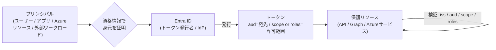
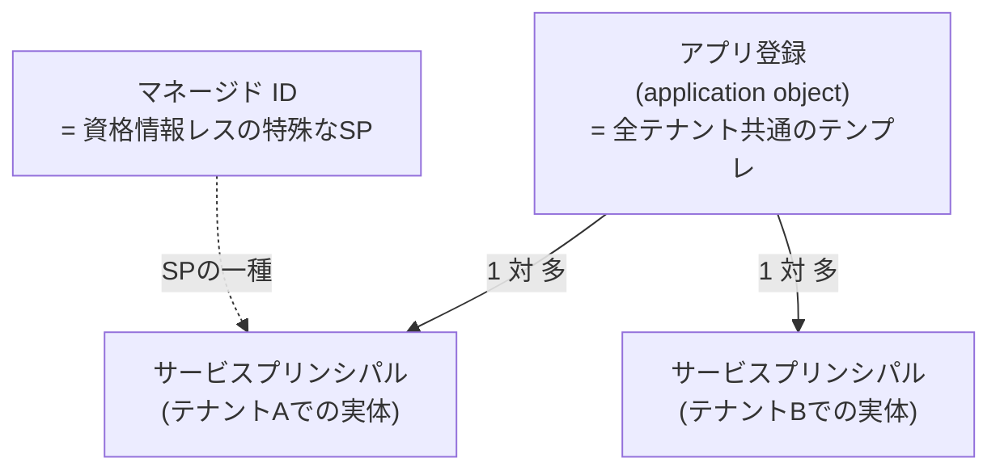
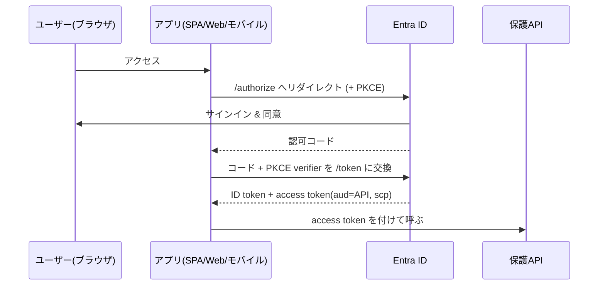
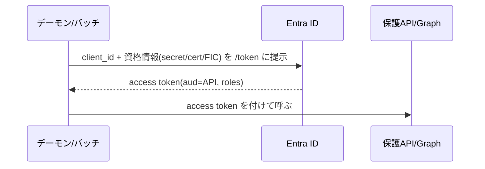
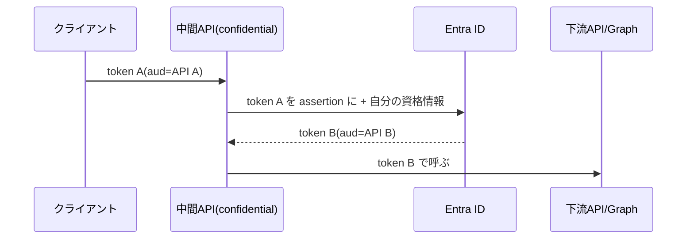
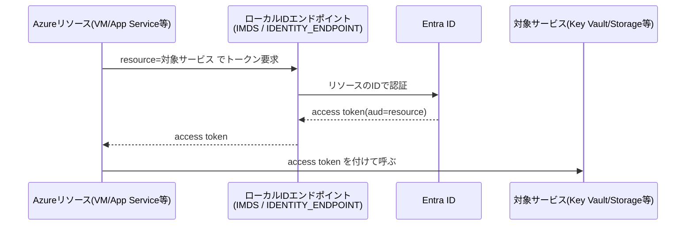
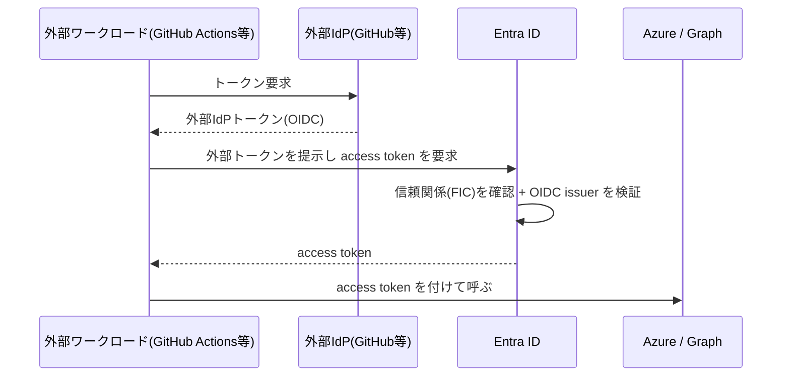
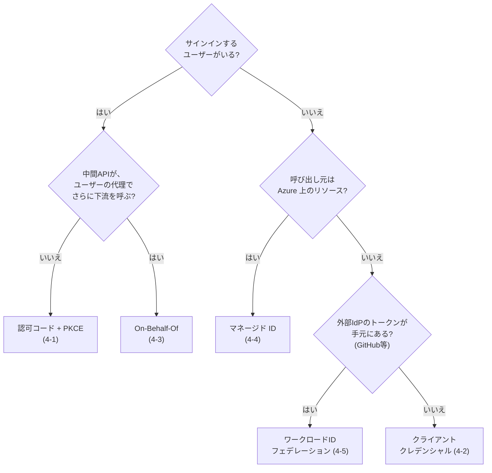

## この記事の狙い

OAuth 2.0 の認可コードフロー、アクセストークン、`aud`（オーディエンス）や `scope` まではすでに知っている。そんな読者を前提に、**「Azure で Entra ID を使って認証する」と言われたときに頭の中に広げる地図**を作ります。

Azure / Entra の認証を調べると、「サインイン」「デーモン」「On-Behalf-Of」「マネージド ID」「ワークロード ID フェデレーション」と名前が次々に出てきて、別々の技術が無秩序に並んでいるように見えます。でも実際には、**違うのは一点だけ**です。

> **誰が呼ぶのか。**

この記事のゴールは網羅リファレンスではありません。次の3つに絞ります。

1. Entra 認証は結局「**何をしている**」のか（共通の幹）
2. なぜフローが**何種類もある**のか、どれを選ぶかは何で決まるのか
3. 主体ごとの**典型・制約・注意点**は何か

実装の軸は Microsoft Entra ID（旧 Azure AD）に置きます。具体的な適用例（SPA→API→Graph の委任チェーン、マネージド ID、GitHub Actions の OIDC デプロイ、デーモン）は、密度を保つために別記事に切り出しました。本編で地図を手に入れてから読むと、すっと入るはずです。

- 👉 具体例編：**[Azure × Entra 認証の具体例 ── 4つの典型パターンをみっちり](https://zenn.dev/)**（同シリーズ。公開後にリンク差し替え）

:::message
本文では概念理解のために生の挙動やパラメータに触れますが、実運用では手書きせず MSAL / Microsoft.Identity.Web / Azure.Identity などの公式ライブラリを使うのが前提です。
:::

---

## 1. 一枚の地図 ── Entra 認証の共通の幹

まず幹を1本立てます。Azure / Entra の認証は、フローの名前が何であれ、次の一連の流れに還元できます。

言葉にすると、こうです。

> **あるプリンシパルが、ある資格情報で身元を証明し、宛先（`aud`）と許可範囲（`scope` または `roles`）を持つトークンを Entra から受け取り、保護リソースがそのトークンを検証する。**

Entra ID は、この中央に座る**トークン発行者（Identity Provider）**です。公式は Entra をこう位置づけています。

> Microsoft Entra ID is a centralized identity provider in the cloud.
> （Microsoft Entra ID は、クラウド上の中央集権的な識別プロバイダーである）
> ― [Authentication vs. authorization](https://learn.microsoft.com/en-us/entra/identity-platform/authentication-vs-authorization)

認証（authn）と認可（authz）を Entra という1か所に委譲するからこそ、SSO（シングルサインオン）や条件付きアクセス、MFA がアプリ横断で効きます。逆に言うと、**個々のフローは「この幹の、どのパラメータを誰がどう埋めるか」の違いにすぎません**。

そして、Microsoft identity platform 上のフローはすべて業界標準に乗っています。

> The Microsoft identity platform supports authentication for various modern app architectures, all of them based on industry-standard protocols OAuth 2.0 or OpenID Connect.
> ― [Application types for the Microsoft identity platform](https://learn.microsoft.com/en-us/entra/identity-platform/v2-app-types)

この地図を持っておけば、新しい用語が出てきても「ああ、これは幹のどこを変えた枝か」と読み解けます。以降、幹を構成する**トークン**（2章）と**プリンシパルの入れ物**（3章）を押さえ、そのうえで**主体別の枝**（4章）へ進みます。

---

## 2. トークンの正体 ── ここを外すと地図が読めない

幹の中心はトークンです。Entra が出すトークンには大きく2種類あり、役割がはっきり違います。

| | ID トークン | アクセストークン |
|------|------|------|
| 何のため | **誰がサインインしたか**を、自分（クライアント）が確認する | **保護リソースを呼ぶ鍵** |
| 受け取る相手 | サインインさせたアプリ自身 | リソース（`aud` で示す宛先） |
| 中身の要点 | ユーザーの識別情報 | `aud`（宛先）、`scp`（scope）または `roles` |
| 典型的な検証 | 公開鍵で署名検証してユーザーを確定 | `iss`/`aud`/許可範囲を検証して認可 |

公式も、サインインの締めくくりは ID トークンの検証だと説明しています。

> You can ensure the user's identity by validating the ID token with a public signing key that is received from the Microsoft identity platform.
> ― [Application types for the Microsoft identity platform](https://learn.microsoft.com/en-us/entra/identity-platform/v2-app-types)

### 許可範囲は `scope` か `roles` のどちらかで表現される

ここが地図のいちばん重要な分岐です。トークンに乗る「許可範囲」は2系統あります。

- **委任権限（delegated permission / `scp`）**：**ユーザーの代理**でリソースを呼ぶときの権限。「サインイン中のユーザーができることの範囲」を表す。
- **アプリケーション権限（application permission / app role / `roles`）**：**アプリ自身**の権限。ユーザーがいない経路で使う。

そして、両者は「**ユーザーがいるかどうか**」で排他的に決まります。

> When authenticating as an application (as opposed to with a user), you can't use delegated permissions because there is no user for your app to act on behalf of. You must use application permissions, also known as app roles, that are granted by an admin or by the API's owner.
> （アプリとして認証する場合、代理すべきユーザーがいないので委任権限は使えない。管理者や API 所有者が付与するアプリケーション権限＝app role を使わなければならない）
> ― [OAuth 2.0 client credentials flow](https://learn.microsoft.com/en-us/entra/identity-platform/v2-oauth2-client-creds-grant-flow)

つまり、**「誰が呼ぶか」を決めた瞬間に、使えるトークンの種類（`scp` か `roles` か）まで連動して決まります**。4章の枝分かれは、すべてこの一点から派生します。

---

## 3. プリンシパルの入れ物 ── アプリ登録・サービスプリンシパル・マネージド ID

幹のもう一方の端、「プリンシパル」を Entra はどう管理しているのか。ここを整理すると、後で出てくる用語が混乱しなくなります。

- **アプリ登録（application object）**：アプリの**グローバルな定義**。「このアプリはどんな権限を要求し、どんなリダイレクト URI を持つか」のテンプレート。

  > An application object has: A one-to-one relationship with the software application, and a one-to-many relationship with its corresponding service principal objects.
  > ― [Apps & service principals in Microsoft Entra ID](https://learn.microsoft.com/en-us/entra/identity-platform/app-objects-and-service-principals)

- **サービスプリンシパル**：そのアプリの、**各テナントでの実体**。「このテナントで実際に何ができるか・誰がアクセスできるか」を定義します。リソースにアクセスする主体は、ユーザーも含めて必ず何らかの security principal で表されます。

- **マネージド ID**：資格情報の管理が不要な、**特殊なサービスプリンシパル**。

  > A managed identity is a special type of service principal that eliminates the need for developers to manage credentials.
  > ― [What are workload identities?](https://learn.microsoft.com/en-us/entra/workload-id/workload-identities-overview)

そして、これらのサービスプリンシパルに権限が「効く」ようにするのが**同意（consent）**です。委任権限はユーザー（または管理者）の同意で、アプリケーション権限は管理者の同意で、サービスプリンシパルに付与されます（[Grant tenant-wide admin consent](https://learn.microsoft.com/en-us/entra/identity/enterprise-apps/grant-admin-consent)）。

ポイントは、**「アプリを作る」と「そのアプリがテナントで動ける」は別の操作**だということ。アプリ登録＝設計図、サービスプリンシパル＝実体、同意＝権限の有効化、と捉えてください。

---

## 4. 主体別の枝 ── 「誰が呼ぶか」で5パターン

ここからが本題です。幹（2〜3章）は同じまま、**「誰が呼ぶか」だけを変える**と、おなじみのフロー名が順番に現れます。各枝は「いつ使う／トークンの出どころ／注意点」で押さえます。

### 4-1. 人間ユーザーがサインインする ── 認可コードフロー + PKCE（委任）

最も基本の枝。ブラウザのようなリダイレクト可能な user-agent を起点に、**ユーザーの委任権限**のトークンを得ます。

公式は、対象アプリ種別と PKCE 併用を明示しています。

> Use the auth code flow paired with Proof Key for Code Exchange (PKCE) and OpenID Connect (OIDC) to get access tokens and ID tokens in these types of apps: Single-page web application (SPA), Standard (server-based) web application, Desktop and mobile apps.
> ― [OAuth 2.0 authorization code flow](https://learn.microsoft.com/en-us/entra/identity-platform/v2-oauth2-auth-code-flow)

- **トークンの出どころ**：`/authorize` → `/token`（認可コードの引き換え）。
- **注意点**：SPA はリダイレクト URI を `spa` タイプにし、PKCE を使う。implicit フローは後方互換のために残っていますが、**推奨されません**（同上）。

### 4-2. アプリ自身で呼ぶ ── クライアントクレデンシャル（アプリ権限）

ユーザーが一切いない経路。アプリが**自分の資格情報**で身元を証明し、`roles`（アプリケーション権限）で動きます。

- **トークンの出どころ**：`/token`（アプリ自身の資格情報を提示）。
- **注意点**：資格情報をソースに埋めない。confidential client が前提です。

  > Because the application's own credentials are being used, these credentials must be kept safe. Never publish that credential in your source code, embed it in web pages, or use it in a widely distributed native application.
  > ― [OAuth 2.0 client credentials flow](https://learn.microsoft.com/en-us/entra/identity-platform/v2-oauth2-client-creds-grant-flow)

### 4-3. ユーザーの代理で下流を呼ぶ ── On-Behalf-Of（委任を引き回す）

中間層の Web API が、自分宛てに来たユーザートークンを、**下流 API 宛ての新しいトークンに交換**して、ユーザーの委任を保ったまま引き回す枝です。

これは「新しい認証」ではなく、**確立済みの委任を別の宛先（`aud`）向けに再発行する操作**です。詳細・落とし穴・RFC 8693 との違いは、独立記事にまとめてあります。

- 👉 **[OBO（On-Behalf-Of）フロー再入門](https://zenn.dev/)**（既存記事 `obo_flow.md`。公開後にリンク差し替え）

### 4-4. Azure リソースが呼ぶ ── マネージド ID（資格情報レス）

ここから Azure らしさが出ます。VM / App Service / Function などの **Azure リソース自身**にプリンシパルを与え、**シークレットを一切持たずに**トークンを取得する枝です。

マネージド ID には2種類あります。

- **システム割り当て（system-assigned）**：1つのリソースに紐づき、ライフサイクルを共有する。
- **ユーザー割り当て（user-assigned）**：独立したリソースとして作り、複数のリソースで共有できる。

トークンは Azure 上の**ローカルなエンドポイント**から取得し、`resource` パラメータがそのまま `aud` になります。

> `resource` ... indicating the App ID URI of the target resource. It also appears in the `aud` (audience) claim of the issued token.
> ― [Use managed identities on a VM to acquire access token](https://learn.microsoft.com/en-us/entra/identity/managed-identities-azure-resources/how-to-use-vm-token)

- **トークンの出どころ**：Azure のローカル ID エンドポイント（後述の通り Azure 上でしか到達できない）。
- **注意点**：`aud` を取り違えると弾かれる、ローカル開発では使えない、など。サービス差異として6章でまとめます。

### 4-5. 外部ワークロード／別 IdP から呼ぶ ── ワークロード ID フェデレーション

最後の枝は、**Azure の外**で動くワークロード（GitHub Actions、他クラウド、外部 Kubernetes など）が、自分が持っている**別 IdP のトークン**を Entra のトークンに**交換**して呼ぶパターンです。シークレットは不要。

仕組みの核心はこうです。

> Once that trust relationship is created, your external software workload exchanges trusted tokens from the external IdP for access tokens from Microsoft identity platform.
> ― [Workload identity federation concepts](https://learn.microsoft.com/en-us/entra/workload-id/workload-identity-federation)

- **トークンの出どころ**：外部 IdP のトークンを `/token` で Entra のトークンに交換。
- **信頼関係（FIC: Federated Identity Credential）**：アプリ登録、または user-assigned マネージド ID に設定する。
- **注意点**：マネージド ID を FIC の資格情報として使う場合は**上限20件**（[Managed identities overview](https://learn.microsoft.com/en-us/entra/identity/managed-identities-azure-resources/overview)）。

---

## 5. どれを選ぶか ── 判断フロー

5つの枝は、たった数問で振り分けられます。

この順で問うと、公式のシナリオ対応表（[App types and authentication flows](https://learn.microsoft.com/en-us/entra/identity-platform/authentication-flows-app-scenarios)）ともきれいに対応します。迷ったら「**まずユーザーの有無、次に実行場所、最後に資格情報の出どころ**」の順で考えてください。

:::message
device code フロー（ブラウザを持たない端末）や username/password（ROPC）も存在しますが、前者は特殊端末向け、後者はレガシー扱いです。地図の隅に置いておけば十分で、新規設計では基本選びません。
:::

---

## 6. サービス差異で「注意のいる」点だけ

「Azure で Entra 認証」のメンタルモデルが崩れやすいのは、**サービスごとの実装差**に出くわしたときです。ここでは、地図を歪ませない程度に**引っかかりやすい4点だけ**挙げます。

### 6-1. 組み込み認証（Easy Auth）── 認証を「前段」が肩代わりする

App Service / Azure Functions / Container Apps には、**OAuth フロー自体をプラットフォームが代行**する組み込み認証（通称 Easy Auth）があります。アプリコードに到達する前に認証を済ませ、結果を HTTP ヘッダで渡します。

> App Service intercepts unauthenticated requests and redirects to the identity provider ... After authentication, App Service adds the `X-MS-CLIENT-PRINCIPAL` header.
> ― [Configure App Service authentication (EasyAuth)](https://learn.microsoft.com/en-us/azure/data-api-builder/concept/security/authenticate-easy-auth)

つまり、自前で JWT 検証を書かずに「サインイン済みのユーザー」を受け取れます。アプリは `X-MS-CLIENT-PRINCIPAL`（Base64 の JSON）等のヘッダから claims を読みます（[Work with user identities](https://learn.microsoft.com/en-us/azure/app-service/configure-authentication-user-identities)）。Container Apps は App Service と同じ認証基盤ですが差異があります（[Container Apps authentication](https://learn.microsoft.com/en-us/azure/container-apps/authentication)）。

⚠️ **注意**：これらのヘッダは「Easy Auth を通った」前提で信頼されます。**Easy Auth を迂回してアプリに直接到達できる経路**があると、ヘッダ偽装で認証を素通りされます。

### 6-2. Azure リソース宛てトークンの `aud` は固定値

マネージド ID や SDK でトークンを取るとき、**対象サービスごとにリソース値（＝`aud`）が決まっています**。

| 対象サービス | リソース値 / `aud`（例） |
|------|------|
| Azure Resource Manager | `https://management.azure.com` |
| Key Vault | `https://vault.azure.net` |
| Storage | `https://storage.azure.com` |

`resource` / `scope` を取り違えると、トークンは取れても**受け側が `aud` 不一致で拒否**します（[how-to-use-vm-token](https://learn.microsoft.com/en-us/entra/identity/managed-identities-azure-resources/how-to-use-vm-token)）。「トークンは出ているのに 401」のときは、まず `aud` を疑ってください。

### 6-3. マネージド ID はローカルで動かない

マネージド ID のトークン取得エンドポイントは **Azure 上からしか到達できません**（VM などは `169.254.169.254`、App Service は環境変数 `IDENTITY_ENDPOINT` / `IDENTITY_HEADER`）。手元の PC では IMDS に繋がらず失敗します。

対策は、`Azure.Identity` の `DefaultAzureCredential` を使うこと。これは**Azure 上ではマネージド ID、ローカルでは開発者の資格情報**へ自動でフォールバックします（探索順は `EnvironmentCredential` → `WorkloadIdentityCredential` → `ManagedIdentityCredential` → 各種開発ツール資格情報、[DefaultAzureCredential Class](https://learn.microsoft.com/en-us/dotnet/api/azure.identity.defaultazurecredential)）。

### 6-4. Key Vault は RBAC とアクセスポリシーが別系統

マネージド ID から Key Vault を読むとき、権限付与には2つの系統があります。**RBAC を有効化するとアクセスポリシーは無効**になります。RBAC なら、マネージド ID に `Key Vault Secrets User` などのロールを割り当てます（[Key Vault references](https://learn.microsoft.com/en-us/azure/app-service/app-service-key-vault-references)）。新規は RBAC が基本です。

---

## 7. 具体例は別記事で

ここまでで地図はできました。「誰が呼ぶか → 資格情報 → トークンの `aud`/許可範囲」という幹で、5つの枝を読み解けるはずです。

実際の構成は枝の**組み合わせ**になります。たとえば「SPA でサインイン（4-1）→ 中間 API が OBO（4-3）→ Graph」のように。こうした重要パターンの適用例を、認証の流れ・関連する留意事項・関連サービス・別構成まで含めて、別記事でみっちり扱います。

- 👉 **[Azure × Entra 認証の具体例 ── 4つの典型パターンをみっちり](https://zenn.dev/)**（公開後にリンク差し替え）
  1. SPA → BFF → 業務 API → Microsoft Graph（委任チェーン）
  2. Azure 上の App / Function → Key Vault / Storage（マネージド ID）
  3. GitHub Actions → Azure デプロイ（ワークロード ID フェデレーション）
  4. デーモン / バッチ → Microsoft Graph（クライアントクレデンシャル）

---

## 8. まとめ ── 3点を順に問う

「Azure で Entra を使って認証」は、次の3点を順に問えば、どのフローでも筋が通ります。

1. **誰が呼ぶのか？** ── ユーザー / アプリ自身 / Azure リソース / 外部ワークロード。これで枝が決まる。
2. **資格情報は何か？** ── ユーザーのサインイン / シークレット・証明書 / マネージド ID / フェデレーション。
3. **トークンの `aud` と許可範囲は？** ── 宛先は誰で、`scp`（委任）か `roles`（アプリ権限）か。

そして幹は1本。**Entra が、宛先付きのトークンを発行し、リソースがそれを検証する。** トークンの横流しでもなければ、フローごとに別世界があるわけでもありません。地図さえ持っていれば、新しい用語は枝として位置づけられます。

---

## 参考リンク

- [Microsoft identity platform overview](https://learn.microsoft.com/en-us/entra/identity-platform/v2-overview)
- [Authentication vs. authorization](https://learn.microsoft.com/en-us/entra/identity-platform/authentication-vs-authorization)
- [Application types for the Microsoft identity platform](https://learn.microsoft.com/en-us/entra/identity-platform/v2-app-types)
- [App types and authentication flows](https://learn.microsoft.com/en-us/entra/identity-platform/authentication-flows-app-scenarios)
- [OAuth 2.0 authorization code flow](https://learn.microsoft.com/en-us/entra/identity-platform/v2-oauth2-auth-code-flow)
- [OAuth 2.0 client credentials flow](https://learn.microsoft.com/en-us/entra/identity-platform/v2-oauth2-client-creds-grant-flow)
- [On-Behalf-Of flow](https://learn.microsoft.com/en-us/entra/identity-platform/v2-oauth2-on-behalf-of-flow)
- [Apps & service principals in Microsoft Entra ID](https://learn.microsoft.com/en-us/entra/identity-platform/app-objects-and-service-principals)
- [Access token claims reference](https://learn.microsoft.com/en-us/entra/identity-platform/access-token-claims-reference)
- [Managed identities for Azure resources](https://learn.microsoft.com/en-us/entra/identity/managed-identities-azure-resources/overview)
- [Use managed identities on a VM to acquire access token](https://learn.microsoft.com/en-us/entra/identity/managed-identities-azure-resources/how-to-use-vm-token)
- [Workload identity federation concepts](https://learn.microsoft.com/en-us/entra/workload-id/workload-identity-federation)
- [Configure App Service authentication (user identities)](https://learn.microsoft.com/en-us/azure/app-service/configure-authentication-user-identities)
- [DefaultAzureCredential Class](https://learn.microsoft.com/en-us/dotnet/api/azure.identity.defaultazurecredential)
