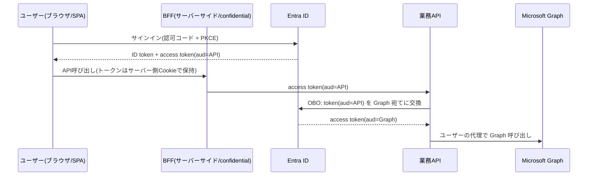
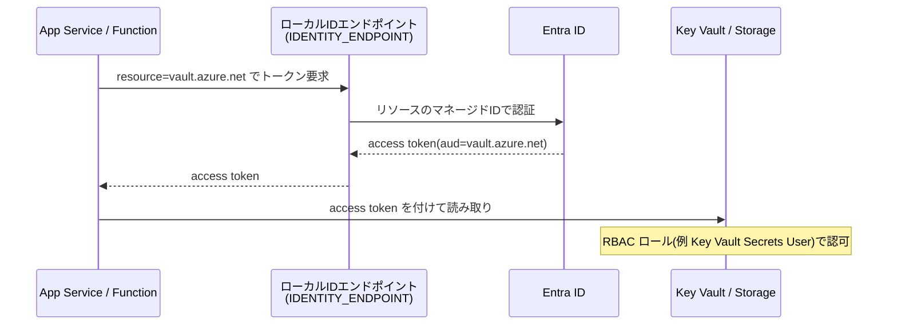
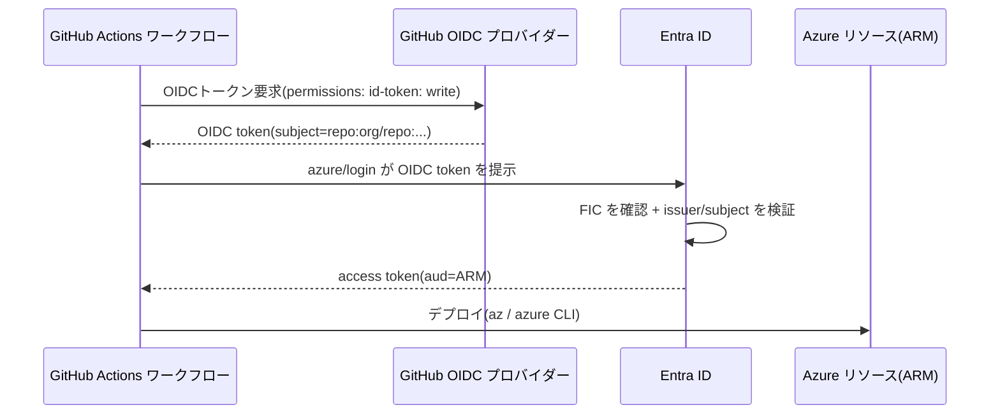
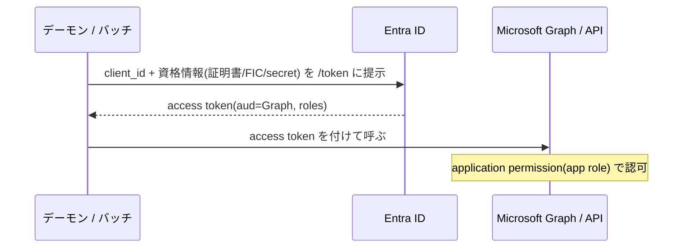

## この記事の狙い

姉妹記事 **[Azure × Entra ID 認証の歩き方 ── 「誰が呼ぶか」で組み立てる一枚の地図](https://zenn.dev/)** で、Azure / Entra 認証の「幹」と5つの「枝」を整理しました。本編が地図なら、こちらは**現地踏査**です。

実際の構成は、枝の**組み合わせ**で決まります。本記事では、実務で頻出する4つの典型パターンを、それぞれ次の5点でみっちり扱います。

- **(a) 構成図**（Mermaid）
- **(b) 認証フロー**（どの枝の組み合わせか・トークンの `aud`/許可範囲）
- **(c) 関連する留意事項**（ハマりどころ・セキュリティ）
- **(d) 関連サービス**
- **(e) 考えられる別構成**

前提知識（OAuth/OIDC の基礎、地図の5つの枝）は本編に置いています。枝の番号（4-1〜4-5）は本編の章番号です。

:::message
実装は手書きせず、MSAL / Microsoft.Identity.Web / Azure.Identity などの公式ライブラリを使うのが前提です。本文は中身を理解するための解説です。
:::

---

## パターン1：SPA → BFF → 業務 API → Microsoft Graph（委任チェーン）

「ユーザーがサインインする Web アプリが、そのユーザーの権限で Microsoft Graph を読む」。最も多い構成であり、**委任（delegation）を最後まで保つ**のが肝です。

### (a) 構成図

### (b) 認証フロー

2つの枝の組み合わせです。

1. **入口＝認可コード + PKCE（4-1）**：ユーザーがサインインし、業務 API 宛て（`aud`=API、`scp`=委任）のトークンを得る。
2. **延長＝On-Behalf-Of（4-3）**：業務 API が、自分宛てに来たトークンを **Graph 宛てのトークンに交換**し、ユーザーの委任を保ったまま Graph を呼ぶ。

ここで「ユーザーの委任」が `aud`=API → `aud`=Graph と受け継がれます。アプリ自身の権限ではなく、**サインイン中のユーザーができる範囲**で Graph を読む点が重要です。

### (c) 関連する留意事項

- **ブラウザにトークンを置くリスク**：SPA の `localStorage` などにアクセストークンを保存するのは脆弱です。公式も明確に避けるよう促しています。

  > Insecure handling of access tokens, such as ... storing access tokens directly in the browser using local storage, session storage, or web workers.
  > ― [Configure JWT bearer authentication in ASP.NET Core](https://learn.microsoft.com/en-us/aspnet/core/security/authentication/configure-jwt-bearer-authentication)

  これを避けるのが **BFF（Backend for Frontend）パターン**です。トークンはサーバー側で保持し、ブラウザには（HttpOnly Cookie の）セッションだけを渡します。

- **SPA は confidential client になれない**：だから OBO の起点にはなれません。OBO はシークレットを安全に保持できるサーバー側（BFF / 業務 API）から行います（理由は本編 4-2・4-3 と OBO 記事参照）。

- **アプリ登録は「認証用」と「認可用」を分ける**：SPA 用と API 用でアプリ登録を2つに分けるのが定石です。SPA 側を認証専用にし、Graph 等のスコープは API 側にだけ露出させると、権限がブラウザに漏れません。

  > SPA app reg will be used for authentication only while API app reg will be used for authorization.
  > ― [One vs Two App Registrations (Microsoft Q&A)](https://learn.microsoft.com/en-us/answers/questions/1421814/one-vs-two-app-registrations-for-an-app-with-front)

  逆にアプリ登録を1つにまとめると、SPA から直接あらゆる Graph スコープを要求できてしまい、OBO の意味が薄れます。

### (d) 関連サービス

- **API Management（APIM）**：クライアントと BFF の間に置き、JWT 検証・クレーム検査・ログ集約を前段で行えます。トークンをそのまま透過させる構成（クライアントが直接バックエンドの `aud` 宛てトークンを提示）も取れます。

  > API Management is configured with policies to validate the JSON Web Tokens and rejects requests that lack a token or contain invalid claims.
  > ― [Backends for Frontends pattern (Azure Architecture Center)](https://learn.microsoft.com/en-us/azure/architecture/patterns/backends-for-frontends)

- **Microsoft.Identity.Web**：OBO を含む委任呼び出しを `IDownstreamApi` で簡潔に書けます。BFF を YARP（リバースプロキシ）で組む構成も公式サンプルにあります（[Secure a Blazor Web App with Entra ID](https://learn.microsoft.com/en-us/aspnet/core/blazor/security/blazor-web-app-with-entra)）。

- **App Service の Easy Auth**：サインイン部分（4-1）をプラットフォームに任せる選択肢（本編 6-1）。

### (e) 考えられる別構成

- **SPA が Graph を直接呼ぶ**：委任トークンを SPA から直接取得して Graph を叩く。シンプルですが、権限がブラウザに露出し、BFF のような集中制御ができません。読み取り少量・低リスクなら選択肢。
- **APIM でトークン検証を前段化**：各バックエンドで JWT 検証を書かず、APIM のポリシーに寄せる。マイクロサービスが増えるほど効きます。
- **トークン交換を OBO 以外で**：標準の OAuth 2.0 Token Exchange（RFC 8693）でも委任の引き回しは可能ですが、Entra なら Microsoft.Identity.Web の OBO が最も簡単（[JWT bearer auth in ASP.NET Core](https://learn.microsoft.com/en-us/aspnet/core/security/authentication/configure-jwt-bearer-authentication)）。

---

## パターン2：Azure 上の App / Function → Key Vault / Storage（マネージド ID）

「Azure 上で動くアプリが、シークレットを一切持たずに他の Azure サービスを呼ぶ」。**資格情報レス**の王道です。

### (a) 構成図

### (b) 認証フロー

枝は**マネージド ID（4-4）**単独です。

- アプリは Azure 上のローカル ID エンドポイントに `resource`（=対象サービス）を指定してトークンを要求。`resource` がそのまま `aud` になります（本編 6-2）。
- トークンの宛先（`aud`）は、Key Vault なら `https://vault.azure.net`、ARM なら `https://management.azure.com`。
- 認可は**Azure RBAC**で、マネージド ID（サービスプリンシパルの一種）にロールを割り当てます。

公式チュートリアルも、コードからは `DefaultAzureCredential()` 一発でマネージド ID を使う形を示しています。

> This code uses DefaultAzureCredential() to authenticate to Key Vault, which uses a token from managed identity to authenticate.
> ― [Use Azure Key Vault with an Azure web app in .NET](https://learn.microsoft.com/en-us/azure/key-vault/general/tutorial-net-create-vault-azure-web-app)

### (c) 関連する留意事項

- **ローカルで動かない**：ローカル開発では IMDS に繋がりません（本編 6-3）。`DefaultAzureCredential` を使えば、Azure 上はマネージド ID、ローカルは開発者資格情報へ自動フォールバックします（探索順は `Environment` → `WorkloadIdentity` → `ManagedIdentity` → 各種開発ツール、[DefaultAzureCredential Class](https://learn.microsoft.com/en-us/dotnet/api/azure.identity.defaultazurecredential)）。

- **system-assigned か user-assigned か**：system-assigned はリソース作成後にしか存在せず、「リソースを作る→ID ができる→RBAC を付ける」の順になり、IaC で**鶏と卵**問題が起きがちです。**user-assigned を先に作って RBAC を付け、リソースにアタッチ**するとこれを避けられ、複数リソースで同じ ID を共有もできます。

- **Key Vault の認可系統**：RBAC とアクセスポリシーは別物。RBAC を有効化するとアクセスポリシーは無効になり、マネージド ID に `Key Vault Secrets User` 等のロールを割り当てます（本編 6-4、[Key Vault references](https://learn.microsoft.com/en-us/azure/app-service/app-service-key-vault-references)）。

- **`aud` 取り違え**：「トークンは取れるが 401」の典型。要求した `resource`/`scope` と、呼ぶ相手の `aud` を一致させる。

### (d) 関連サービス

- **Key Vault references**：App Service / Functions / Logic Apps では、アプリ設定や接続文字列に Key Vault 参照を書くと、**コードを書かずに**マネージド ID 経由でシークレットが注入されます。

  > When an app setting or connection string is a Key Vault reference, your application code can use it like any other app setting.
  > ― [Use Key Vault references as App Settings](https://learn.microsoft.com/en-us/azure/app-service/app-service-key-vault-references)

- **Entra 認証対応サービス全般**：Azure SQL、Storage なども Entra 認証を受けられ、接続文字列のパスワードをマネージド ID に置き換えられます（[Managed identities overview](https://learn.microsoft.com/en-us/entra/identity/managed-identities-azure-resources/overview)）。

### (e) 考えられる別構成

- **Key Vault references で完全コードレス**：シークレット取得をプラットフォームに任せ、アプリは普通のアプリ設定として読む。
- **user-assigned マネージド ID を共有**：複数の App / Function に同じ ID を付け、RBAC を1か所で管理。
- **マネージド ID を FIC 化（パターン4と接続）**：マネージド ID を Entra アプリのフェデレーション資格情報として使い、シークレットレスの client credentials を実現（本編 4-5、[Managed identities overview](https://learn.microsoft.com/en-us/entra/identity/managed-identities-azure-resources/overview)）。

---

## パターン3：GitHub Actions → Azure デプロイ（ワークロード ID フェデレーション）

「CI/CD パイプラインが、シークレットを GitHub に置かずに Azure へデプロイする」。**シークレットレス CI/CD**の定番です。

### (a) 構成図

### (b) 認証フロー

枝は**ワークロード ID フェデレーション（4-5）**です。

1. ワークフローが GitHub の OIDC プロバイダーからトークンを取得（`permissions: id-token: write` が必要）。
2. `azure/login@v2` がその OIDC トークンを Entra に提示。
3. Entra が**フェデレーション資格情報（FIC）**の信頼関係を確認し、`issuer`（GitHub）と `subject`（リポジトリ/環境）を検証して、Azure 用のアクセストークンを発行。

`subject` はワークフローの実行文脈で決まります。

> _Subject_ identifies the GitHub organization, repo, and environment for your GitHub Actions workflow. ... For Jobs tied to an environment: `repo:<Organization/Repository>:environment:<Name>`
> ― [Configure an app to trust an external IdP](https://learn.microsoft.com/en-us/entra/workload-id/workload-identity-federation-create-trust)

GitHub 側には `AZURE_CLIENT_ID` / `AZURE_TENANT_ID` / `AZURE_SUBSCRIPTION_ID`（=識別子のみ、**シークレットではない**）を置きます（[Authenticate to Azure from GitHub Actions by OIDC](https://learn.microsoft.com/en-us/azure/developer/github/connect-from-azure-openid-connect)）。

### (c) 関連する留意事項

- **シークレット運用が消える**：従来のサービスプリンシパル + クライアントシークレットは、ローテーションと漏洩リスクが付きまといます。FIC はその管理自体を不要にします。

- **`subject` / `issuer` の厳密一致**：FIC の `subject` がワークフローの実行文脈（ブランチ / 環境 / PR）と一致しないと交換が失敗します。ブランチ別・環境別に FIC を分けるのが基本。

- **FIC をどこに付けるか**：アプリ登録（サービスプリンシパル）か、user-assigned マネージド ID のどちらにも設定できます（[同上](https://learn.microsoft.com/en-us/azure/developer/github/connect-from-azure-openid-connect)）。

- **公開リポジトリは環境シークレット**：レビュー承認を要求する environment と組み合わせると安全性が上がります（[同上](https://learn.microsoft.com/en-us/azure/app-service/deploy-github-actions)）。

### (d) 関連サービス

- **`azure/login` / `azure/cli` アクション**：ログイン後に Azure CLI / PowerShell でデプロイ。
- **App Service Deployment Center**：OIDC + user-assigned ID を使うワークフローを自動生成できます（[Deploy to App Service with GitHub Actions](https://learn.microsoft.com/en-us/azure/app-service/deploy-github-actions)）。

### (e) 考えられる別構成

- **サービスプリンシパル + シークレット**（非推奨）：従来方式。動くがシークレット管理が残る。
- **user-assigned マネージド ID を FIC 主体に**：アプリ登録の代わりにマネージド ID を信頼主体にする（[OIDC connect doc](https://learn.microsoft.com/en-us/azure/developer/github/connect-from-azure-openid-connect)）。
- **他 CI / 他クラウドへ横展開**：同じ FIC の考え方は、外部 Kubernetes・他クラウドの OIDC でも使えます（本編 4-5）。

---

## パターン4：デーモン / バッチ → Microsoft Graph（クライアントクレデンシャル）

「ユーザーが介在しないバックグラウンド処理が、アプリ自身の権限で Graph や API を呼ぶ」。**ユーザー不在**の経路です。

### (a) 構成図

### (b) 認証フロー

枝は**クライアントクレデンシャル（4-2）**です。

- ユーザーがいないので、使えるのは**アプリケーション権限（app role / `roles`）**だけ（本編 2章）。
- アプリは自分の資格情報で身元を証明し、`aud`=対象 API のトークンを得る。
- 認可は「アプリ自身が、その操作をしてよいか」で判断されます。

> When the app presents a token to a resource, the resource enforces that the app itself has authorization to perform an action since there is no user involved.
> ― [OAuth 2.0 client credentials flow](https://learn.microsoft.com/en-us/entra/identity-platform/v2-oauth2-client-creds-grant-flow)

### (c) 関連する留意事項

- **資格情報の種類**：クライアントシークレットより、**証明書**または**フェデレーション資格情報（FIC）**が望ましい。公式も「より高い保証レベルには証明書 / フェデレーション資格情報」と述べています（[client credentials flow](https://learn.microsoft.com/en-us/entra/identity-platform/v2-oauth2-client-creds-grant-flow)）。

- **管理者同意が必須**：アプリケーション権限は管理者の同意がないと効きません。

  > After you grant your application access to the resource API, it runs as a background service or daemon without a signed-in user. Application permissions are also known as app roles.
  > ― [Grant tenant-wide admin consent](https://learn.microsoft.com/en-us/entra/identity/enterprise-apps/grant-admin-consent)

- **権限が広くなりがち**：アプリケーション権限は「全ユーザーのメールを読める」のように広範になりやすい。最小権限を徹底し、付与済み権限は定期レビューを（[Review permissions granted to enterprise applications](https://learn.microsoft.com/en-us/entra/identity/enterprise-apps/manage-application-permissions)）。

### (d) 関連サービス

- **Microsoft Graph**：デーモンからの典型的な呼び先。アプリケーション権限（`Mail.Read` 等）を付与。
- **マネージド ID（Azure 上で動くなら）**：デーモンが Azure 上なら、シークレットを持つ代わりにマネージド ID を使う／FIC 化するのが筋（本編 4-4・4-5）。

### (e) 考えられる別構成

- **Azure 上なら マネージド ID 直接**：対象が Entra 認証対応の Azure サービスなら、client credentials すら不要でマネージド ID で済む。
- **マネージド ID を FIC にした client credentials**：Graph のように `aud` が固定の相手でも、マネージド ID を Entra アプリの FIC にすればシークレットレスにできる（[Managed identities overview](https://learn.microsoft.com/en-us/entra/identity/managed-identities-azure-resources/overview)）。
- **OBO に置き換え（ユーザー文脈が必要なら）**：本当は「特定ユーザーのデータ」を扱うなら、アプリ権限で全体を舐めるより、ユーザー委任 + OBO が最小権限に適うこともある（パターン1）。

---

## まとめ ── 組み合わせも幹は同じ

4パターンを見てきましたが、どれも本編の幹「**誰が呼ぶか → 資格情報 → トークンの `aud`/許可範囲**」の上に乗っています。

| パターン | 主体 | 主な枝 | 資格情報 | 許可範囲 |
|------|------|------|------|------|
| 1. SPA→API→Graph | ユーザー | 4-1 + 4-3(OBO) | サインイン+APIのシークレット | 委任(`scp`) |
| 2. App→Key Vault | Azureリソース | 4-4(MI) | マネージドID(なし) | RBAC ロール |
| 3. GitHub→Azure | 外部ワークロード | 4-5(WIF) | フェデレーション(なし) | RBAC ロール |
| 4. デーモン→Graph | アプリ自身 | 4-2 | 証明書/FIC/secret | アプリ権限(`roles`) |

実務で迷ったら、まず本編の判断フローで枝を決め、次に「Azure 上で動くか」「シークレットを消せるか（MI / FIC）」を重ねて考えると、自然と上の表のどこかに着地します。

---

## 参考リンク

- 姉妹記事：[Azure × Entra ID 認証の歩き方](https://zenn.dev/)（公開後にリンク差し替え）
- [Backends for Frontends pattern (Azure Architecture Center)](https://learn.microsoft.com/en-us/azure/architecture/patterns/backends-for-frontends)
- [Configure JWT bearer authentication in ASP.NET Core](https://learn.microsoft.com/en-us/aspnet/core/security/authentication/configure-jwt-bearer-authentication)
- [Secure a Blazor Web App with Microsoft Entra ID (BFF/YARP)](https://learn.microsoft.com/en-us/aspnet/core/blazor/security/blazor-web-app-with-entra)
- [One vs Two App Registrations (Microsoft Q&A)](https://learn.microsoft.com/en-us/answers/questions/1421814/one-vs-two-app-registrations-for-an-app-with-front)
- [Use Azure Key Vault with an Azure web app in .NET](https://learn.microsoft.com/en-us/azure/key-vault/general/tutorial-net-create-vault-azure-web-app)
- [Use Key Vault references as App Settings](https://learn.microsoft.com/en-us/azure/app-service/app-service-key-vault-references)
- [DefaultAzureCredential Class](https://learn.microsoft.com/en-us/dotnet/api/azure.identity.defaultazurecredential)
- [Authenticate to Azure from GitHub Actions by OpenID Connect](https://learn.microsoft.com/en-us/azure/developer/github/connect-from-azure-openid-connect)
- [Configure an app to trust an external identity provider](https://learn.microsoft.com/en-us/entra/workload-id/workload-identity-federation-create-trust)
- [Deploy to Azure App Service by using GitHub Actions](https://learn.microsoft.com/en-us/azure/app-service/deploy-github-actions)
- [OAuth 2.0 client credentials flow](https://learn.microsoft.com/en-us/entra/identity-platform/v2-oauth2-client-creds-grant-flow)
- [Grant tenant-wide admin consent](https://learn.microsoft.com/en-us/entra/identity/enterprise-apps/grant-admin-consent)
- [Review permissions granted to enterprise applications](https://learn.microsoft.com/en-us/entra/identity/enterprise-apps/manage-application-permissions)
