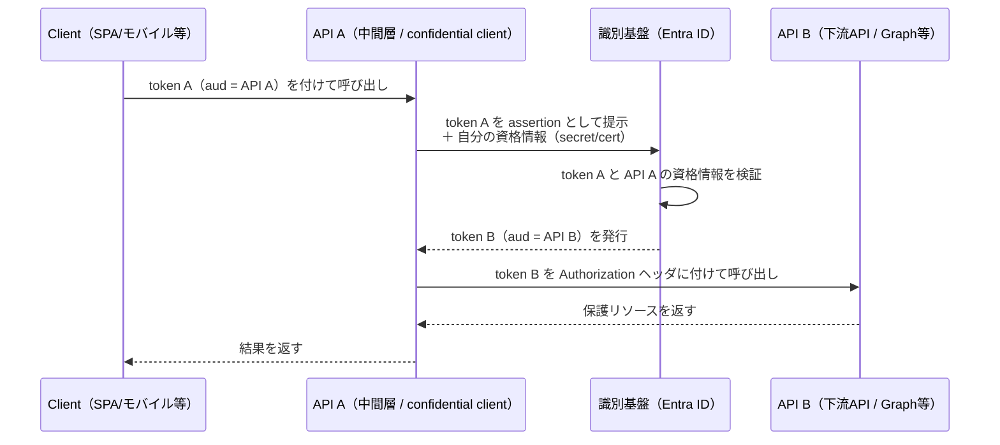

## この記事の狙い

OAuth 2.0 の認可コードフロー、アクセストークン、`aud`（オーディエンス）や `scope`、そして「トークン交換」という言葉まではすでに知っている。そんな読者を前提に、**On-Behalf-Of（OBO）フロー**を扱います。

ゴールは網羅的なリファレンスではありません。次の3つに絞ります。

1. OBO は結局「**何を何に交換している**」のか（かんたんなおさらい）
2. 従来の認証/認可フローと**何が決定的に違う**のか
3. **どこで使い、どこでは使わない/使えない**のか（制約とアンチパターン）

実装の軸は Microsoft Entra ID（旧 Azure AD）に置きますが、考え方そのものは汎用的に書きます。

:::message
本文で生の HTTP リクエストを示しますが、実運用では手書きせず MSAL / Microsoft.Identity.Web などの公式ライブラリを使うのが前提です。プロトコルの中身を理解するための解説として読んでください。
:::

---

## 0. トークンを「そのまま転送」したくなる瞬間

こういう構成を考えます。

- フロントエンド（client）が、サインインしたユーザーの権限で **API A** を呼ぶ
- API A は、処理の途中で **別の API B**（自社の別サービスや Microsoft Graph）を呼びたい

このとき自然に思いつくのが「クライアントから受け取ったアクセストークンを、そのまま API B に転送する」というやり方です。

しかしこれは、多くの場合**動きません。そして動いてはいけません**。なぜなら、アクセストークンには宛先（`aud` クレーム）があるからです。API A が受け取ったトークンは「API A 宛て」に発行されており、それを API B に持っていっても、API B は「これは自分宛てじゃない」と拒否すべきです。

公式ドキュメントは OBO をこう定義しています。

> The on-behalf-of (OBO) flow describes the scenario of a web API using an identity other than its own to call another web API.
> （OBO フローは、Web API が自分自身とは別の識別情報を使って別の Web API を呼ぶシナリオを指す）
> ― [Microsoft identity platform and OAuth 2.0 On-Behalf-Of flow](https://learn.microsoft.com/en-us/entra/identity-platform/v2-oauth2-on-behalf-of-flow)

「自分自身とは別の識別情報」＝ここでは**サインイン中ユーザーの識別情報**です。OBO は、トークンを横流しするのではなく、**ユーザーの委任（delegation）を保ったまま、API B 宛ての新しいトークンに作り直す**仕組みです。

---

## 1. かんたんなおさらい：OBO は「aud 付きトークンの交換」

OBO の流れを図にすると、こうなります。



公式の手順をそのまま要約すると次の5ステップです（[OBO doc](https://learn.microsoft.com/en-us/entra/identity-platform/v2-oauth2-on-behalf-of-flow)）。

1. クライアントが token A（`aud` = API A）を付けて API A を呼ぶ
2. API A が識別基盤のトークンエンドポイントに対し、token A を提示して「API B 用のトークンが欲しい」と要求する
3. 識別基盤が **API A の資格情報** と **token A** の両方を検証し、API B 用の token B を API A に発行する
4. API A は token B を Authorization ヘッダにセットして API B を呼ぶ
5. API B がリソースを返し、API A 経由でクライアントに戻る

ここで前提になっているのは、「クライアントはすでに認可コードフローなどでサインインを済ませ、API A 宛てのトークン（token A）を持っている」状態です。OBO は**そこから先、チェーンを延長する**ための仕組みだと捉えてください。

OAuth の用語で言えば、これは **delegation（委任）**です。「アプリ A 自身の権限」ではなく「ユーザーの権限を、アプリ A が代理して下流に引き回す」という意味づけが、token A から token B へと受け継がれます。

---

## 2. 最小スニペット：実際のトークン交換リクエスト

「何が交換されているか」を HTTP で具体的に見てみます。API A が識別基盤に投げるリクエストはこうです（[OBO doc](https://learn.microsoft.com/en-us/entra/identity-platform/v2-oauth2-on-behalf-of-flow) の例を整形）。

```http
POST /oauth2/v2.0/token HTTP/1.1
Host: login.microsoftonline.com
Content-Type: application/x-www-form-urlencoded

grant_type=urn:ietf:params:oauth:grant-type:jwt-bearer
&client_id=11112222-bbbb-3333-cccc-4444dddd5555
&client_assertion_type=urn:ietf:params:oauth:client-assertion-type:jwt-bearer
&client_assertion=<API A の証明書で署名した JWT>
&assertion=<クライアントから受け取ったアクセストークン token A>
&requested_token_use=on_behalf_of
&scope=<API B のスコープ>
```

キモになるパラメータは次の通りです。

| パラメータ | 役割 |
|------|------|
| `grant_type` | `urn:ietf:params:oauth:grant-type:jwt-bearer`。後述する RFC 8693 の token-exchange グラントとは**別物**である点に注意 |
| `assertion` | **交換に出すトークン本体**。クライアントから受け取った token A をそのまま入れる。このトークンの `aud` は「このリクエストをしているアプリ自身」でなければならない |
| `requested_token_use` | OBO では `on_behalf_of` 固定。「このリクエストは委任の引き回しだ」という宣言 |
| `client_assertion`（または `client_secret`） | **クライアント認証**。証明書ベースの JWT か、クライアントシークレットを使う |

最後の `client_assertion` / `client_secret` が重要です。OBO リクエストには**アプリ自身の資格情報が必須**で、これは「API A が confidential client（機密クライアント、＝秘密を安全に保持できるサーバーサイドのアプリ）であること」を前提にしています。この一点が、後述する「向かない場面」を決めます。

`assertion` についての公式の注意書きも引いておきます。

> This token must have an audience (`aud`) claim of the app making this OBO request. Applications can't redeem a token for a different app (for example, if a client sends an API a token meant for Microsoft Graph, the API can't redeem it using OBO. It should instead reject the token).
> （このトークンは OBO リクエストを行うアプリの `aud` クレームを持っていなければならない。アプリは別アプリ向けのトークンを引き換えできない。例えば Graph 宛てのトークンを受け取った API は、それを OBO に使えず、拒否すべきである）
> ― [OBO doc](https://learn.microsoft.com/en-us/entra/identity-platform/v2-oauth2-on-behalf-of-flow)

この「`aud` が自分宛てでなければ交換できない」が、OBO のいちばんよくある事故ポイントです（セクション6で再登場します）。

---

## 3. 従来フローと何が違うのか

読者がすでに知っているであろう2つのフローと並べると、OBO の位置づけがはっきりします。「**誰の権限で・誰が呼ぶ・トークンの宛先（aud）は誰か**」で比較します。

| 観点 | 認可コードフロー | クライアントクレデンシャル | OBO フロー |
|------|------|------|------|
| ユーザーの有無 | あり（サインインする） | **なし** | あり（既にサインイン済み） |
| 誰の権限で呼ぶか | ユーザーの委任権限 | アプリ自身の権限（app role） | ユーザーの委任権限（引き回し） |
| 必要な権限の種類 | delegated permission | application permission | delegated permission |
| トークンの出どころ | `/authorize`→`/token`（コード引換） | `/token`（自分の資格情報） | `/token`（受領トークンを交換） |
| 典型的な使い手 | フロント/クライアント | デーモン/バッチ | 中間層 Web API |
| チェーン上の位置 | 入口 | 単独（ユーザー不在の経路） | 入口の**続き**を延長 |

それぞれの公式定義を踏まえると、違いがより鮮明になります。

**クライアントクレデンシャルフロー**は、ユーザーを一切介在させません。

> permits a web service (confidential client) to use its own credentials, instead of impersonating a user, to authenticate when calling another web service.
> （Web サービスがユーザーになりすますのではなく、自分自身の資格情報を使って別の Web サービスを呼ぶことを許す）
> ― [client credentials flow](https://learn.microsoft.com/en-us/entra/identity-platform/v2-oauth2-client-creds-grant-flow)

そして、ユーザーがいないので委任権限は使えません。

> When authenticating as an application (as opposed to with a user), you can't use delegated permissions because there is no user for your app to act on behalf of. You must use application permissions.

**認可コードフロー**は逆に、ユーザーのサインインを起点にした委任です。リダイレクトできる user-agent（ブラウザ等）を必要とします。

ここから OBO の本質が見えます。OBO は「**新しい認証ではない**」ということです。認可コードフローで一度確立した「ユーザーの委任」という文脈を、**別の宛先（`aud`）向けに再発行する操作**にすぎません。だからこそ入口の token A が必要だし、その委任の中身（ユーザーは誰か、どの scope か）が下流まで引き継がれます。

---

## 4. RFC 8693（Token Exchange）との関係

「トークン交換」を知っている読者は、[RFC 8693 OAuth 2.0 Token Exchange](https://datatracker.ietf.org/doc/html/rfc8693) を思い浮かべるはずです。OBO と RFC 8693 は**概念は地続きですが、実装プロファイルは別**です。ここを混同しないことが、ドキュメントを読むときの事故防止になります。

RFC 8693 の汎用トークン交換は、こういう形をしています。

```http
POST /as/token.oauth2 HTTP/1.1
Content-Type: application/x-www-form-urlencoded

grant_type=urn:ietf:params:oauth:grant-type:token-exchange
&subject_token=<対象（誰の代理か）のトークン>
&subject_token_type=...
&actor_token=<行為主体（誰が代理するか）のトークン>   ← OPTIONAL
&requested_token_type=...
&audience=...
```

RFC 8693 の特徴を押さえておきます。

- `subject_token`：**誰の代理として**リクエストするか（対象＝subject）
- `actor_token`：**誰が代理するか**（行為主体＝actor、任意）
- **delegation と impersonation を区別**する。委任（actor が誰であるかを保持したまま代理）か、なりすまし（actor を消して subject になりきる）かを表現できる
- `may_act` / `act` クレーム：「この主体が、あの主体の代理を務めてよい」という認可を、トークン自身に埋め込める

一方、Entra ID の OBO は前述の通り **`jwt-bearer` グラント**（[RFC 7523](https://datatracker.ietf.org/doc/html/rfc7523) 系の assertion grant）で実装されており、`grant_type=...token-exchange` ではありません。パラメータ体系（`assertion` + `requested_token_use=on_behalf_of`）も RFC 8693 の `subject_token`/`actor_token` とは異なります。

まとめると、

- **概念レベル**（トークンを別のトークンに交換して委任を引き回す）は共通
- **プロトコルレベル**（grant_type やパラメータ）は別プロファイル

「OBO ＝ RFC 8693 の token-exchange」と早合点すると、パラメータが噛み合わずハマります。「OBO は token exchange の**一種の考え方**だが、Entra の実装は jwt-bearer グラント」と覚えておくのが安全です。

---

## 5. 向く場面 ── OBO が正解になるとき

OBO が素直にハマるのは、次の条件がそろうときです。

- 呼び出し元が **confidential client である中間層 Web API**（サーバーサイドで秘密を保持できる）
- その API が、**サインイン中ユーザーの権限で**さらに下流の API を呼びたい
- 下流でも「**誰のデータか**」を保ちたい（ユーザー単位の認可・最小権限・監査をチェーン全体で効かせたい）

アプリ種別の公式ドキュメントも、Web API が別の downstream API を呼ぶケースを OBO の典型として挙げています。

> web APIs can take advantage of the On-Behalf-Of (OBO) flow, which allows the web API to exchange an incoming access token for another access token to be used in outbound requests.
> ― [Application types for the Microsoft identity platform](https://learn.microsoft.com/en-us/entra/identity-platform/v2-app-types)

具体例:

- BFF（Backend for Frontend）や API ゲートウェイの**裏側の業務 API** が、ユーザーの代理で Microsoft Graph を叩いてプロフィールやメールを読む
- マイクロサービス構成で、フロント向け API が、ユーザーの委任権限を保ったまま内部サービスを呼ぶ

ポイントは、**「アプリの権限」ではなく「ユーザーの権限」で下流を呼びたい**という要件です。ここが application permission（クライアントクレデンシャル）との分岐点になります。

---

## 6. 向かない／使えない場面 ── ここを外すと事故る

OBO は便利ですが、適用範囲は意外と狭いです。次のケースでは避けるか、そもそも使えません。

### 6-1. SPA・モバイルなどパブリッククライアント → 使えない

OBO リクエストには `client_assertion` / `client_secret`、つまり**クライアント認証が必須**です。これは confidential client であることが前提。ブラウザ内の SPA やモバイルアプリに秘密を埋め込むことはできない（取り出されてしまう）ため、これらは OBO の呼び出し元になれません。ユーザーの代理で下流を呼びたいなら、**サーバーサイド（BFF など）を1段はさんで**そこから OBO する、が定石です。

### 6-2. ユーザー不在のデーモン/バッチ → クライアントクレデンシャルを使う

OBO は「受け取ったユーザートークン（token A）」を交換の種にします。バッチやデーモンのように**そもそもユーザーがいない**経路には、種になるトークンがありません。この場合は OBO ではなく、アプリ自身の権限で動くクライアントクレデンシャルフロー（application permission）が正解です。

### 6-3. 単純なパススルー（同じ aud・同じ下流） → 交換不要

OBO はあくまで「**別の `aud` 向けにトークンを作り直す**必要があるとき」の仕組みです。下流が同じ `aud` で受け付けられるなら、わざわざ交換する必要はありません。何でもかんでも OBO を噛ませると、トークンエンドポイントへの往復とスコープ管理が無駄に増えます。

### 6-4. `aud` 不一致トークンの流用 → 拒否される（典型エラー源）

セクション2で引いた通り、**自分宛てでないトークンは OBO に出せません**。「クライアントから Graph 宛てに発行されたトークンを、API がそのまま OBO の `assertion` に使う」といった誤用は通りません。受け取った API は、自分宛て（`aud` = 自分）でないトークンを**拒否すべき**です。OBO がうまくいかないときは、まず `assertion` に入れているトークンの `aud` を疑ってください。

### 6-5. 多段 OBO の濫用 → 設計の臭い

OBO で延ばしたチェーンの先で、さらに OBO、さらに OBO…と段を重ねることは技術的には可能ですが、段が深くなるほど scope・同意（consent）・トークン寿命の管理が指数的に複雑化します。多段が必要に見えたら、サービス境界の切り方やアクセスパターンを見直すサインだと考えたほうがよいです。

---

## 7. 最近の発展：AI エージェントの代理（Agent ID OBO）

OBO の「委任を引き回す」というモデルは、AI エージェント時代にも拡張されつつあります。Microsoft Entra Agent ID では、エージェントがサインイン中ユーザーの代理で動く場面に、標準の OBO が使われます。

> User delegation enables agent identities to operate on behalf of signed-in users using standard OAuth 2.0 On-Behalf-Of flows with agent-specific impersonation. The agent identity is assigned the necessary delegated permissions needed for OBO access. It requires consent from users to access their data.
> ― [Agent OAuth flows - On-behalf-of flow](https://learn.microsoft.com/en-us/entra/agent-id/agent-on-behalf-of-oauth-flow)

特徴をかいつまむと、

- エージェント識別情報に **delegated permission** を割り当て、**ユーザー同意**のうえで OBO する
- サポートされる grant types は `client_credential` / `jwt-bearer` / `refresh_token`
- クライアント資格情報には、シークレットや証明書に加えて **マネージド ID（Federated Identity Credential, FIC）** も使える

ここで重要なのは、「これまで人間ユーザー→API→下流API だった委任チェーンに、**エージェントという行為主体が挟まる**」という点です。OBO の delegation モデルがそのまま延長されているのが分かります。

この領域は発展途上で、仕様も動きます。深入りはしませんが、公式も**手書き実装を避け、承認済み SDK（Microsoft.Identity.Web や Agent ID SDK）を使うこと**を強く推奨しています。

---

## 8. まとめ：3問で判断する

OBO を使うべきかは、次の3つの問いでだいたい判断できます。

1. **呼び出し元は confidential client か？**（秘密を安全に保持できるサーバーサイドか）
   - No → OBO は使えない。サーバーサイドを1段はさむ
2. **ユーザーの委任権限を下流に引き回したいか？**（アプリ自身の権限ではなく）
   - No（アプリ権限でよい / ユーザー不在）→ クライアントクレデンシャル
3. **下流 API の `aud` は別か？**（受領トークンをそのまま使えないか）
   - No（同じ aud で通る）→ そもそも交換不要

3つすべて Yes なら、OBO が素直にハマる場面です。

OBO の正体は「**中間層 API が、自分宛てに来たユーザートークンを、下流 API 宛ての新しいトークンに、委任を保ったまま交換する**」こと。トークンの横流しではない、という一点を押さえておけば、違いも使いどころも落とし穴も一本の筋で理解できます。

---

## 参考リンク

- [Microsoft identity platform and OAuth 2.0 On-Behalf-Of flow](https://learn.microsoft.com/en-us/entra/identity-platform/v2-oauth2-on-behalf-of-flow)
- [Application types for the Microsoft identity platform](https://learn.microsoft.com/en-us/entra/identity-platform/v2-app-types)
- [OAuth 2.0 client credentials flow](https://learn.microsoft.com/en-us/entra/identity-platform/v2-oauth2-client-creds-grant-flow)
- [Microsoft identity platform and OAuth 2.0 authorization code flow](https://learn.microsoft.com/en-us/entra/identity-platform/v2-oauth2-auth-code-flow)
- [Agent OAuth flows - On-behalf-of flow (Microsoft Entra Agent ID)](https://learn.microsoft.com/en-us/entra/agent-id/agent-on-behalf-of-oauth-flow)
- [RFC 8693 - OAuth 2.0 Token Exchange](https://datatracker.ietf.org/doc/html/rfc8693)
- [RFC 7523 - JWT Profile for OAuth 2.0 Client Authentication and Authorization Grants](https://datatracker.ietf.org/doc/html/rfc7523)
