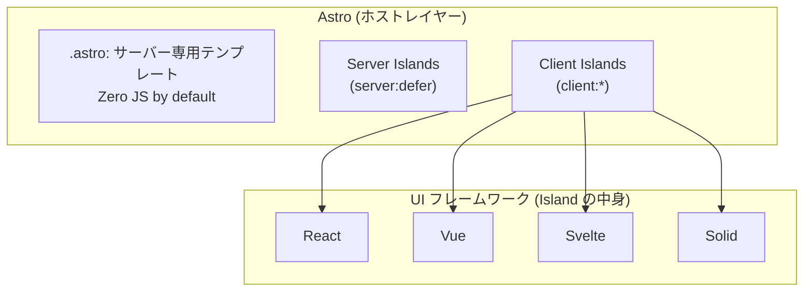

## この記事について

Astro は「高速」「Zero JS」「React・Vue・Svelte・Solid を載せられる」といった断片的な印象で語られがちなフレームワークである。一方で「なぜ Astro なのか」「Astro は何を解き、何を代償にしているのか」を**短く自分の言葉で説明できるか**と問われると即答に窮することは少なくない。

本記事は Astro の文法を一切説明しない。代わりに、React を「UI ランタイム」、Vue を「コンパイラ付きリアクティブランタイム」、Svelte を「コンパイラ × ランタイム反応性」、Solid を「消えるコンポーネント・残るリアクティビティ」として捉え直すのと同じ視点で、Astro を見直す。

ここで強調すべき点が 1 つある。**Astro は React/Vue/Svelte/Solid と同列に並ぶ選択肢ではない。** これらはいずれも「クライアントの状態空間の爆発をどう抽象化するか」という同じ問題に対する別々の賭けだったが、**Astro はその上のレイヤーに立ち、別の問題に答えるフレームワークである**。

本記事では、

1. Astro が他の UI フレームワークと**問題定義のレベルで何が違うのか**
2. Astro の賭けは何か — Islands / Zero JS by default / UI-agnostic / Server-first
3. その賭けと引き換えに、利用者が新しく引き受けた制約は何か
4. React/Vue/Svelte/Solid との位置関係はどう整理されるか

を、Astro 5.0(2024 年 12 月)時点の公式 Docs と公式ブログを根拠に整理する。日常で Astro を書いている人、あるいはこれから Astro を選定する人が、**原理のレベルで判断できる軸**を手に入れることを目的とする。

なお同じ視点で書いた個別記事として、[React](./react_framework_nature)、[Vue](./vue_framework_nature)、[Svelte](./svelte_framework_nature)、[Solid](./solid_framework_nature)、およびそれらの比較を整理した[インデックス記事](./framework_nature_index)がある。本記事は単独で読めるよう構成しているが、これらを併読すると Astro の位置づけがより明確になる。

---

## 1. 出発点の違い — 「状態空間の爆発」が起こらないなら何を解くのか

React/Vue/Svelte/Solid は、いずれも同じ命令的 UI コードから出発する。

```js
input.addEventListener('input', (e) => {
  state.query = e.target.value;
  if (state.query.length > 0) {
    clearButton.hidden = false;
  } else {
    clearButton.hidden = true;
  }
  // 影響する箇所を全部、自分で同期する
});
```

相互作用 N に対して整合性違反の組み合わせが O(N²) 以上に膨らむ — この「クライアント状態空間の爆発」をどう抽象化するかが、React/Vue/Svelte/Solid に共通する**出発点**である。

Astro はここから入らない。Astro が想定する主な対象は、**コンテンツ駆動サイト**である。

> Astro is the web framework for building content-driven websites including blogs, marketing, and e-commerce. If you need a website that loads fast with great SEO, then Astro is for you.
> ([astro.build/blog/astro-5/](https://astro.build/blog/astro-5/))

> 訳: Astro はブログ・マーケティング・EC のような**コンテンツ駆動サイト**を構築するためのウェブフレームワークである。ロードが速く SEO が良いサイトが必要なら、Astro は適している。

そして公式の設計原則として、次のように書かれている。

> Astro was designed to be less complex than other UI frameworks and languages. One big reason for this is that Astro was designed to render on the server, not in the browser. That means that you don't need to worry about hooks (React), stale closures (also React), refs (Vue), observables (Svelte), atoms, selectors, reactions, or derivations. There is no reactivity on the server, so all of that complexity melts away.
> ([docs.astro.build / Why Astro?](https://docs.astro.build/en/concepts/why-astro/))

> 訳: Astro は他の UI フレームワークや言語より**複雑性を減らす**ことを意図して設計された。大きな理由は、Astro が**ブラウザではなくサーバーでレンダリングする**ことを前提にしている点である。これにより、hooks(React)、stale closure(同じく React)、refs(Vue)、observables(Svelte)、atoms、selectors、reactions、derivations といった概念に悩む必要がなくなる。**サーバーには反応性が存在しない**ため、そうした複雑性はすべて溶けて消える。

これは強い宣言である。**React/Vue/Svelte/Solid が解こうとしていた問題そのものを、コンテンツ駆動サイトの領域では「発生しないものとして退避させる」** という賭けを Astro はしている。

- React は「状態 → ビューを純関数として書かせ、ツリー全体を diff で整合性に戻す」
- Vue は「値の変化を値自身に監視させる(reactive proxy)+ コンパイラが runtime を縮める」
- Svelte は「専用言語 + コンパイラに寄せ、signals を実装詳細として隠す」
- Solid は「コンポーネントは一度だけ実行し、signals と JSX を直接 DOM に繋ぐ」
- **Astro は「サーバーで HTML を作り、クライアントランタイムをデフォルトでゼロにする。interactivity が必要な箇所だけ、別のフレームワークを Island として埋め込む」**

Astro は 4 つと同じ列に並ぶ賭けではなく、**それらの上に乗るホストフレームワーク**として読むのが正しい位置づけである。

---

## 2. Astro の賭け — 「Islands ホスト」

公式は Astro の設計原則として Islands / UI-agnostic / Server-first / Zero JS, by default / Content collections / Customizable を挙げている。本章ではこのうち構造上重要な 4 つを、他フレームワークと対比しながら見ていく。

### 2.1 `.astro` は「サーバー専用テンプレート言語」— クライアント反応性を持たない

これが Astro の最大の分岐点である。

> Astro components are HTML-only templating components with no client-side runtime and use the `.astro` file extension.
> ([docs.astro.build / Components](https://docs.astro.build/en/basics/astro-components/))

> 訳: Astro コンポーネントは**クライアントランタイムを持たない HTML 専用テンプレートコンポーネント**であり、`.astro` 拡張子を使う。

frontmatter の JS/TS はビルド時(または on-demand)に**サーバー側でだけ**実行され、出力 HTML からは消える。

> The most important thing to know about Astro components is that they don't render on the client. They render to HTML either at build-time or on-demand. You can include JavaScript code inside of your component frontmatter, and all of it will be stripped from the final page sent to your users' browsers.
> ([docs.astro.build / Components](https://docs.astro.build/en/basics/astro-components/))

> 訳: Astro コンポーネントについて最も重要なのは、**クライアントでレンダーされない**ことである。レンダーされるのはビルド時か on-demand であり、出力 HTML になる。frontmatter に書いた JavaScript コードは、ユーザーのブラウザに送られる最終ページからは**すべて剥がされる**。

`.astro` を `client:` で hydrate しようとすると**エラー**になる。

> If you try to hydrate an Astro component with a `client:` modifier, you will get an error.
> ([docs.astro.build / Front-end frameworks](https://docs.astro.build/en/guides/framework-components/))

> 訳: Astro コンポーネントを `client:` 修飾子で hydrate しようとすると、エラーになる。

他フレームワークとの対比で位置づけは明確になる。

- React は **コンポーネントを純関数として再レンダー**する
- Vue/Svelte/Solid は **値単位の反応性**を別の場所(Proxy / runes / signals)に置く
- Astro は **そもそも `.astro` レイヤーに反応性を持ち込まない** — フレームワークとしてやらないと決めた

「サーバー専用テンプレート」が `.astro` の本質であり、interactivity が必要なら**別のレイヤー(Island)** で取りに行く、という分業がここから生まれる。

### 2.2 デフォルトは Zero JS、interactivity は明示的な opt-in(Client Islands)

React/Vue/Svelte/Solid では「クライアントランタイムは常にある」が暗黙の前提だった。Astro はこの前提を**逆転**する。

> By default, Astro will automatically render every UI component to just HTML & CSS, stripping out all client-side JavaScript automatically.
> ([docs.astro.build / Islands architecture](https://docs.astro.build/en/concepts/islands/))

> 訳: デフォルトでは Astro はすべての UI コンポーネントを **HTML & CSS のみ**にレンダーし、クライアントサイド JavaScript を**自動的に剥がす**。

```astro
---
import MyReactComponent from '../components/MyReactComponent.jsx';
---
<MyReactComponent />
```

このコードを書くと、React は SSR された HTML だけを残して**消える**。React ランタイムはクライアントに 1 バイトも送られない。

interactivity が必要な箇所だけ `client:` ディレクティブで opt-in する。Astro は 5 種類のディレクティブを用意している。

| ディレクティブ | hydration タイミング |
|---|---|
| `client:load` | マウント直後に即時 hydrate |
| `client:idle` | `requestIdleCallback` で hydrate(ブラウザがアイドルになったら) |
| `client:visible` | IntersectionObserver で viewport に入ったら hydrate |
| `client:media={QUERY}` | メディアクエリ条件を満たしたら hydrate |
| `client:only={FRAMEWORK}` | SSR をスキップ、クライアントだけで描画 |

公式の整理は次のとおりである。

> With all client directives except `client:only`, your component will first render on the server to generate static HTML. Component JavaScript will be sent to the browser according to the directive you chose. The component will then hydrate and become interactive.
> ([docs.astro.build / Front-end frameworks](https://docs.astro.build/en/guides/framework-components/))

> 訳: `client:only` を除くすべての client ディレクティブで、コンポーネントはまずサーバーで静的 HTML としてレンダーされる。コンポーネント JavaScript は選んだディレクティブに従ってブラウザに送られ、その後 hydrate されてインタラクティブになる。

そして同一フレームワークの Island が複数あっても、**フレームワーク本体は 1 回しか送られない**。

> If two or more components on a page use the same framework, the framework will only be sent once.

> 訳: 同一ページ上で 2 つ以上のコンポーネントが同じフレームワークを使う場合、そのフレームワークは 1 度だけ送信される。

他フレームワークは「ランタイムが必ず 1 個丸ごとロードされる」前提だったが、Astro は **「乗せないのがデフォルト、乗せたい箇所を 1 つずつ宣言する」** という逆転を行っている。これが Zero JS, by default の意味である。

### 2.3 UI-agnostic — 中身の Island は別フレームワークでよい

> UI-agnostic: Supports React, Preact, Svelte, Vue, Solid, HTMX, web components, and more.
> ([docs.astro.build / Why Astro?](https://docs.astro.build/en/concepts/why-astro/))

> 訳: UI 非依存:React、Preact、Svelte、Vue、Solid、HTMX、Web Components などをサポートする。

1 ページに React と Svelte と Solid を並べることが可能である(推奨するという意味ではなく、原理上**可能**ということ)。これは React/Vue/Svelte/Solid の延長ではなく、**それらの外側に乗るホスト**としての位置づけを定義している。

含意は大きい。Astro を選ぶことは **「どのフレームワークか」を選ぶ前段の選択**となる。チーム横断のサイト基盤として機能させることもでき、既存の React/Vue/Svelte/Solid 資産を**ホストレイヤーに乗せ替える**移行戦略にも使える。

### 2.4 Server-first と Server Islands — 動的コンテンツの新しい場所

> Server-first: Moves expensive rendering off of your visitors' devices.
> ([docs.astro.build / Why Astro?](https://docs.astro.build/en/concepts/why-astro/))

> 訳: サーバーファースト:重いレンダリングを訪問者の端末から**外に逃がす**。

Astro 5.0(2024 年 12 月)で安定化した **Server Islands** が、この方針の現時点での到達点である。`server:defer` ディレクティブで「静的にキャッシュされる本体ページ」と「サーバー側で遅延描画される動的部分」を同居させる。

> Server islands ... let you defer the rendering of dynamic content until after the initial page load. This lets you serve static pages with personalized content injected later, providing the best of both worlds: fast, CDN-cached static pages, with personalized and dynamic content.
> ([astro.build/blog/astro-5-beta/](https://astro.build/blog/astro-5-beta/))

> 訳: Server Islands は…動的コンテンツのレンダリングを初回ページロード後まで遅延させる。これにより、後から個人化コンテンツが注入される静的ページを提供できる ── 両方の良いとこ取り、すなわち **CDN にキャッシュされた高速な静的ページと、個人化された動的コンテンツ**である。

実装の中身も明示されている。

> Server island implementation happens mostly at build-time where component content is swapped out for a small script. Each of the islands marked with `server:defer` is split off into its own special route which the script fetches at run time.
> ([docs.astro.build / Server islands](https://docs.astro.build/en/guides/server-islands/))

> 訳: Server Island の実装は主にビルド時に行われ、コンポーネントの中身は**小さなスクリプトに置き換えられる**。`server:defer` でマークされた各 Island は専用ルートに切り出され、スクリプトが実行時にそこを fetch する。

これに加えて、Astro 5.0 で **Content Layer** も安定化している。

> The content layer is a flexible and extensible way to interact with content, providing a unified, type-safe API to access and define your content in your Astro project—no matter where it comes from—thanks to powerful loaders.
> ([astro.build/blog/astro-5-beta/](https://astro.build/blog/astro-5-beta/))

> 訳: Content Layer は柔軟で拡張可能なコンテンツ操作の方法であり、**コンテンツの出所を問わず**、Astro プロジェクト内でコンテンツを定義・アクセスするための**統一された型安全な API** を、強力な loader 機構によって提供する。

`defineCollection() + loader + Zod スキーマ` の組み合わせにより、ローカル Markdown でも CMS でも外部 API でも**同じ型安全な API**で扱える。公式が示す Astro 5.0 時点の数値としては、Markdown 5x、MDX 2x の高速化、メモリ使用量 25-50% 削減である([astro.build/blog/astro-5/](https://astro.build/blog/astro-5/))。

「コンテンツがどこにあるか」を抽象化する層が公式に用意されたことで、クライアント反応性とは別軸で、**コンテンツ起点のサイト基盤**としての完成度が大きく上がっている。

---

## 3. Astro が「新しく持ち込んだ」4 つの問題

どのフレームワークも代償を伴うが、Astro も例外ではない。「Zero JS、高速、SEO に強い」という見出しの裏で、利用者が引き受けている制約を 4 つに整理する。

### 3.1 Island は state を持つ「孤島」— context での状態共有が成立しない

React の Context、Vue の provide/inject、Svelte の context、Solid の context — いずれも **Astro の Island 境界を跨げない**。

> UI frameworks like React or Vue may encourage "context" providers for other components to consume. But when partially hydrating components within Astro or Markdown, you can't use these context wrappers.
> ([docs.astro.build / Share state between islands](https://docs.astro.build/en/recipes/sharing-state-islands/))

> 訳: React や Vue のような UI フレームワークは context プロバイダによる消費を推奨することが多いが、Astro や Markdown 内で**部分的に hydrate される**コンポーネントでは、こうした context wrapper は使えない。

理屈はシンプルである。Island の外側は `.astro`(クライアントランタイムなし)であるため、context provider をそこに置けない。Island 同士は別々に hydrate されるため、共通の親 provider という概念が成立しない。

公式の推奨解は **Nano Stores** である。

> Astro recommends a different solution for shared client-side storage: Nano Stores. ... The Nano Stores library allows you to author stores that any component can interact with.
> ([docs.astro.build / Share state between islands](https://docs.astro.build/en/recipes/sharing-state-islands/))

> 訳: Astro は共有クライアントストレージとして**別の解**を推奨する:Nano Stores である。Nano Stores はあらゆるコンポーネントから操作できる store を作るためのライブラリである。

含意は明確である。Island を細分化するほど、コンポーネント間で state を引き回す手段は **prop drilling / global store(Nano Stores)/ DOM event** に縮退する。React の Context / Redux に慣れた感覚で設計すると、ここで一度詰まる。

これは React の「`memo` は最適化であって保証ではない」や、Solid の「props を destructure すると反応性が切れる」と同種の **抽象が漏れる場所** である。Astro では Island 境界が抽象の漏れ口となる。

### 3.2 client directive の選択責任がユーザー側にある

他フレームワークでは「いつ JS が走るか」は基本的にランタイムが決めていた。Astro では**ユーザーが宣言する**。

5 種類のうちどれを使うかで UX とパフォーマンスが大きく変わる。

- `client:load` — マウント直後に hydrate。**確実に動く**が、Astro を使う意味を一番打ち消しやすい
- `client:idle` — ブラウザがアイドルになるまで遅延。**FCP を悪化させない**
- `client:visible` — viewport に入るまで遅延。**ファーストビュー外のコストをゼロにできる**
- `client:media={QUERY}` — メディアクエリ条件下のみ hydrate。**モバイル限定の機能などに**
- `client:only={FRAMEWORK}` — SSR スキップ、クライアントだけで描画。**初期 HTML には何も出ない**

「反射的に `client:load` を書く」は Astro の典型的なアンチパターンである。ページの大部分を `client:load` で覆うと、Next.js より重い結果になりうる。同様に `client:only` を「SSR がうまくいかないので逃げる」用途で使うと、SEO と FCP が両方悪化する。

React の `useEffect` は「いつ走るか」を React に任せていた。Solid の `createEffect` も同様である。**Astro は「いつ JS が起動するか」をフレームワーク自身が決めない** — これは Zero JS を維持するために避けられない設計判断であり、同時に**ユーザーに渡される責任**でもある。

### 3.3 Server Islands の props は serializable 限定 — 関数も循環参照も渡せない

これは Astro 固有かつ最も誤りやすい制約である。`server:defer` を付けたコンポーネントへの props は**ネットワーク越しに転送できる形にシリアライズ**される。

> Props provided to server island components must be serializable: able to be translated into a format suitable for transfer over a network, or storage. ... Notably, functions cannot be passed to components marked with `server:defer` as they cannot be serialized. Objects with circular references are also not serializable.
> ([docs.astro.build / Server islands](https://docs.astro.build/en/guides/server-islands/))

> 訳: Server Island コンポーネントに渡す props は **serializable** でなければならない:ネットワーク転送やストレージに適した形に変換できるという意味である。特に、`server:defer` でマークされたコンポーネントには**関数を渡せない**(シリアライズできないため)。**循環参照を持つオブジェクトも**シリアライズ不能である。

サポートされる型は明示的に限定されている。

> The following prop types are supported: plain object, `number`, `string`, `Array`, `Map`, `Set`, `RegExp`, `Date`, `BigInt`, `URL`, `Uint8Array`, `Uint16Array`, `Uint32Array`, and `Infinity`.

> 訳: サポートされる prop の型は次のとおりである: plain object、`number`、`string`、`Array`、`Map`、`Set`、`RegExp`、`Date`、`BigInt`、`URL`、`Uint8Array`、`Uint16Array`、`Uint32Array`、および `Infinity`。

含意は大きい。React/Vue で当たり前に行う **「callback props を子に渡す」「巨大なオブジェクト / クラスインスタンスを丸ごと渡す」が、Server Island 境界では成立しない**。

Server Island は **API 境界として扱う**思考が要求される。プリミティブな値だけを渡し、ロジックは Server Island 内で完結させる。通常の「props」感覚とはモデルが異なるため、軽視すると本番環境で初めて破綻する。

なお Server Island には fallback content が用意されており、`slot="fallback"` で「ロード中の表示」を指定できる。

```astro
<Avatar server:defer>
  <GenericAvatar slot="fallback" />
</Avatar>
```

これは「Server Island は遅延描画される = 初期 HTML には空白がある」ことを前提に、レイアウトシフトと UX 劣化を防ぐ仕組みである。

### 3.4 適用範囲の縛り — 「アプリ」全体を Astro で書こうとすると逆風になる

設計上の前提として、Astro は**コンテンツ駆動サイト**に最適化されている。SPA 的に画面遷移しない大量の状態を抱えるアプリ(ダッシュボード、エディタ、リアルタイムコラボ、ゲーム的 UI)では、ページが Island だらけとなり、Astro の利点は大きく薄れる。

View Transitions / `<ClientRouter />` は SPA-like な遷移体験を補う仕組みだが、根本は MPA(マルチページアプリ)である。

> Astro's view transitions and client-side routing support is powered by the View Transitions browser API and also includes... shared state across pages and persistent elements, and some drawbacks, such as needing to manually reinitialize scripts or state after navigation.
> ([docs.astro.build / View transitions](https://docs.astro.build/en/guides/view-transitions/))

> 訳: Astro の View Transitions とクライアント側ルーティングは View Transitions browser API に基づいており…ページを跨いだ共有状態や永続化要素といった利点がある一方、ナビゲーション後にスクリプトや状態を**手動で再初期化する必要がある**などの欠点もある。

公式は将来的な見通しも明示している。

> However, as browser APIs and web standards evolve, using Astro's `<ClientRouter />` for this additional functionality will increasingly become unnecessary. We recommend keeping up with the current state of browser APIs so you can decide whether you still need Astro's client-side routing for the specific features you use.
> ([docs.astro.build / View transitions](https://docs.astro.build/en/guides/view-transitions/))

> 訳: しかし、ブラウザ API と Web 標準が進化するにつれて、こうした追加機能のために Astro の `<ClientRouter />` を使うことは**だんだん必要なくなっていく**。具体的に使いたい機能のために Astro のクライアントサイドルーティングが今も必要かどうか判断できるよう、ブラウザ API の現在地を追い続けることを推奨する。

含意は次のとおりである。「SPA に近づきたい」と感じた時、`<ClientRouter />` で持ち上げる前に、**そもそも Astro が適していないのではないか**を問う必要がある。MPA を起点とする Astro で SPA らしさを買い増していくと、Next.js / SvelteKit / SolidStart で書いたほうが素直に収まるケースに到達する。

---

## 4. 他フレームワークとの位置関係 — Astro は「上のレイヤー」

ここまでで、Astro と React/Vue/Svelte/Solid の位置関係が整理できる。

- React/Vue/Svelte/Solid は **「コンポーネントの抽象 + リアクティビティ」** を提供する
- **Astro はその 4 つを Island として、どこで・いつ・どう動かすかを統括するホスト**

レイヤー構造で示すと次のようになる。



「クライアントリアクティビティの抽象化方法」という軸で React/Vue/Svelte/Solid を比較するテーブルに Astro を並置すると**ミスリーディング**になる。Astro が答えている問いがそもそも別だからである。

実務上の組み合わせは次のようなパターンに集約される。

- **Astro × React**: 既存 React 資産をコンテンツサイトに転用したいケース。`@astrojs/react` インテグレーションが公式に提供されている
- **Astro × Svelte / Solid**: Island のランタイムを小さく軽くしたいケース。バンドルサイズが効くページに有効
- **Astro × 複数フレームワーク**: チーム横断でそれぞれの強みを活かすケース。マルチ JSX(React + Preact + Solid)は `include` / `exclude` で振り分ける

つまり、**React/Vue/Svelte/Solid のすべてが Astro の Island 候補として活きる**。Astro はそれらを否定するフレームワークではなく、それらを「乗せる場所」を再定義したフレームワークである。

---

## 5. 原理から導かれる成功パターン

ここまでの 4 つの制約を踏まえると、公式ドキュメントに散在する「推奨」が同じ方向を向いていることが見えてくる。

1. **デフォルトは Zero JS、interactivity は明示的に opt-in**
   `.astro` で書けることはすべて `.astro` で書く。フレームワーク Island は「ボタンが押せる」「フォームが動く」のような必要箇所のみに限定する。

2. **`client:visible` を第一選択にする**
   `client:load` を反射的に書かない。「viewport に入るまで遅延できないか」「アイドル時間まで待てないか」を先に問う。`client:load` を選ぶのは「ファーストビューに対してインタラクションが即必要」というケースに絞る。

3. **Island の粒度はできるだけ小さく**
   Island 境界 = ランタイム送信 + hydration コストの境界である。「ページ全体を 1 つの Island にする」は Next.js を Astro 風に塗っただけであり、利点が消える。「押されるボタン」と「その周辺の表示」だけを Island に切り出す。

4. **Island 間の共有 state は Nano Stores、`<script>` で繋ぐ**
   React Context は使えない前提で設計する。Nano Stores / `<script>` 内の DOM 直接操作 / カスタム DOM event が選択肢となる。

5. **動的部分は Server Islands(`server:defer`)で切り出す**
   「静的にキャッシュできる本体 + 個人化されたパーツ」と切り分けると、CDN キャッシュと動的描画を両立できる。props は serializable のみ、関数は渡せない、という制約を念頭に置く。

6. **コンテンツは Content Layer(`defineCollection` + Zod スキーマ)で型安全に**
   Markdown / MDX / CMS / API をすべて統一 API で扱う。`getCollection` の型がそのままページ生成側の安全網となる。

7. **MPA を起点に、必要なら View Transitions / `<ClientRouter />` で持ち上げる**
   SPA 的遷移体験は ClientRouter で取りに行ける。ただし「これが本当に MPA では困るのか」を先に問う。

---

## 6. 地雷になりやすいアンチパターン

上記の原則を裏返すと、地雷が見えてくる。いずれも表面上は動作するが、**Astro が保証してくれていた性質**を自ら破壊している。

- ページのほぼ全体に `client:load` を付ける(Zero JS の利点が消滅し、Next.js より遅くなる可能性すらある)
- `client:only` を SSR がうまくいかない時の逃げとして乱用する(初期 HTML が空になり SEO / FCP が悪化する)
- Island 間で React Context を共有しようとして provider を Island ツリーの外に置く(`.astro` は React ランタイムを持たないため**原理上不可能**)
- Server Island に関数 props や循環参照を渡す(`server:defer` 経由のシリアライズで破綻するが、本番環境でしか発覚しないことも多い)
- 大きな状態を持つアプリを Astro 単独で完結させようとする(SPA らしさが必要なら Next.js / SvelteKit / SolidStart の方が適する)
- 同じページに React・Vue・Svelte・Solid をすべて投入する(原理上は可能だが**ランタイムをそれぞれ送る**ため Zero JS の利点が大きく毀損する)
- `.astro` の frontmatter に「クライアントでも動くつもり」のコードを書く(frontmatter は**サーバー側でのみ**実行され、ブラウザには送られない。クライアントで動かしたい場合は `<script>` か Island に移す)

これらが「なぜダメか」を、機能単位ではなく **Astro の原理単位**で説明できることが重要である。

---

## 7. Astro が向くユースケース、向かないユースケース

原理から、向き不向きの切り分けが素直に導かれる。

**Astro が勝ちやすい領域**

- **ブログ / ドキュメント / マーケティング / ランディングページ / EC 商品ページ** — コンテンツが主、interactivity は局所的(検索バー、フォーム、カート、コメント)
- **SEO と Core Web Vitals が事業価値に直結するプロダクト** — Zero JS by default がそのまま競争力となる
- **既存の React / Vue / Svelte / Solid 資産を、ホストとしてのフレームワークに乗せ替え、JS バンドルを縮めたいケース**
- **複数チームが別々のフレームワークを使っており、横断のサイト基盤を作りたいケース** — UI-agnostic が活きる
- **Markdown / MDX / Headless CMS でコンテンツを管理し、TypeScript の型安全性をコンテンツにも適用したいケース** — Content Layer が活きる

**Astro が負けやすい / コスト過剰な領域**

- **ダッシュボード / 管理画面 / オーディオ・動画エディタ / リアルタイムコラボツールのようなアプリ寄りプロダクト** — Island の粒度設計に莫大なコストがかかる
- **ページ間で持続する大きなクライアント状態が中心の体験(チャットアプリ、SaaS の操作画面)** — MPA を SPA に近づける改修コストが累積する
- **React Server Components のようなサーバーファースト UI モデルに、ランタイムごと一本化したいケース** — Next.js の方が方向性が一致する
- **「全部 React で書きたい / 全部 Vue で書きたい」とチームが決まっており、ホストレイヤーを別に考えたくないケース** — Astro のメリットが見えにくい

重要なのは、「Astro が速い / 他が遅い」ではなく、**「クライアントランタイムを最初から最小に絞り、interactivity は Island として明示的に opt-in する」という問題定義そのものの選択**である、という捉え方である。

---

## 8. まとめ

Astro は「`.astro` はサーバー専用テンプレート、interactivity は明示的に opt-in する Island、動的部分は Server Islands、コンテンツは Content Layer」という、**コンテンツ駆動サイトに特化した問題定義への賭け**を行ったホストフレームワークである。

その賭けと引き換えに、利用者は 4 つの制約を受け入れている。

1. **`.astro` は反応性を持たない** — クライアントランタイムは Island の中だけ
2. **Island 間の状態共有は context ではなく Nano Stores / `<script>` / DOM event** — UI ライブラリの context は Island 境界を跨げない
3. **`client:` / `server:defer` の選択責任はユーザー側にある** — 特に `client:only` の SSR スキップ、`server:defer` の props serializable 限定
4. **アプリ全体を Astro で書こうとすると逆風になる** — MPA を起点に、必要なら View Transitions / `<ClientRouter />` で補う

React/Vue/Svelte/Solid との関係は「**同列の選択肢ではなく、それらの上に乗るホスト**」である。Astro × React / Vue / Svelte / Solid の組み合わせとして読むと、4 つすべてが Astro の Island 候補として活きる。

公式が直接書いている言葉が、本記事全体を一文で要約している。

> There is no reactivity on the server, so all of that complexity melts away.
>
> 訳: サーバーには反応性が存在しないため、その複雑性はすべて溶けて消える。

クライアント反応性を抽象化する問題そのものを、**コンテンツ駆動サイトの領域では「発生しないものとして退避させる」**、というのが Astro の選択である。日々の書き方の差異(Zero JS のデフォルト、`client:visible` 中心、Island 間の Nano Stores、Server Island の props 制約、…)は、すべてこの一つの賭けから自然に導かれている。

## 参考資料

- [Why Astro? — Astro Docs](https://docs.astro.build/en/concepts/why-astro/)
- [Islands architecture — Astro Docs](https://docs.astro.build/en/concepts/islands/)
- [Components — Astro Docs](https://docs.astro.build/en/basics/astro-components/)
- [Front-end frameworks — Astro Docs](https://docs.astro.build/en/guides/framework-components/)
- [Template directives reference — Astro Docs](https://docs.astro.build/en/reference/directives-reference/)
- [Server islands — Astro Docs](https://docs.astro.build/en/guides/server-islands/)
- [Content collections — Astro Docs](https://docs.astro.build/en/guides/content-collections/)
- [Astro Content Loader API — Astro Docs](https://docs.astro.build/en/reference/content-loader-reference/)
- [View transitions — Astro Docs](https://docs.astro.build/en/guides/view-transitions/)
- [Share state between islands — Astro Docs](https://docs.astro.build/en/recipes/sharing-state-islands/)
- [Share state between Astro components — Astro Docs](https://docs.astro.build/en/recipes/sharing-state/)
- [Astro Renderer API — Astro Docs](https://docs.astro.build/en/reference/renderer-reference/)
- [Astro 5.0 — Astro Blog](https://astro.build/blog/astro-5/)
- [Astro 5.0 Beta Release — Astro Blog](https://astro.build/blog/astro-5-beta/)
- [2024 year in review — Astro Blog](https://astro.build/blog/year-in-review-2024/)
