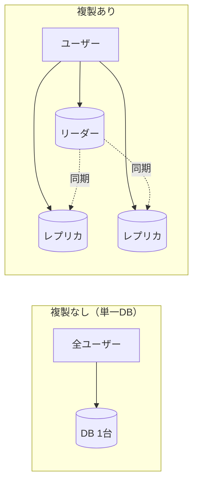
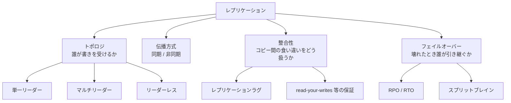
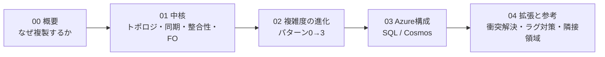

> システム設計シリーズ 第二弾「データベースレプリケーション」
> **00 概要(本記事)** ／ [01 ベンダー非依存の中核](01_core_vendor_neutral.md) ／ [02 複雑度の進化](02_complexity_evolution.md) ／ [03 Azure構成例](03_azure_mapping.md) ／ [04 拡張トピックと参考リンク](04_extensions_and_refs.md)

## このシリーズと、第二弾のお題

本シリーズは、ひとつのお題を次の同じ「型」で最後まで追いかけます。

1. **ベンダー非依存の一般解** — クラウドの固有名詞を出さず、問題の本質と選択肢・トレードオフを整理する
2. **要件・複雑度での変化** — 規模やグローバル性が増えると、構成がどう進化するかをパターンで見る
3. **Azureへの落とし込み** — その一般解が、Azureのどのサービス・どの機能に対応するかを見る

第一弾は[URLショートナー](../url_shortener/00_overview.md)でした。第二弾のお題は、ほぼすべての分散システムの土台にある**データベースレプリケーション（複製）**です。

:::message
**前提知識**：Web/インフラの基礎と、分散システムの素朴な概念（整合性・可用性）が分かることを前提にします。Azureパートでは、Azure SQL Database と Azure Cosmos DB の「名前と役割」が分かると読みやすいです。各サービスの操作手順そのものは扱いません。
:::

## お題：レプリケーションとは

**レプリケーション**とは、同じデータのコピー（レプリカ）を複数のノードに保持し、互いを同期し続けることです。「ただコピーするだけ」に見えますが、難しさは**コピーした瞬間から、コピー同士が食い違いうる**ことにあります。

まず、複製を**しない**世界＝単一DBが何に困るかを見ます。

単一DBには3つの弱点があります。

- **単一障害点（SPOF）**：その1台が落ちたらサービス全停止
- **読み負荷の集中**：読み取りが増えても1台で受けるしかない
- **地理的レイテンシ**：遠いユーザーは物理距離分だけ遅い

レプリケーションはこの3つを攻略する基本手段です。ただし、その代償として「**レプリカ間の食い違い（整合性）**」という新しい難所を必ず連れてきます。

## なぜ複製するのか：2つの動機を混同しない

設計を誤る最大の原因は、**複製の動機が2つあるのに、それを混ぜてしまう**ことです。本シリーズで最初に強調したいのはここです。

| 動機 | 何が嬉しいか | 生まれる難所 |
|---|---|---|
| **① 可用性 / 災害復旧（DR）** | 1ノード・1リージョンが壊れても止まらない。データを失わない | フェイルオーバーの正しさ、RPO/RTO、スプリットブレイン |
| **② 読みスケール / 局所性** | 読み取りを複数レプリカに分散できる。ユーザーの近くで読める | レプリケーションラグ、結果整合、古いデータの読み取り |

:::message
**この2つは別物です。** 「読みを速くしたい」のに災害復旧用の同期構成を組んでも噛み合わないし、「絶対に止めたくない・データを失いたくない」のに非同期の読みレプリカを足しても守れません。**まず自分の動機がどちらか（あるいは両方か）を言語化する**ことが、レプリケーション設計の出発点です。
:::

本シリーズは、この**両方の動機をバランスよく**扱います。[01](01_core_vendor_neutral.md)で両者に共通する中核（トポロジ・同期/非同期・整合性）を、[02](02_complexity_evolution.md)で「読みスケール起点(パターン1)」と「DR起点(パターン2)」がどう積み上がるかを見ます。

## レプリケーションの登場概念マップ

以降で出てくる概念を、最初に俯瞰しておきます。

これらは独立ではなく、**強く絡み合っています**。たとえば「非同期にする（伝播方式）」と「ラグが出る（整合性）」、「リーダーが落ちる（フェイルオーバー）」と「未伝播分を失う（RPO）」のように連鎖します。[01](01_core_vendor_neutral.md)はこの絡まりをほどく回です。

## レプリケーション ≠ バックアップ ≠ シャーディング

混同されやすい3つを最初に切り分けます。

| 用語 | 主目的 | 本シリーズでの扱い |
|---|---|---|
| **レプリケーション** | 同じデータを複数ノードで**冗長化・分散** | 本題 |
| **バックアップ** | 過去の時点へ**戻せる**ようにする（誤削除・破損対策） | [04](04_extensions_and_refs.md)で隣接言及 |
| **シャーディング（パーティショニング）** | データを**分割**して書き込みをスケールさせる | [04](04_extensions_and_refs.md)で隣接言及 |

:::message alert
レプリカは「**今**の同じデータの複製」であって、「**昨日**のデータ」ではありません。誤って `DELETE` した行は、全レプリカへ忠実に複製されます。だから**レプリケーションはバックアップの代わりにならない**。この線引きは設計の基本です。
:::

## このシリーズの読み進め方

- まず[01](01_core_vendor_neutral.md)で、クラウドに依存しない**中核の設計判断**（トポロジ・同期/非同期・ラグと整合性・フェイルオーバー）を押さえます。
- [02](02_complexity_evolution.md)で、同じ「複製したい」が**規模と動機によってどう構成を変えるか**をパターンで見ます。
- [03](03_azure_mapping.md)で、それを**Azureの具体サービス**（Azure SQL Database と Cosmos DB の2スタイル）に落とします。
- [04](04_extensions_and_refs.md)で、**衝突解決・ラグ対策の実務**と隣接領域への地図、深掘り用リンクを置きます。

:::message
本シリーズは「網羅」ではなく「型と勘所」を狙います。各方式の完全な実装やベンチマークには踏み込まず、信頼できる外部記事・公式ドキュメントへの導線を随所に置きます。レプリケーションの体系的な土台としては、Martin Kleppmann『Designing Data-Intensive Applications』（DDIA）第5章が定番です。本シリーズの整合性まわりの枠組みもここに多くを負っています。
:::

次は[01 ベンダー非依存の中核](01_core_vendor_neutral.md)へ。
