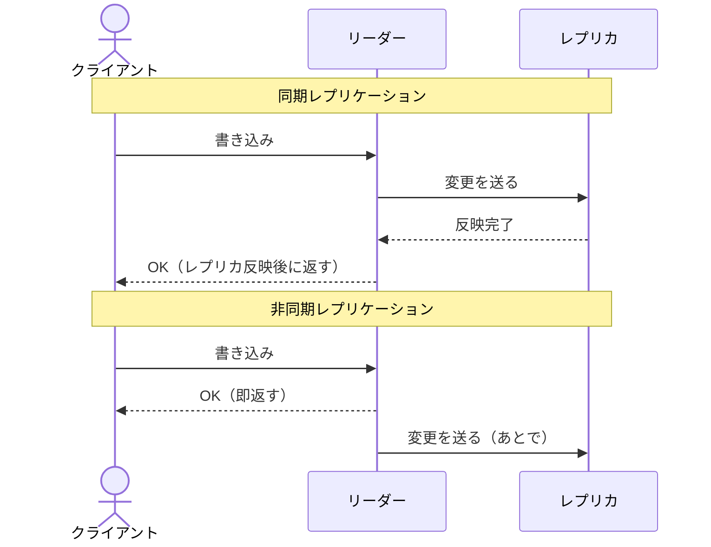
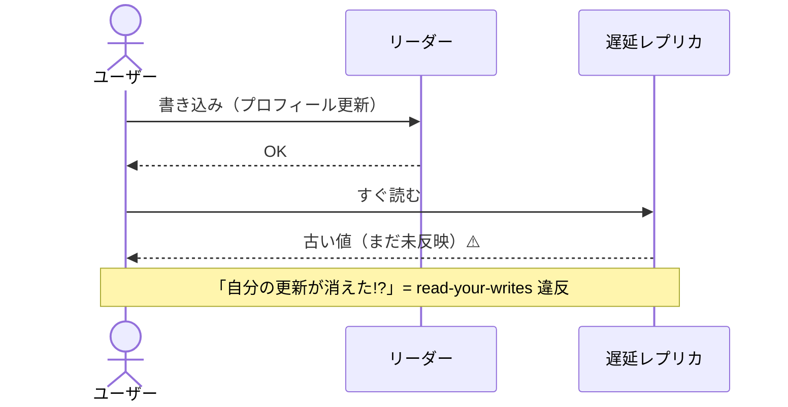

> システム設計シリーズ 第二弾「データベースレプリケーション」
> [00 概要](00_overview.md) ／ **01 中核(本記事)** ／ [02 複雑度の進化](02_complexity_evolution.md) ／ [03 Azure構成例](03_azure_mapping.md) ／ [04 拡張トピックと参考リンク](04_extensions_and_refs.md)

[00](00_overview.md)で「なぜ複製するか（2動機）」を押さえました。本記事は、**どのクラウドを使うかとは無関係に決まる中核の設計判断**を扱います。難所は4つ。「トポロジ」「同期/非同期」「ラグと整合性」「フェイルオーバー」です。3番目が本記事の核です。

## 1. トポロジ：誰が書き込みを受けるか

最初の分岐は「**書き込みを受け付けるノードが何個あるか**」です。これで世界が3つに分かれます。

### ① 単一リーダー（leader-follower / プライマリ-レプリカ）

書き込みは**ただ1つのリーダー**が受け、リーダーが変更ログをフォロワーへ流します。読み取りはフォロワーに分散できます。

- **長所**：書きが1箇所なので**順序が一意に決まり、強整合が素直**。実装が単純で、衝突が原理的に起きない
- **短所**：書きが**リーダーに集中（ボトルネック）**し、リーダーが**SPOF**。リーダー障害時は昇格（フェイルオーバー）が要る
- **代表**：PostgreSQL、MySQL、SQL Server などの主要RDB

### ② マルチリーダー（active-active / master-master）

**複数のリーダー**がそれぞれ書き込みを受け、互いに変更を非同期で複製し合います。

- **長所**：**書き込みの可用性が高い**（1リーダーが落ちても他が受ける）。地理的に分散したリーダーで**近くに書ける**＝書き込みレイテンシを下げられる
- **短所**：**書き込み衝突が発生**する。同じ行を別リーダーで同時更新したとき、どちらを勝たせるかの**衝突解決**が必須になる（[04](04_extensions_and_refs.md)で深掘り）
- **向くケース**：グローバルに書き込みが発生し、ダウンタイムを許せないシステム

### ③ リーダーレス（Dynamo系）

リーダーを置かず、**任意のノードが読み書きを受ける**。クライアントは複数レプリカに同時に書き、**クォーラム**で整合を調整します。

- **クォーラム**：N個のレプリカに対し、書き W 個・読み R 個から応答を得る。`W + R > N` を満たすと、読みは最低1つの最新コピーに必ず当たる
- **長所**：**SPOFがない**。一部ノードが落ちても読み書きを継続でき、可用性が極めて高い
- **短所**：**結果整合**が基本で、並行書き込みの**衝突解決**（バージョン管理）が要る。ネットワーク往復が増える
- **代表**：DynamoDB、Cassandra、Riak

### 比較表

[OpenMetal「Leader-Based vs Leaderless Replication」](https://openmetal.io/resources/blog/leader-based-vs-leaderless-replication) の整理に沿うと、性質の違いが見えます。

| 観点 | 単一リーダー | マルチリーダー | リーダーレス |
|---|---|---|---|
| 書き込み窓口 | 1つ | 複数 | 任意のノード |
| 書きスループット | リーダーで頭打ち | 分散 | ノード間で分散 |
| 読みスループット | フォロワーで分散 | 分散 | 分散 |
| SPOF | リーダー | なし(縮小) | なし |
| 整合性 | 強整合が素直 | 結果整合＋衝突 | 結果整合(クォーラムで調整) |
| 衝突解決 | 不要 | **必要** | **必要** |
| 複雑度 | 低 | 高 | 高 |
| 代表 | PostgreSQL/MySQL/SQL Server | （地理分散RDB等） | DynamoDB/Cassandra/Riak |

:::message
**圧倒的多数のシステムは①単一リーダーで始めれば十分**です。②③は「書き込みの可用性・地理分散・SPOF排除」という強い要件が出てから検討する領域。複雑度（特に衝突解決）の代償が大きいことを忘れないでください（参考：[ByteByteGo「How to Choose a Replication Strategy」](https://blog.bytebytego.com/p/how-to-choose-a-replication-strategy)）。
:::

## 2. 同期 vs 非同期：いつ「書けた」と返すか

トポロジと直交するもう一つの軸が、**レプリカへの伝播を待つか待たないか**です。



| 方式 | データ損失 | 書きレイテンシ | 可用性 |
|---|---|---|---|
| **同期** | レプリカにも確実に届いてから返すので**損失ゼロ（RPO=0）** | レプリカ反映を待つので**遅い** | レプリカが遅延/停止すると**書きが止まる**ことがある |
| **非同期** | リーダー障害時、未伝播分を**失う（RPO>0）** | 即返すので**速い** | レプリカが遅れても書きは進む |

実務では両者の中間＝**準同期（semi-synchronous）**もよく使われます。「**少なくとも1つのレプリカには同期で、残りは非同期で**」とすることで、損失リスクを抑えつつ全レプリカ待ちの遅さを避けます。

:::message
この軸は[00](00_overview.md)の2動機に直結します。**可用性/DRで「データを失いたくない」なら同期寄り**（RPO=0）、**読みスケールで「速く広げたい」なら非同期**（ラグは受容）。同期はレプリカの遅延が書き込みを巻き込むため、「遠いレプリカに同期」はレイテンシ的に厳しい、という物理も効いてきます。
:::

## 3. レプリケーションラグと整合性保証（本記事の核）

非同期レプリケーションには宿命があります。それが**レプリケーションラグ**＝リーダーの最新状態がレプリカに届くまでの遅れです。多くの場合は数ミリ秒ですが、負荷時には秒単位に伸びることもあります。

このラグは、ユーザーから見える**3つのアノマリ（異常）**を生みます。これは Martin Kleppmann『DDIA』第5章で整理された枠組みで、それぞれに対応する**セッション保証**があります（参考：[Read-After-Write consistency の解説](https://preparingforcodinginterview.wordpress.com/2021/02/07/read-after-write-consistency)、[Read Consistency and Replication Lag](https://rustycloud.org/distributed_systems_track/module-02-replication/lesson-03-read-consistency.html)）。



### ① read-your-writes（自分の書きが見えない）

自分が書いた直後に読むと、まだ反映されていないレプリカから**古い値**が返り、「保存に失敗した？」と見える。

- **解1**：書き込み後の一定時間、その**ユーザーの読みはリーダー（または最新が保証されるノード）に固定**する
- **解2（より洗練）**：セッションごとに観測した**リーダーのLSN（ログ位置）を記録**し、そこまで追いついたレプリカにだけ読みを振る（セッション位置トークン）

### ② monotonic reads（時間が巻き戻る）

1回目は新しいレプリカ、2回目は遅れたレプリカ、と当たると、**新しい値を見たあとに古い値**が見える＝時間が逆行して見える。

- **解**：**同一ユーザーの読みは常に同じレプリカに固定**する（ユーザーIDのハッシュでレプリカを選ぶなど）。そのレプリカが遅れていても「後退しない」ことは保証できる

### ③ consistent prefix reads（因果が逆転する）

「質問」と「その回答」のように**因果関係のある書き込み**が、別々に伝播して**順序が逆**に見える（回答が質問より先に表示される）。

- **解**：**因果関係のある書き込みは同じパーティションへ**送り、順序を保つ。あるいは**因果一貫性（ベクタークロック等）**で、読み手の観測した因果順を破る読みを拒否する

:::message
整合性は「強整合 or 結果整合」の二択ではなく、**連続体**です。両端の間に **read-your-writes / monotonic reads / consistent prefix** といった**セッション保証**が並びます。「全部強整合」は遅く・可用性も下がる。**要件が要求する最小限の保証を、必要なユーザー・操作にだけ効かせる**のが設計の腕です。この連続体は[03](03_azure_mapping.md)で Cosmos DB の「整合性5レベル」という具体的な選択肢として再登場します。
:::

## 4. フェイルオーバーの意味論：壊れたとき誰が引き継ぐか

可用性/DR動機の核心が**フェイルオーバー**＝リーダー（やリージョン）が落ちたとき、レプリカを昇格させて引き継ぐことです。ここで2つの指標を定義します。

```text
RPO（Recovery Point Objective） … どこまでのデータ損失を許すか（時間）
RTO（Recovery Time Objective）  … どれだけで復旧するか（時間）
```

- **非同期フェイルオーバーは RPO > 0**：未伝播分は失われる。RPO=0が要るなら同期が必要
- **自動 vs 手動**：自動は速いが**誤検知（false positive）**のリスク。ネットワークの一時断で不要なフェイルオーバーが起きうる
- **スプリットブレイン**：旧リーダーが復活して「自分はまだリーダー」と思い込み、新リーダーと**二重に書き込む**最悪のケース。フェンシング（旧ノードを確実に締め出す）で防ぐ

:::message alert
分散システムでは **RPO=0 かつ RTO=0 を同時に達成することはできません**。「データを1バイトも失わず（RPO=0）、瞬時に復旧する（RTO=0）」は物理的に不可能です。**どちらをどこまで諦めるか**が、可用性設計の本質的な意思決定になります。
:::

## 中核設計のまとめ

クラウド非依存の中核は4つでした。

- **トポロジ**：①単一リーダー（強整合・単純、まずこれ）②マルチリーダー（書き可用性・地理分散、衝突解決が必要）③リーダーレス（SPOFなし・結果整合）
- **同期/非同期**：同期はRPO=0だが遅い・可用性に影響、非同期は速いがラグと損失。準同期が実務的折衷
- **ラグと整合性**：非同期の宿命。read-your-writes / monotonic reads / consistent prefix の3アノマリと、対応するセッション保証
- **フェイルオーバー**：RPO/RTO、自動の誤検知、スプリットブレイン。RPO=0かつRTO=0は不可能

次の[02 複雑度の進化](02_complexity_evolution.md)では、これらの部品を組み合わせ、**動機と規模が上がるにつれて構成がどう変わるか**をパターン0→3で見ます。
