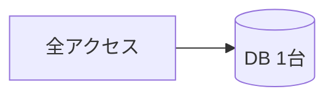
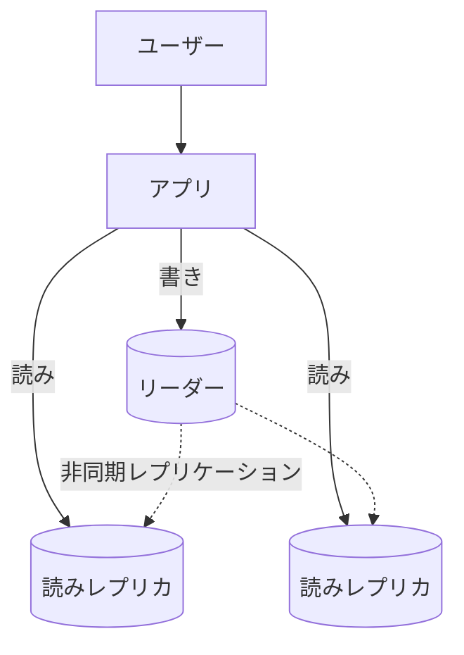
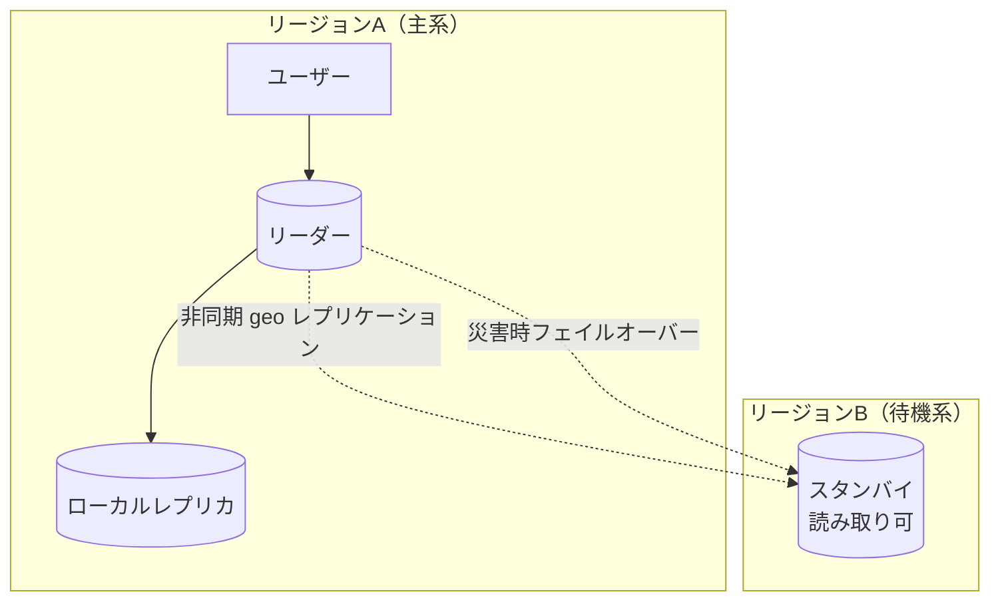
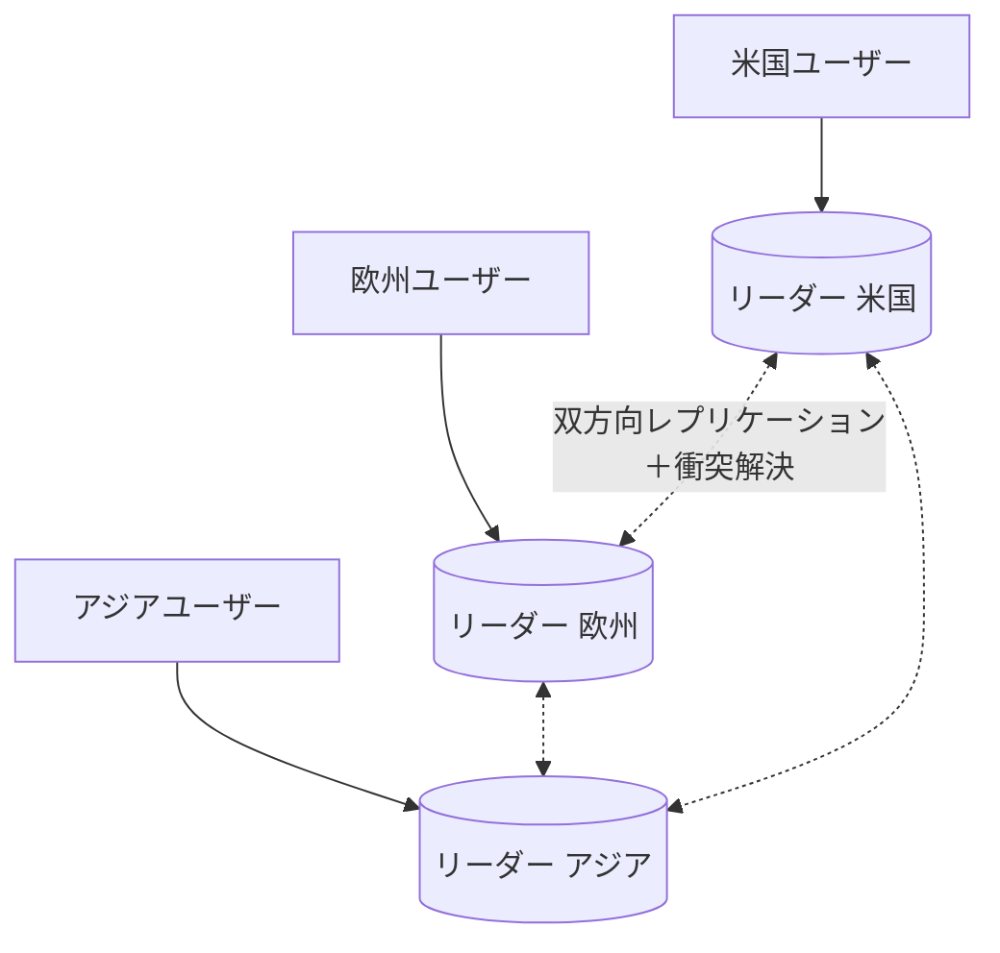
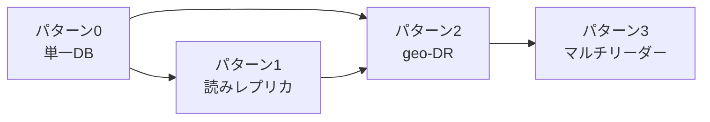

> システム設計シリーズ 第二弾「データベースレプリケーション」
> [00 概要](00_overview.md) ／ [01 中核](01_core_vendor_neutral.md) ／ **02 複雑度の進化(本記事)** ／ [03 Azure構成例](03_azure_mapping.md) ／ [04 拡張トピックと参考リンク](04_extensions_and_refs.md)

[01](01_core_vendor_neutral.md)で中核の部品が揃いました。本記事は、**同じ「複製したい」でも、動機と規模が変わると“正解”が動く**ことを、4つのパターンで段階的に見ます。

:::message
大事なのは「最初から右端（グローバル分散）を作らない」ことです。各パターンの「向くケース」と「次へ進む引き金」を意識してください。[00](00_overview.md)の2動機（①可用性/DR ②読みスケール/局所性）のどちらに押されて次へ進むのかを、毎回確認しながら読むと地図が立体的になります。
:::

## パターン0：単一DB（複製なし）

まず複製のない最小構成。書きも読みも1台のDBが受けます。

**向くケース**：社内ツール、PoC、トラフィックの小さいサービス。**この構成で十分なケースは現実に多い。**

**限界（次へ進む引き金）**：

- **読み**：読み取りが増えると1台が直撃を受ける → 動機②（読みスケール）でパターン1へ
- **可用性**：1台がSPOF。ハード故障やゾーン障害で全停止 → 動機①（可用性/DR）でパターン2へ

つまりパターン0からは、**押される動機によって進む方向が違います**。

## パターン1：読みレプリカ（読みスケール動機）

[01](01_core_vendor_neutral.md)の**単一リーダー＋非同期フォロワー**を導入します。書きはリーダー、読みはレプリカに振り分け、**読み経路を独立してスケール**させます。

- 読み取りを複数レプリカに分散でき、**read-heavyなワークロードに効果絶大**
- リーダーは書きに専念でき、読みの増加が書きを巻き込まない

**向くケース**：読み取りが増えてきたが、まだ単一リージョンで足りるサービス。**費用対効果が高い一手。**

**限界**：

- **レプリケーションラグ**で[01](01_core_vendor_neutral.md)の整合性アノマリ（read-your-writes 等）が顔を出す → セッション保証の対策が要る
- **リーダーがSPOFのまま**。リーダーが落ちると書きが止まる
- 読みレプリカは可用性を上げるが、**リージョン全体の障害には無力**

「リーダー障害やリージョン障害に備えたい」が要件になったら、動機①に押されてパターン2へ。

## パターン2：クロスリージョン geo-DR（可用性/DR動機）

別リージョンに**スタンバイ（待機系）**を置き、リーダーやリージョンが落ちたら**フェイルオーバー**で引き継ぎます。ここで[01](01_core_vendor_neutral.md)の **RPO/RTO** 設計が主役になります。

- 主系リージョンが丸ごと落ちても、**待機系へ昇格**してサービス継続
- 待機系を**読み取りにも使えば**、DRと地理的な読みスケールを兼ねられる
- **同期 or 非同期**の選択がRPOを決める：地理的に遠い同期は遅いため、**クロスリージョンは非同期＝RPO>0が現実的**

**向くケース**：事業継続が要件のサービス。「リージョン障害で止められない」ライン。

**限界**：

- 書きは依然として**主系の1リーダーに集約**。遠いユーザーの**書き込みレイテンシ**は縮まらない
- 「世界中で**書き込みも**速く・落ちないように」が要件になると、単一リーダーの枠を超える必要

## パターン3：マルチリーダー / グローバル分散

複数リージョンが**それぞれ書き込みを受ける**（[01](01_core_vendor_neutral.md)のマルチリーダー）。各ユーザーは最寄りのリーダーに読み書きし、リーダー同士が非同期で複製し合います。

- **書き込みの局所性**：最寄りリーダーに書けるので書き込みレイテンシが下がる
- **書き込みの可用性**：1リージョンが落ちても他リージョンで書ける（active-active）
- **代償＝衝突と結果整合**：別リージョンで同じデータを同時更新すると**衝突**する。**強整合は物理的に諦め**、衝突解決（LWW・バージョン等。[04](04_extensions_and_refs.md)）と結果整合を受け入れる

:::message alert
グローバル分散の本質的な難しさは「整合性 vs レイテンシ・可用性」のトレードオフです。マルチリーダー（マルチ書き込み）では**強整合は選べません**（[01](01_core_vendor_neutral.md)の通りRPO=0かつRTO=0は不可能）。この具体的な選択肢は、[03](03_azure_mapping.md)で Cosmos DB の整合性レベルと衝突解決として詳しく見ます。
:::

**向くケース**：世界中にユーザーがいて、読み書き両方の低レイテンシと高可用が事業上クリティカルなサービス。

**限界 / 代償**：運用・整合性の難度が一気に上がる。**ここまで要らないなら来るべきではない**領域です。

## 複雑度グラデーション総括

| | P0 単一 | P1 読みレプリカ | P2 geo-DR | P3 マルチリーダー |
|---|---|---|---|---|
| 主な動機 | — | ②読みスケール | ①可用性/DR | ①②両方＋書き局所性 |
| トポロジ | 単一 | 単一リーダー | 単一リーダー＋待機系 | マルチリーダー |
| 書き込み窓口 | 1 | 1 | 1（FO後に切替） | 複数 |
| 整合性 | 強 | 強〜セッション保証 | 強〜結果整合 | 結果整合（衝突解決） |
| 可用性 | SPOFあり | 読みは冗長／書きSPOF | リージョン跨ぎ冗長 | active-active |
| RPO/RTO | — | — | 非同期ならRPO>0 | RPO>0前提 |
| 運用負荷 | 低 | 低〜中 | 中 | 高 |

**読み方**：パターン0からは**押される動機で分岐**します（読みスケールなら1、可用性なら2）。両方が効いてくると2へ収束し、さらに「書き込みも世界中で」となって初めて3へ。下から順に「次へ進む引き金」が引かれたときだけ右へ動く、というのが健全な進化です。

次の[03 Azure構成例](03_azure_mapping.md)では、この4パターンを**Azureの具体サービス**（Azure SQL Database と Cosmos DB の2スタイル）に落とし込みます。
