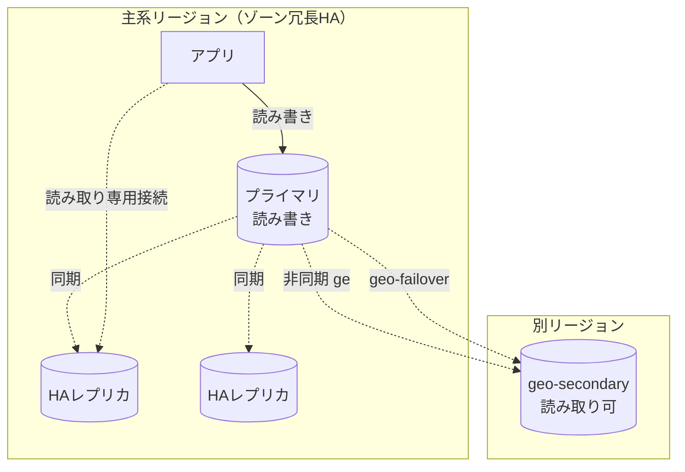
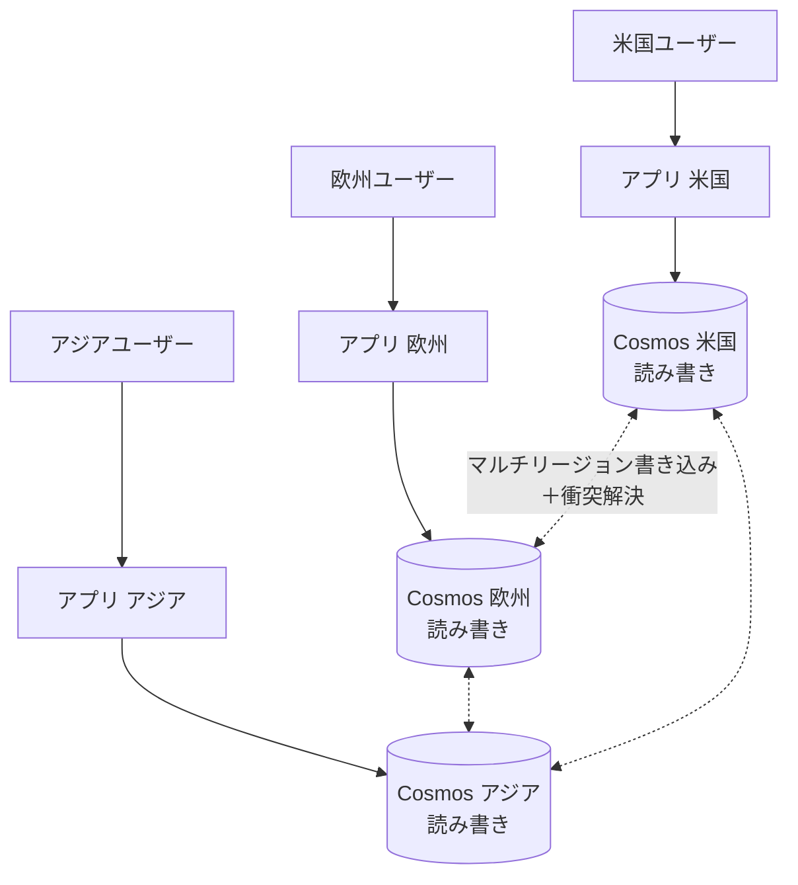

> システム設計シリーズ 第二弾「データベースレプリケーション」
> [00 概要](00_overview.md) ／ [01 中核](01_core_vendor_neutral.md) ／ [02 複雑度の進化](02_complexity_evolution.md) ／ **03 Azure構成例(本記事)** ／ [04 拡張トピックと参考リンク](04_extensions_and_refs.md)

[02](02_complexity_evolution.md)までで、ベンダー非依存の構成パターンが揃いました。本記事は、それを**Azureの具体サービス**に落とします。レプリケーションには2つの代表的な落とし方があります。**「リレーショナルに段階的に複製を足す（Azure SQL Database）」**と、**「最初からグローバル分散を前提にする（Azure Cosmos DB）」**です。両方を見ます。

## 一般概念 → Azure 対応表

[01](01_core_vendor_neutral.md)〜[02](02_complexity_evolution.md)で出た概念を、Azureの機能に対応づけます。

| 一般概念 | Azureの機能（候補） |
|---|---|
| 単一リーダー＋同期レプリカ（ローカルHA） | Azure SQL の**ゾーン冗長HA**（Premium/Business Critical 等） |
| 読みレプリカ（パターン1） | Azure SQL の**読み取りスケールアウト** ／ MySQL・PostgreSQL の**読み取りレプリカ** |
| クロスリージョン geo-DR（パターン2） | Azure SQL の **Active geo-replication** ／ **Failover groups** |
| マルチリーダー / グローバル分散（パターン3） | **Cosmos DB のマルチリージョン書き込み** |
| 整合性レベルの選択 | **Cosmos DB の整合性5レベル** |
| 衝突解決 | **Cosmos DB の衝突解決ポリシー（LWW / カスタム）** |

各サービスの複製方式は公式の[マルチリージョン対応サービス一覧](https://learn.microsoft.com/en-us/azure/reliability/regions-multiregion-support)に横断的に整理されています。以下、SQLとCosmosの2スタイルを具体化します。

## 構成A：Azure SQL Database（単一リーダー型を段階的に強化）

リレーショナルな世界で、[02](02_complexity_evolution.md)のパターン0→1→2を**機能を足しながら登っていく**スタイルです。

### ローカルHA：ゾーン冗長（パターン0の足元を固める）

Premium / Business Critical ティアでは、HAアーキテクチャが**プライマリの読み書きレプリカ＋最大3つのセカンダリレプリカ**で構成されます。プライマリは変更を順序通りにセカンダリへ push し、**十分な数のセカンダリに永続化されてからコミット**します（SQL Server の Always On 可用性グループに似た技術）。プライマリやレプリカがクラッシュしても、**常に完全同期されたレプリカへフェイルオーバー**でき、接続は自動で新プライマリへ振り直されます（参考：[ローカル/ゾーン冗長による可用性](https://learn.microsoft.com/en-us/azure/azure-sql/database/high-availability-sla)）。

- ゾーン冗長HAの目安は **RTO < 30秒 / RPO = 0**（同期レプリカなので損失なし。参考：[ビジネス継続性の概要](https://learn.microsoft.com/en-us/azure/azure-sql/managed-instance/business-continuity-high-availability-disaster-recover-hadr-overview)）

### 読み取りスケールアウト（パターン1）

上記のHAレプリカは遊ばせず、**読み取り専用ワークロードのオフロード**に使えます。これが**読み取りスケールアウト**で、Premium / Business Critical / Hyperscale で**既定有効**です。

- 読み取り専用接続をセカンダリレプリカへ振り、分析系などの読みを**読み書きワークロードから隔離**できる
- Business Critical では**追加コストなしで +100% の計算能力**を読みに使える（参考：[レプリカでの読み取りクエリ](https://learn.microsoft.com/en-us/azure/azure-sql/database/read-scale-out)）
- Basic/Standard/General Purpose にはHAレプリカがなくこの機能は使えない（代替として geo-replica を読みに使う）

### Active geo-replication（パターン2）

別リージョンに**読み取り可能な geo-secondary**を作り、非同期で複製します。

- **DB単位**で構成。**最大4つ**の geo-secondary を同一/別リージョンに作れる
- フェイルオーバーは**手動またはプログラム的**（自動ではない）。T-SQL / PowerShell / CLI / REST で操作
- geo-secondary は**読み取りにも使える**ので、DRと地理的読みスケールを兼ねられる（参考：[Active geo-replication 概要](https://learn.microsoft.com/en-us/azure/azure-sql/database/active-geo-replication-overview)）

### Failover groups（パターン2を運用しやすく）

geo-replication の上に乗る**宣言的な抽象化**です。論理サーバ上のDB群をまとめて別リージョンへ複製し、フェイルオーバーを一括管理します。

- 最大の利点は**安定した接続リスナ**：読み書き用（`*.database.windows.net`）と読み取り専用のリスナがフェイルオーバー後も変わらない → **接続文字列を書き換えずに**フェイルオーバーできる
- 顧客管理のフェイルオーバーポリシーで **RTO < 60秒 / RPO ≈ 5秒**（非同期なので少量の損失を許容。参考：[Failover groups 概要とベストプラクティス](https://learn.microsoft.com/en-us/azure/azure-sql/database/failover-group-sql-db)、[ビジネス継続性](https://learn.microsoft.com/en-us/azure/azure-sql/managed-instance/business-continuity-high-availability-disaster-recover-hadr-overview)）

:::message alert
failover group で追加したセカンダリDBは、**既定ではHA（ゾーン冗長）が有効になりません**。グループ作成後に各DBでHAを明示的に有効化する必要があります。また Hyperscale ティアには一部の制約（auto-failover group 非対応など）があるので、ティア依存の差は公式Docsで確認してください。
:::

## 構成B：Azure Cosmos DB（最初からマルチリージョン前提）

[02](02_complexity_evolution.md)のパターン3（グローバル分散）を、**ターンキーで**実現するスタイルです。リージョンの追加・削除でアプリの再デプロイ・停止は不要です。

### グローバル分散とマルチリージョン書き込み

- **複数読みリージョン（単一書きリージョン）**：読み可用性とグローバルな読みレイテンシを改善（パターン1〜2相当）
- **マルチリージョン書き込み（active-active）**：全リージョンで読み書き可能。**99.999%の読み書き可用性**、**p99で10ms未満**の読み書きを謳う（パターン3相当。参考：[グローバルなデータ分散](https://learn.microsoft.com/en-us/azure/cosmos-db/distribute-data-globally)）

### 整合性5レベル（01の連続体の具体化）

[01](01_core_vendor_neutral.md)で「整合性は連続体」と述べました。Cosmos DB はそれを**5つの選べるレベル**として提供します（参考：[整合性レベル](https://learn.microsoft.com/en-us/azure/cosmos-db/consistency-levels)）。整合性を強くするほど、レイテンシ・可用性・スループットとトレードオフになります。

| レベル | 性質 | RPO（複数リージョン） |
|---|---|---|
| **Strong** | 線形化可能。最新を必ず読む | 0 |
| **Bounded Staleness** | 「Kバージョン or T時間」までの遅れに限定 | K & T（マルチリージョン最小 **10万操作 or 300秒**） |
| **Session** | セッション内で read-your-writes / 単調読みを保証（既定で最も広く使われる） | < 15分 |
| **Consistent Prefix** | 因果順は守る（[01](01_core_vendor_neutral.md)の consistent prefix） | < 15分 |
| **Eventual** | 最終的に収束 | < 15分 |

:::message
[01](01_core_vendor_neutral.md)の3アノマリが、ここで具体的な選択肢になっているのが分かります。**Session** はまさに read-your-writes と monotonic reads をセッション単位で保証するレベルで、「自分の書きは自分で読める」を低レイテンシで実現します。**Consistent Prefix** は因果順の保証そのものです。理論（01）と製品機能（03）が一直線でつながります。
:::

### 衝突解決（マルチリーダーの必須機能）

マルチリージョン書き込みでは、別リージョンで同じアイテムを同時更新すると**衝突**します（[01](01_core_vendor_neutral.md)・[02](02_complexity_evolution.md)で予告した難所）。Cosmos DB はポリシーで解決します（参考：[衝突解決の種類とポリシー](https://learn.microsoft.com/en-us/azure/cosmos-db/conflict-resolution-policies)）。

- **Last Write Wins（LWW、既定）**：システム定義のタイムスタンプ `_ts` で勝者を決める。NoSQL API では任意の数値プロパティ（独自の「タイムスタンプ」）も指定可能
- **カスタム**：ストアドプロシージャで独自ロジックを書く（NoSQL API のみ）
- 全リージョンが**同一の勝者に収束**する。削除衝突は削除が勝つ。**ハブリージョンがアービター**として働く

:::message alert
**マルチリージョン書き込みでは Strong（強整合）は選べません**（[01](01_core_vendor_neutral.md)の通り、マルチ書き込みで強整合は物理的に不可能）。また **Bounded Staleness はマルチ書き込みではアンチパターン**です。同じリージョンに読み書きするなら、本来不要なリージョン間レプリケーション遅延への依存を持ち込むことになるためです（公式が明記）。マルチ書き込みでは **Session / Consistent Prefix / Eventual** から選ぶのが基本になります。
:::

## 構成A vs B どちらを選ぶか

| 観点 | 構成A Azure SQL | 構成B Cosmos DB |
|---|---|---|
| データモデル | リレーショナル・強いトランザクション | NoSQL（KV/ドキュメント等） |
| 出発点 | 単一リーダー＋HAから段階導入 | 最初からグローバル分散前提 |
| 書き込み | 単一プライマリ（FOで切替） | 単一 or マルチリージョン書き込み |
| 整合性 | 強整合が基本 | 5レベルから選択 |
| フェイルオーバー | geo-replication / failover groups（手動〜自動・RTO<60s） | 自動・組み込み（99.999%） |
| 向く動機 | 既存SQL資産・段階的なDR強化 | グローバルな低レイテンシ read/write |

**リレーショナル資産があり、可用性/DRを段階的に足す**なら構成A、**最初から世界規模の active-active が要件**なら構成B、が素直な出発点です。多くのシステムは構成Aの単一〜数リージョンで足ります。

## まとめ

- 一般解の各箱はAzureの機能に素直に対応する
- **構成A（Azure SQL）**：ゾーン冗長HA（RTO<30s/RPO0）→ 読み取りスケールアウト → Active geo-replication → Failover groups（RTO<60s/RPO≈5s）と、パターン0→2を機能で登る
- **構成B（Cosmos DB）**：マルチリージョン書き込み＋整合性5レベル＋衝突解決で、パターン3をターンキーに実現。[01](01_core_vendor_neutral.md)の整合性連続体が「5レベル選択」として具体化する

次の[04 拡張トピックと参考リンク](04_extensions_and_refs.md)で、衝突解決の深掘り・ラグ対策の実務・隣接領域（シャーディング等）への地図と、深掘り用リンク集を扱います。
