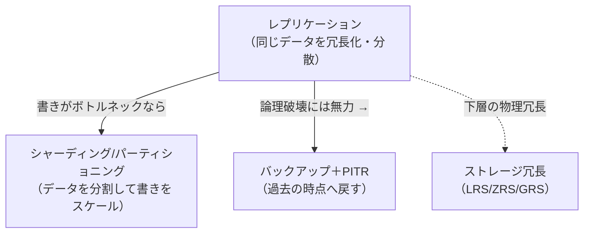
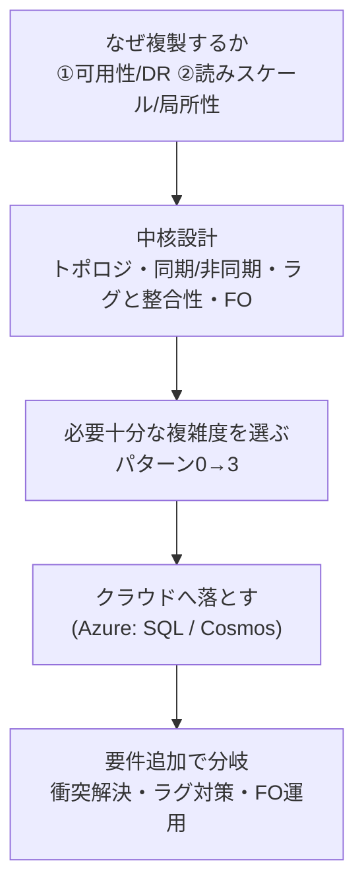

> システム設計シリーズ 第二弾「データベースレプリケーション」
> [00 概要](00_overview.md) ／ [01 中核](01_core_vendor_neutral.md) ／ [02 複雑度の進化](02_complexity_evolution.md) ／ [03 Azure構成例](03_azure_mapping.md) ／ **04 拡張トピックと参考リンク(本記事)**

[03](03_azure_mapping.md)まででコア設計とAzureマッピングが揃いました。本記事は、要件が一段増えたときに**設計がどこで難しくなるか**の勘所と、深掘り用の良質なリンク集です。

:::message
ここで挙げる各トピックは、それ単独で1記事書ける深さがあります。本記事は「**要件が一段増えると、どこに新しい難所が生まれるか**」の地図を示すに留め、厳密な実装や数値の断定は外部の良質な資料に委ねます。
:::

## 1. 衝突解決の深掘り（マルチリーダー採用時の必須検討）

[01](01_core_vendor_neutral.md)〜[03](03_azure_mapping.md)で繰り返し出てきた、マルチリーダー/マルチ書き込みの最大の難所です。別リージョンで同じデータを同時更新したとき、どちらを勝たせるか。

- **Last Write Wins（LWW）**：タイムスタンプが新しい方を勝たせる。単純だが、**クロックスキュー（時計ずれ）で「先に書いたのに負ける」**ことがあり、**負けた書き込みは黙って消える**
- **バージョンベクトル / ベクタークロック**：どの更新がどの更新を「見ているか」（因果）を追跡し、本当に並行した衝突だけを検出する。LWWより正確だが複雑
- **CRDT（Conflict-free Replicated Data Type）**：データ型自体が「マージ可能」になるよう設計され、衝突が原理的に起きない（カウンタ・集合など）
- **アプリ側解決**：衝突を両方保持してアプリ/ユーザーに見せ、業務ロジックでマージする

:::message alert
LWWは「実装が楽」ですが、**データ損失を伴う衝突解決**です。Cosmos DB の既定もLWW（[03](03_azure_mapping.md)）。「消えても困らないデータか」を必ず確認し、困るならカスタム解決やバージョン管理を検討してください。
:::

## 2. レプリケーションラグ対策の実務

[01](01_core_vendor_neutral.md)のセッション保証を、実装としてどう担保するかです。

- **read-your-writes**：書き込み後の一定時間、その**ユーザーの読みをリーダー（または最新が保証されるレプリカ）へ**。Cosmos DB なら整合性レベル **Session** がこれを肩代わりする
- **monotonic reads**：**同一ユーザーは同じレプリカに固定**（sticky session）。ロードバランサ/アプリ層でユーザーIDからレプリカを決める
- **重要な読みだけ強整合**：すべてを強整合にせず、「**残高表示など間違うと困る読みだけ**」リーダー/Strong から読む。大半の読みは結果整合のままにして、コストと整合性のバランスを取る

ポイントは「[00](00_overview.md)の読みスケール動機（速さ）」と「整合性」を、**操作ごとに使い分けて両立**させることです。

## 3. フェイルオーバー運用の勘所

[01](01_core_vendor_neutral.md)で触れたフェイルオーバーの「運用」側です。

- **誤検知（false positive）対策**：ネットワークの一時断で不要なフェイルオーバーが起きないよう、検知のタイムアウト・閾値を慎重に設計する
- **スプリットブレインのフェンシング**：旧リーダーが復活して二重書きしないよう、確実に締め出す仕組みを持つ
- **DR訓練**：フェイルオーバーは「いざ」だけでは成功しない。**定期的に実地フェイルオーバーを試す**。[03](03_azure_mapping.md)の failover group も、手順を回して初めて RTO が現実の数字になる

## 4. 隣接領域の地図（一本に集中しつつ、関係だけ示す）

本シリーズはレプリケーション一本に集中しました。ただし実システムでは、以下の隣接領域とセットで設計されます。関係だけ地図にしておきます。

- **シャーディング/パーティショニング**：レプリケーションは「同じデータを複製」、シャーディングは「データを分割」。**書き込みがリーダーで頭打ち**になったら、レプリケーションでは解けず、分割が必要になる（[02](02_complexity_evolution.md)パターン3のマルチリーダーも一種の地理分割）
- **バックアップ＋PITR**：[00](00_overview.md)で強調した通り、レプリカは論理破壊（誤`DELETE`）を忠実に複製する。**戻せる**仕組みは別に要る
- **ストレージ冗長（LRS/ZRS/GRS）**：DBの下層では、ストレージ自体も複製されている。アプリから見えるレプリケーションとは層が違う

## まとめ：動機 → 複雑度 → 構成の地図

本シリーズの「型」を最後にまとめます。

- **レプリケーションの本質的な難所**は「トポロジ選択」「同期/非同期」「ラグと整合性」「フェイルオーバー」
- **正解は動機と規模で動く**。単一DBで十分なことも多い。読みスケールなら読みレプリカ、可用性ならgeo-DR、世界規模ならマルチリーダーへ
- **Azure**では、Azure SQL（HA→読みスケールアウト→geo-replication→failover groups）で段階的に登るか、Cosmos DB（マルチリージョン書き込み＋整合性5レベル＋衝突解決）でグローバル分散をターンキーに実現する
- **要件を足すたび**に、衝突解決・ラグ対策・フェイルオーバー運用という新しい難所が現れる

この「動機から複雑度を逆算し、クラウドに落とす」型は、第一弾[URLショートナー](../url_shortener/00_overview.md)と同じで、次のお題でもそのまま使えます。

## 厳選参考リンク

### 一般設計（ベンダー非依存）

- Martin Kleppmann『Designing Data-Intensive Applications』第5章「Replication」 — トポロジ・ラグ・整合性保証の体系的な土台。本シリーズの整合性まわりはここに多くを負う
- [OpenMetal「Leader-Based vs Leaderless Replication」](https://openmetal.io/resources/blog/leader-based-vs-leaderless-replication) — リーダー型/リーダーレスの性能・整合性の比較表
- [ByteByteGo「A Guide to Database Replication」](https://blog.bytebytego.com/p/a-guide-to-database-replication-key) / [「How to Choose a Replication Strategy」](https://blog.bytebytego.com/p/how-to-choose-a-replication-strategy) — 単一/マルチ/リーダーレスと選び方
- [Read Consistency and Replication Lag](https://rustycloud.org/distributed_systems_track/module-02-replication/lesson-03-read-consistency.html) — read-your-writes / monotonic / consistent prefix の実装手法（LSNトークン等）

### Azure 構成・実装（公式Docs）

- [Active geo-replication 概要](https://learn.microsoft.com/en-us/azure/azure-sql/database/active-geo-replication-overview) — DB単位のクロスリージョン複製（最大4 geo-secondary・手動FO）
- [Failover groups 概要とベストプラクティス](https://learn.microsoft.com/en-us/azure/azure-sql/database/failover-group-sql-db) — geo-replication上の宣言的抽象・安定リスナ
- [レプリカでの読み取りクエリ（読み取りスケールアウト）](https://learn.microsoft.com/en-us/azure/azure-sql/database/read-scale-out) — Premium/BC/Hyperscaleで読みをオフロード
- [ローカル/ゾーン冗長による可用性](https://learn.microsoft.com/en-us/azure/azure-sql/database/high-availability-sla) / [ビジネス継続性の概要（RPO/RTO）](https://learn.microsoft.com/en-us/azure/azure-sql/managed-instance/business-continuity-high-availability-disaster-recover-hadr-overview)
- [Cosmos DB: グローバルなデータ分散](https://learn.microsoft.com/en-us/azure/cosmos-db/distribute-data-globally) / [整合性レベル](https://learn.microsoft.com/en-us/azure/cosmos-db/consistency-levels) / [衝突解決ポリシー](https://learn.microsoft.com/en-us/azure/cosmos-db/conflict-resolution-policies)
- [Azure: マルチリージョン対応サービス一覧](https://learn.microsoft.com/en-us/azure/reliability/regions-multiregion-support) — SQL/Cosmos/MySQL/PostgreSQLの複製方式を横断比較
- [ミッションクリティカルのデータ基盤（Well-Architected）](https://learn.microsoft.com/en-us/azure/well-architected/mission-critical/mission-critical-data-platform) — geo-replicationを使った設計判断

---

以上で第二弾「データベースレプリケーション」は完結です。同じ型で次のお題（レートリミッタ、通知システムなど）も扱う予定です。最初の[00 概要](00_overview.md)に戻って、動機→複雑度→構成の流れをもう一度俯瞰すると、型が定着します。
