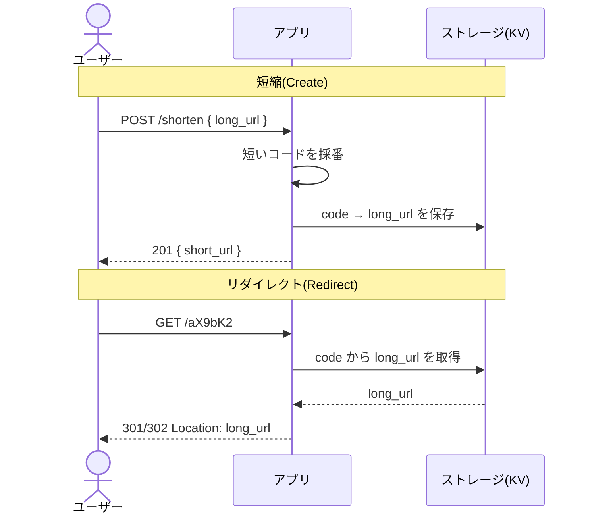
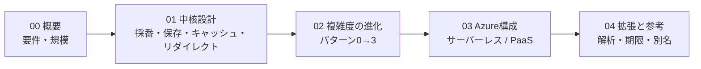

> システム設計シリーズ 第一弾「URLショートナー」
> **00 概要(本記事)** ／ [01 ベンダー非依存の中核設計](01_core_vendor_neutral.md) ／ [02 複雑度の進化](02_complexity_evolution.md) ／ [03 Azure構成例](03_azure_mapping.md) ／ [04 拡張トピックと参考リンク](04_extensions_and_refs.md)

## このシリーズで何をやるか

システム設計の記事は世の中に山ほどあります。にもかかわらずもう一本書くのは、**「設計の正解は要件と規模で動く」という当たり前を、ひとつのお題で最後まで体感する**構成があまり見当たらないからです。

本シリーズは、各記事を次の同じ「型」で進めます。

1. **ベンダー非依存の一般解** — まずクラウドの固有名詞を出さずに、問題の本質と選択肢・トレードオフを整理する
2. **Azureへの落とし込み** — その一般解が、Azureのどのサービスに対応するかを見る
3. **要件・複雑度での変化** — 規模やグローバル性が増えると、構成がどう進化するかをパターンで見る

この型を最初に確立しておくと、次のお題（レートリミッタ、通知システム、ニュースフィード……）でも同じ読み方が効きます。第一弾の題材は定番中の定番、**URLショートナー（URL短縮サービス）**です。

:::message
**前提知識**：Web/インフラの基礎と、Azureの主要サービス（App Service, Azure Functions, Cosmos DB, Azure Front Door, Azure Cache for Redis など）の「名前と役割」が分かることを前提にします。各サービスの操作手順そのものは扱いません。
:::

## お題：URLショートナーとは

`https://example.com/very/long/path?with=query&and=more` のような長いURLを、`https://sho.rt/aX9bK2` のような短いURLに変換し、短縮URLへのアクセスを元のURLへ**リダイレクト**するサービスです。Bitly や TinyURL が代表例です。

やることは、突き詰めると3つの動作しかありません。

- **短縮（Create）**：長いURLを受け取り、短いコードを採番して対応関係を保存する
- **解決（Resolve）**：短縮URLにアクセスが来たら、元のURLを引く
- **リダイレクト（Redirect）**：元のURLへHTTPリダイレクトを返す

最短経路をシーケンス図で描くと、驚くほど単純です。

この図だけ見ると「`Map<String, String>` を1つ用意すれば終わりでは？」と思えます。実際、**プロトタイプならそれで十分**です。本シリーズが面白くなるのは、ここに「規模」と「非機能要件」が乗った瞬間からです。

## 要件を機能 / 非機能に分ける

設計の第一歩は、要件を**機能要件（何ができるか）**と**非機能要件（どれだけうまくやるか）**に分けることです。この分離をサボると、「コードはどう作る？」の議論に飛びついて、本当の難所（後者）を見落とします。

### 機能要件

| 区分 | 要件 |
|---|---|
| 必須 | 長いURLを短縮URLに変換できる |
| 必須 | 短縮URLにアクセスすると元のURLへリダイレクトされる |
| 任意 | カスタムエイリアス（`sho.rt/mybrand` のような任意文字列）を指定できる |
| 任意 | 有効期限（一定期間後に失効）を設定できる |
| 任意 | クリック数などの解析（アナリティクス）を取れる |

「任意」をどこまで入れるかで設計は大きく分岐します。本シリーズでは必須2つを軸に据え、任意要件は[04](04_extensions_and_refs.md)で「増えると何が変わるか」として扱います。

### 非機能要件

ここがURLショートナーの本当の主役です。

| 要件 | なぜ重要か |
|---|---|
| **低レイテンシ** | リダイレクトは人間がクリックを待つ。数十ms単位の遅延が体感に直結する |
| **高可用性** | リンクが死ぬとSNS・メール・印刷物に貼った全リンクが死ぬ。書き込みより読み取りの可用性が決定的 |
| **読み取りスケール** | 後述の通り圧倒的に読み多め。読み経路を独立してスケールさせたい |
| **一意性** | 同じコードを2つの異なるURLに割り当ててはいけない（採番の正しさ） |

:::message
ポイントは「**書き込みと読み取りの性質がまるで違う**」こと。書き込み（短縮）はたまにしか起きず、多少遅くても許される。読み取り（リダイレクト）は大量に来て、速くなければならない。この非対称性が、以降のすべての設計判断の根っこになります。
:::

## 規模を見積もる「型」

非機能要件を具体化するには、ざっくりした数字が要ります。設計面接でも実務でも、**桁が合っていれば十分**です。仮に次のように置きます。

- 1日の新規短縮（書き込み）：**1,000万件/日**
- 読み取り（リダイレクト）と書き込みの比：**約 100:1**（read-heavyの定番値）
- → 読み取り：**約10億件/日**

この「**read/write ≒ 100:1**」という read-heavy 性は、URLショートナー設計の出発点としてよく引かれます（参考：[AlgoMaster](https://algomaster.io/learn/system-design-interviews/design-url-shortener)）。

ここから派生する概算：

- **QPS**：10億 / 86,400秒 ≒ **約1.1万 QPS（読み）**、書きはその1/100。平均でこれなので、ピークはさらに数倍を見込む
- **ストレージ**：1件あたり数百バイト（コード＋元URL＋メタdata）。年間で数十億件 × 数百B = **TB級**。巨大ではないが単一ノードKVのメモリには載りきらない規模
- **採番空間**：短縮コードを Base62（`a-z A-Z 0-9` の62文字）で表すと、長さ7文字で `62^7 ≒ 3.5兆`通り。長さ6でも `62^6 ≒ 568億`通り。**コード長を1文字伸ばすだけで空間が62倍**になる

最後の採番空間の話は、[01](01_core_vendor_neutral.md)の「採番方式」に直結します。「何文字にするか」は「何件さばくか」と「URLの短さ（＝UX）」のトレードオフです。

## このシリーズの読み進め方

- まず[01](01_core_vendor_neutral.md)で、クラウドに依存しない**中核の設計判断**（特に採番）を押さえます。
- [02](02_complexity_evolution.md)で、同じ要件が**規模によってどう構成を変えるか**をパターンで見ます。
- [03](03_azure_mapping.md)で、それを**Azureの具体サービス**に2つのスタイル（サーバーレス／PaaS・コンテナ）で落とします。
- [04](04_extensions_and_refs.md)で、**任意要件が増えたときの設計分岐**と、深掘り用の良質なリンクを置きます。

:::message
本シリーズは「網羅」ではなく「型と勘所」を狙います。各方式の完全な実装やベンチマークには踏み込みません。代わりに、信頼できる外部記事・公式ドキュメントへの導線を随所に置きます。まずは設計面接の定番教材として質の高い [Hello Interview「Design Bitly」](https://www.hellointerview.com/learn/system-design/problem-breakdowns/bitly) と [systemdesign.one](https://systemdesign.one/url-shortening-system-design) を並走読みすると理解が深まります。
:::

次は[01 ベンダー非依存の中核設計](01_core_vendor_neutral.md)へ。
