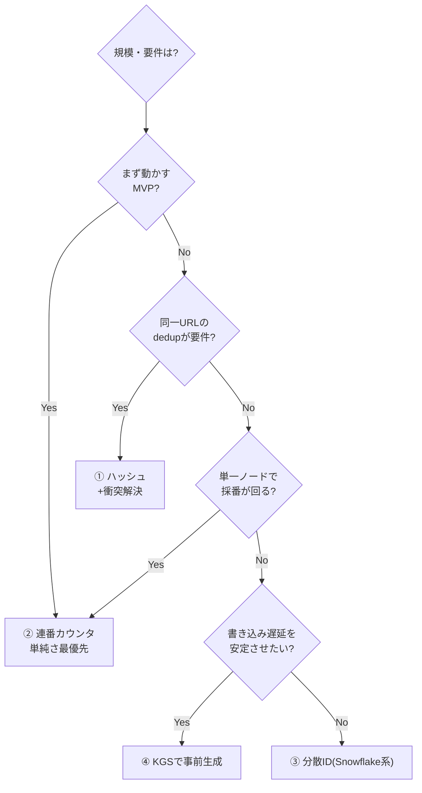
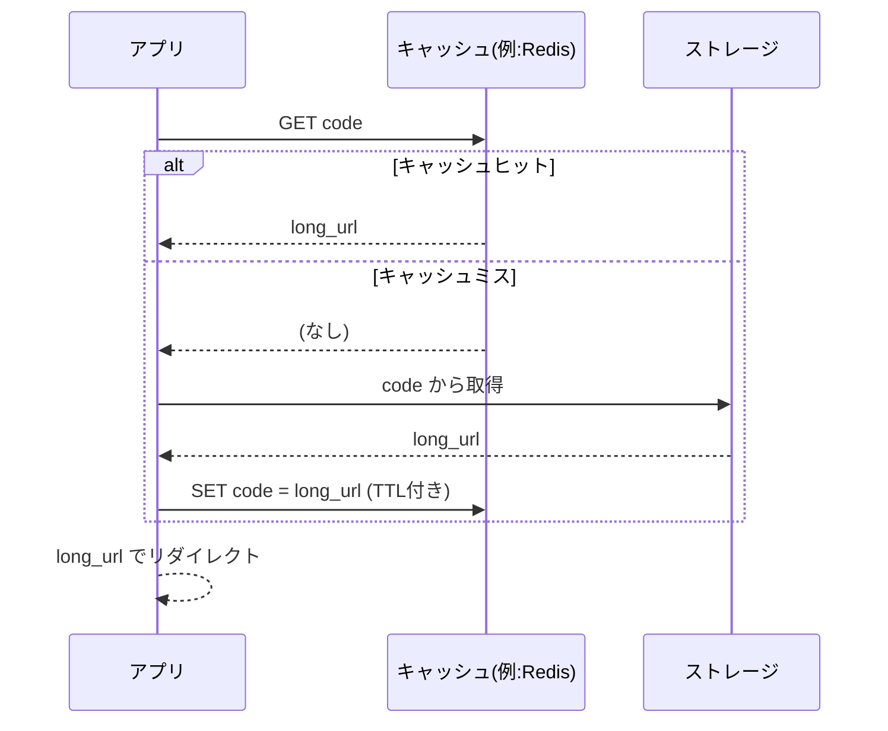

> システム設計シリーズ 第一弾「URLショートナー」
> [00 概要](00_overview.md) ／ **01 中核設計(本記事)** ／ [02 複雑度の進化](02_complexity_evolution.md) ／ [03 Azure構成例](03_azure_mapping.md) ／ [04 拡張トピックと参考リンク](04_extensions_and_refs.md)

[00](00_overview.md)で要件と規模を押さえました。本記事は、**どのクラウドを使うかとは無関係に決まる中核の設計判断**を扱います。難所は3つ。「採番」「読み経路の最適化（キャッシュ）」「リダイレクトの意味論」です。ストレージ選定も合わせて見ます。

## 1. 採番：短いコードをどう作るか（最大の山場）

短縮コードの生成方式は、URLショートナー設計で最も議論が割れるところです。代表的な4方式を、長所・短所・向くケースで比較します。

### ① ハッシュ + Base62 切り詰め

元URLをハッシュ関数（MD5/SHAなど）にかけ、結果をBase62エンコードして先頭数文字を採用します。

```text
canonical = canonicalize(long_url)   # ホスト小文字化・既定ポート除去・末尾スラッシュ正規化など
code = base62(hash(canonical))[:7]
```

- **長所**：状態を持たず**決定的**。同じURLは同じコードになるので、重複URLの排除（dedup）が自然にできる
- **短所**：**衝突が原理的に避けられない**。切り詰めるほど衝突確率は上がる。衝突時は salt 付与や再ハッシュなどの解決ロジックが要る
- **向くケース**：同一URLを1つのコードに集約したいサービス

:::message alert
「正規化（canonicalization）」を最初に決めておかないと、`example.com/` と `example.com` が別コードになり dedup が機能しません。ハッシュ方式を採るなら正規化規則を仕様として固定しましょう（参考：[Hello Interview](https://www.hellointerview.com/learn/system-design/problem-breakdowns/bitly)）。
:::

### ② 連番カウンタ + Base62

グローバルに単調増加する整数を採番し、それをBase62で表現してコードにします。`10000000 → "FXsk"` のように。

- **長所**：**一意性が保証**され、ロジックが単純。衝突解決が不要
- **短所**：採番が**中央のボトルネック**になりやすい。さらにIDが連番なので**コードが推測可能**（`...aX9`の次は`...aXa`）。列挙攻撃やプライバシーの懸念が出る
- **向くケース**：中小規模で、推測可能性が問題にならないアプリ

推測可能性は、採番した連番を可逆な変換（暗号化やビットシャッフル）でかき混ぜてからBase62化することで緩和できます。ただし複雑度は上がります。

### ③ 分散ID生成（Snowflake系）

複数ノードが協調せずに一意IDを払い出す方式。Twitter発の Snowflake が代表で、「タイムスタンプ + マシンID + シーケンス」のビット構成でIDを作ります。

- **長所**：中央ボトルネックがなく**高スループット**。時間順にほぼ整列する（**k-sortable**）ので、時系列の扱いに有利
- **短所**：**実装が複雑**。各ノードの時計に依存するため**クロックスキュー（時刻ずれ）に敏感**。マシンIDの割り当て運用も要る
- **向くケース**：大規模・分散で高可用と高スループットが要るシステム

### ④ 事前生成（Key Generation Service, KGS）

採番をリクエストのホットパスから切り離し、**あらかじめ未使用コードを大量に生成してプール**しておく方式。短縮リクエストが来たら在庫から1つ払い出すだけにします。

- **長所**：採番処理がリクエスト経路から消え、衝突チェックも事前に済む。**書き込みレイテンシが安定**
- **短所**：鍵の**在庫管理**（使用済み/未使用の管理、二重払い出し防止、補充）という別の仕組みが要る
- **向くケース**：書き込みレイテンシを安定させたい、衝突解決をホットパスから外したい場合

### 比較表

[AlgoMaster](https://algomaster.io/learn/system-design-interviews/design-url-shortener) のまとめが簡潔なので、それに沿って整理します。

| 方式 | 長所 | 短所 | 向くケース |
|---|---|---|---|
| ① ハッシュ | 決定的・状態レス・dedup向き | 衝突が不可避で解決が複雑 | 同一URLを集約したいサービス |
| ② 連番カウンタ | 一意性保証・ロジック単純 | 中央ボトルネック・推測可能 | 中小規模・中程度のトラフィック |
| ③ 分散ID | 高スケール・k-sortable・高スループット | 実装複雑・クロックスキューに敏感 | 大規模分散・高可用が要るシステム |
| ④ 事前生成KGS | 採番をホットパスから除去・安定 | 在庫管理の仕組みが必要 | 書き込みレイテンシを安定させたい |

### どれを選ぶか：規模で動く

ここが本シリーズの肝です。**正解は規模で変わります。**



このフローの「右下」（分散ID・KGS）に進むのが、まさに[02](02_complexity_evolution.md)で見る「規模が上がったとき」の世界です。小さいうちは②で十分、という判断ができることが設計力です。

:::message
採番方式の数式（コード長と表現空間、衝突確率）まで踏み込みたい場合は [systemdesign.one](https://systemdesign.one/url-shortening-system-design) の容量見積りパートが参考になります。
:::

## 2. ストレージ：何に保存するか

保存するデータは本質的に **`code → long_url`（＋メタdata）のキーバリュー**です。アクセスパターンは「**コードという主キーで1件引く**」がほぼ全て。範囲検索や複雑なJOINは基本不要です。

このアクセスパターンには **KVストア / NoSQL が素直**です（参考：[AlgoMaster](https://algomaster.io/learn/system-design-interviews/design-url-shortener) は "NoSQL for simple key-value access patterns at scale" と整理）。

- **NoSQL/KV**：主キー引きに最適化され、水平分割（シャーディング）でスケールしやすい。URLショートナーの読み経路と相性が良い
- **RDB（リレーショナル）**：トランザクションや強い整合性、二次索引（例：「あるユーザーが作った全URL」を引く）が要るなら候補。小規模ならRDB一本でも全く問題ない

:::message
「NoSQLでなければダメ」ではありません。**MVPならRDB一本が最も楽**です。重要なのは「主キー引き中心・read-heavy」というアクセスパターンを把握し、規模が上がったときにKV/NoSQLへ寄せられる余地を持っておくことです。
:::

カスタムエイリアスやユーザー別一覧（[04](04_extensions_and_refs.md)で扱う任意要件）を入れると、二次的なアクセスパターンが増え、ストレージ選定の判断が変わります。

## 3. キャッシュ：read-heavyの本丸

[00](00_overview.md)の通り読み取りは書き込みの約100倍。**人気のリンクほど何度も引かれる**ため、ホットなものをキャッシュに載せるだけで、DBへの負荷とレイテンシが劇的に下がります。定番は **cache-aside（キャッシュ・アサイド）パターン**です。



- **ヒット時**：DBに触れずキャッシュだけで応答。最速
- **ミス時**：DBから引き、次回のためにキャッシュへ書き戻す（TTL付き）
- 短縮URLの**マッピングは基本的に不変**（一度決めたら変わらない）なので、キャッシュ無効化の悩みが少なく、TTLベースの素朴な運用で十分なことが多い

read-heavyなワークロードでは「**書き込みは単純で確実に、読み取りは積極的に最適化**」が原則です（参考：[AlgoMaster](https://algomaster.io/learn/system-design-interviews/design-url-shortener)）。キャッシュはその読み最適化の第一手で、[02](02_complexity_evolution.md)の「パターン1」そのものになります。さらに地理的に広げると、エッジ/CDNでのキャッシュ（パターン3）に発展します。

## 4. リダイレクトの意味論：301 か 302 か

意外と見落とされがちですが、**どのHTTPステータスで返すか**は設計判断です。

```text
HTTP/1.1 301 Moved Permanently   ← 恒久的リダイレクト。ブラウザ/中間がキャッシュする
HTTP/1.1 302 Found               ← 一時的リダイレクト。基本キャッシュされない
```

| ステータス | 挙動 | 嬉しいこと | 困ること |
|---|---|---|---|
| **301（恒久）** | ブラウザやCDNが結果をキャッシュし、次回からサーバを経由しない | サーバ負荷が下がる・最速 | **クリック解析が取れない**（サーバにアクセスが来ない） |
| **302（一時）** | 毎回サーバに問い合わせる | **毎クリックを計測できる** | サーバ負荷が下がらない |

ここに明確なトレードオフがあります。

- **負荷最優先・解析不要** → 301
- **クリック解析が要件** → 302（[04](04_extensions_and_refs.md)の解析パイプラインは302を前提にする）

「速さ」と「計測」はしばしば両立しません。要件が決める典型例です（参考：[Hello Interview](https://www.hellointerview.com/learn/system-design/problem-breakdowns/bitly)）。

## 中核設計のまとめ

ここまでがクラウド非依存の中核です。

- **採番**：①ハッシュ ②連番 ③分散ID ④KGS。規模と要件で選ぶ。小さいうちは②で十分、大きくなると③/④へ
- **ストレージ**：主キー引き・read-heavy → KV/NoSQLが素直。小規模ならRDB一本も可
- **キャッシュ**：read-heavyの本丸。cache-asideで読みを最適化
- **リダイレクト**：301（速い・解析不可）vs 302（解析可・負荷高）の二択

次の[02 複雑度の進化](02_complexity_evolution.md)では、これらの部品を組み合わせ、**規模が上がるにつれて構成がどう変わるか**をパターン0→3で見ます。
