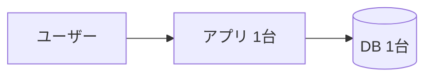
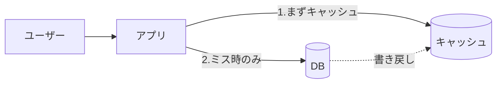
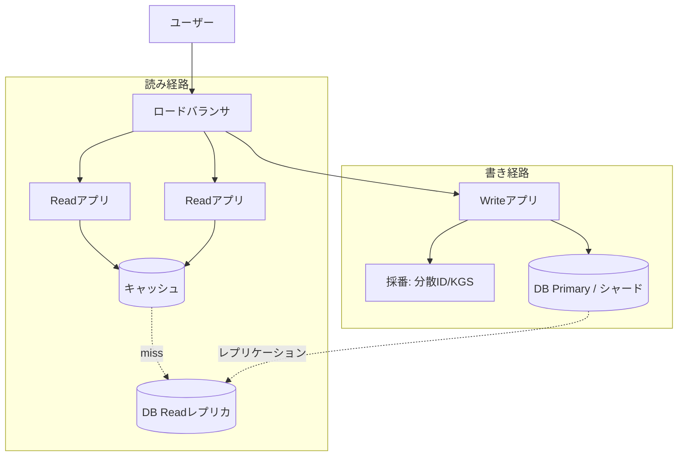
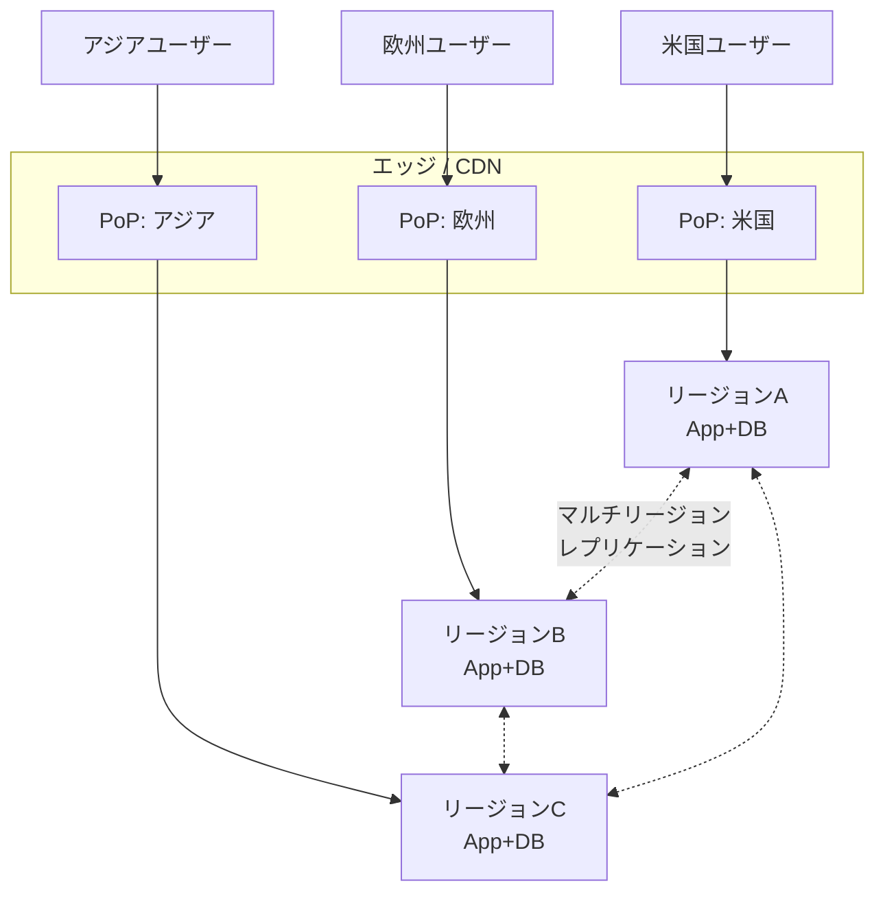
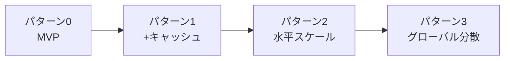

> システム設計シリーズ 第一弾「URLショートナー」
> [00 概要](00_overview.md) ／ [01 中核設計](01_core_vendor_neutral.md) ／ **02 複雑度の進化(本記事)** ／ [03 Azure構成例](03_azure_mapping.md) ／ [04 拡張トピックと参考リンク](04_extensions_and_refs.md)

[01](01_core_vendor_neutral.md)で中核の部品が揃いました。本記事は、**同じ要件でも規模が変わると“正解”が動く**ことを、4つのパターンで段階的に見ます。

:::message
大事なのは「最初から右端（グローバル分散）を作らない」ことです。**過剰設計も過小設計も失敗**です。各パターンの「向くケース」と「限界（次のパターンへ進む引き金）」を意識してください。設計は、[Hello Interview](https://www.hellointerview.com/learn/system-design/problem-breakdowns/bitly) や [systemdesign.one](https://systemdesign.one/url-shortening-system-design) でも勧められているように、**要件をひとつずつ足しながら段階的に**構築するのが定石です。
:::

## パターン0：MVP（単一アプリ + 単一DB）

まず動かす最小構成。アプリ1台、DB1台。採番は[01](01_core_vendor_neutral.md)の②連番カウンタ（DBの自動採番でよい）。

- **読み**：`GET /code` → App → DB を引いてリダイレクト
- **書き**：`POST /shorten` → App → DB に保存（採番はDB任せ）

**向くケース**：社内ツール、PoC、トラフィックが小さいサービス。**この構成で十分なケースは現実に多い。**

**限界（次へ進む引き金）**：

- 読み取りが増えると**DBが直撃**を受け、レイテンシが悪化する
- アプリもDBも**単一障害点（SPOF）**。1台落ちたら全停止
- 1台のスペックで頭打ちになる

最初の悲鳴はたいてい「読み取りでDBが苦しい」です。そこでパターン1へ。

## パターン1：読み取り最適化（+ キャッシュ層）

read-heavy（約100:1）なので、**ホットなコードをキャッシュ**するだけで効果は絶大です。[01](01_core_vendor_neutral.md)の cache-aside をそのまま導入します。

- 人気リンクの読みは**キャッシュだけで完結**し、DB負荷とレイテンシが激減
- マッピングは基本不変なので、TTLベースの素朴な運用で破綻しにくい

**向くケース**：トラフィックが伸びてきたが、まだ単一リージョンで足りるサービス。**費用対効果が最も高い一手。**

**限界**：

- アプリ自体のCPU/接続数が頭打ちになる（アプリ1台のまま）
- アプリ・DB・キャッシュそれぞれがまだ単一だと、可用性は上がりきらない

次は「台数を増やして水平に伸ばす」パターン2へ。

## パターン2：水平スケール（ステートレス化 + 読み書き分離）

アプリを**ステートレス**にして複数台に増やし、前段に**ロードバランサ（LB）**を置きます。さらに read-heavy を活かして**読み経路と書き経路を分離**し、それぞれ独立にスケールさせます（参考：[AlgoMaster](https://algomaster.io/learn/system-design-interviews/design-url-shortener) "separate the write service from the read service"）。

採番は、アプリが複数台になると単一カウンタが渋滞するため、[01](01_core_vendor_neutral.md)の**③分散ID か ④KGS**へ切り替えます。DBはレプリカ（読み用）やパーティション（シャーディング）で広げます。

- **ステートレス**なアプリは台数を足すだけで読みスループットが伸びる
- **読み書き分離**で、読みの増加が書きを巻き込まず、逆も同様
- **DBレプリカ/パーティション**で単一ノードの限界を超える
- 採番が**分散ID/KGS**になり、複数Writeアプリでも一意性を保てる

**向くケース**：一般的な中〜大規模Webサービス。多くの実運用はこのあたりで十分。

**限界**：

- すべて単一リージョンだと、**地理的に遠いユーザーのレイテンシ**は物理距離で決まる（光の速さの壁）
- リージョン全体の障害には弱い

「世界中で速く・落ちないように」が要件になったら、最後のパターン3へ。

## パターン3：グローバル分散（エッジ + マルチリージョン）

ユーザーの近くで応答するため、**エッジ/CDN**でリダイレクトを処理し、データを**複数リージョンに分散**します。

- **エッジ/CDN**：ユーザーに最も近いPoP（拠点）で応答。リダイレクト結果をエッジでキャッシュすればさらに速い
- **マルチリージョンDB**：各リージョンで読み（場合により書き）を完結。1リージョンが落ちても他が引き継ぐ → 可用性が大幅向上
- **整合性の妥協**：複数リージョンに同時書き込みすると、強整合は物理的に諦める必要がある。短縮URLは「**作った直後に世界中で即座に読めなくてもよい**」（数秒の伝播遅延は許容できる）ことが多く、**最終的整合性**と相性が良い

:::message alert
グローバル分散の本質的な難しさは「整合性 vs レイテンシ・可用性」のトレードオフです。マルチリージョン書き込みでは**強整合は選べません**（分散システムでRPO=0かつRTO=0は不可能）。この具体的な選択肢は、[03](03_azure_mapping.md)でCosmos DBの整合性レベルとして詳しく見ます。
:::

**向くケース**：世界中にユーザーがいて、低レイテンシと高可用が事業上クリティカルなサービス（Bitly級）。

**限界 / 代償**：運用が一気に複雑になり、コストも上がる。**ここまで要らないなら来るべきではない**領域です。

## 複雑度グラデーション総括

| | P0 MVP | P1 キャッシュ | P2 水平スケール | P3 グローバル |
|---|---|---|---|---|
| 想定規模 | 小 | 中 | 中〜大 | 超大 |
| 採番 | 連番 | 連番 | 分散ID/KGS | 分散ID/KGS |
| 読み最適化 | なし | キャッシュ | キャッシュ+レプリカ | エッジ+マルチリージョン |
| 可用性 | SPOFあり | SPOF残る | リージョン内冗長 | リージョン跨ぎ冗長 |
| 整合性 | 強 | 強 | 強〜結果整合 | 結果整合(妥協) |
| 運用負荷 | 低 | 低 | 中 | 高 |

**読み方**：要件（規模・グローバル性・可用性）に対して**必要十分なパターンを選ぶ**こと。下から順に「次へ進む引き金」を引かれたときだけ右へ動く、というのが健全な設計の進化です。

次の[03 Azure構成例](03_azure_mapping.md)では、この4パターンを**Azureの具体サービス**に、サーバーレス／PaaS・コンテナの2スタイルで落とし込みます。
