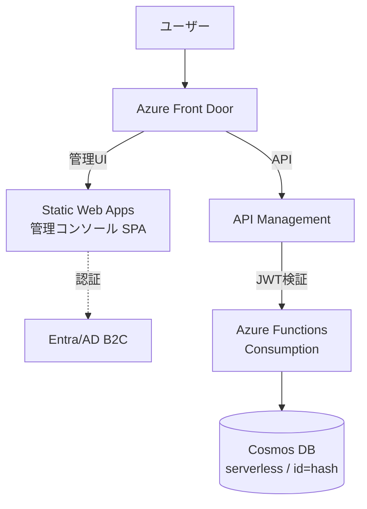
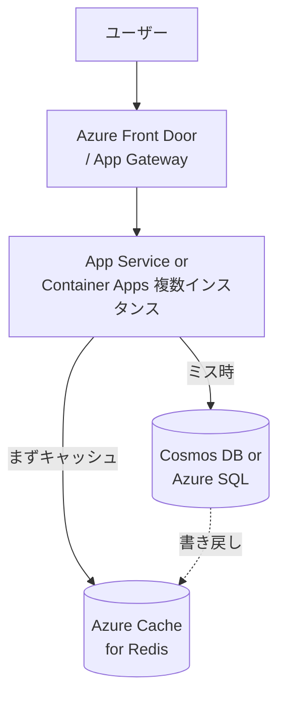
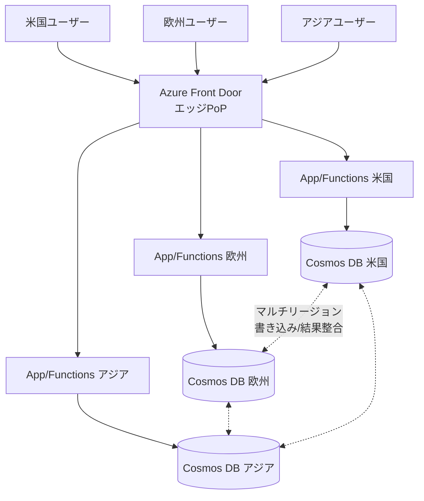

> システム設計シリーズ 第一弾「URLショートナー」
> [00 概要](00_overview.md) ／ [01 中核設計](01_core_vendor_neutral.md) ／ [02 複雑度の進化](02_complexity_evolution.md) ／ **03 Azure構成例(本記事)** ／ [04 拡張トピックと参考リンク](04_extensions_and_refs.md)

[02](02_complexity_evolution.md)までで、ベンダー非依存の構成パターンが揃いました。本記事は、それを**Azureの具体サービス**に落とします。同じ要件でも**「サーバーレス中心」と「PaaS/コンテナ中心」**で異なる落とし方があるので、両方を見ます。

## 一般概念 → Azure 対応表

[01](01_core_vendor_neutral.md)〜[02](02_complexity_evolution.md)で出た部品を、Azureサービスに対応づけます。

| 一般概念 | Azureサービス（候補） |
|---|---|
| アプリ（リダイレクト/API） | Azure Functions（サーバーレス）／ App Service ／ Container Apps（PaaS・コンテナ） |
| KVストレージ | Azure Cosmos DB ／ Azure Table Storage |
| キャッシュ | Azure Cache for Redis |
| ロードバランサ / API入口 | Azure Front Door ／ Application Gateway ／ API Management |
| エッジ / CDN | Azure Front Door |
| 静的UI（管理画面） | Azure Static Web Apps |
| 認証 | Microsoft Entra（Azure AD B2C 等） |
| 解析パイプライン | Azure Event Hubs（→ Functions / Stream Analytics） |

ここから2つの構成スタイルを具体化します。どちらも[02](02_complexity_evolution.md)のパターン1〜2相当を出発点にし、最後にパターン3（グローバル化）の勘所を足します。

## 構成A：サーバーレス中心

「使った分だけ課金・運用最小」を優先するスタイル。Microsoft公式が示すサーバーレスURLショートナー構成（[techcommunity「Serverless URL Shortener」](https://techcommunity.microsoft.com/blog/appsonazureblog/serverless-url-shortener/3754120)、および公式OSS [AzUrlShortener](https://learn.microsoft.com/en-us/shows/azure-friday/azurlshortener-an-open-source-budget-friendly-url-shortener)）に概ね沿います。

構成のポイント（公式記事準拠）：

- **アプリ＝Azure Functions（Consumptionプラン）**：短縮URLの生成・解決をイベント駆動で処理。トラフィックに応じて自動スケールし、アイドル時はほぼ課金されない
- **ストレージ＝Cosmos DB（serverless、ゾーン冗長）**：コンテナのパーティションキーを `/id` にし、**生成したハッシュをそのまま `id`** として格納する。`id` は高カーディナリティなので、Cosmos DBのパーティションキー設計のベストプラクティス（値が分散し、ホットパーティションを作らない）に合致する
- **API入口＝API Management（Consumptionティア）**：4つ程度のAPI（短縮作成・解決・一覧・削除）を集約。**Entra/AD B2C が発行したJWTの検証**もAPIM側で行える
- **管理UI＝Static Web Apps**：URL一覧などの管理コンソールをSPAとしてホスト
- **入口/配信＝Azure Front Door**：SPAとAPIをエッジから配信

### Functions と Cosmos のバインディングの妙

サーバーレス構成の気持ちよさは、[Eran Stiller の実装](https://eranstiller.com/build-a-custom-url-shortener-using-azure-functions-and-cosmos-db) に端的に表れています。Functions の **Cosmos DB 入出力バインディング**を使うと、登録時に `vanity`（任意コード）を `id` とするドキュメントを出力バインディングで書き、リダイレクト時はパスの `vanity` で同じドキュメントを入力バインディングが自動取得します。**アプリ側にDBアクセスのボイラープレートをほとんど書かずに** `code → long_url` が完結します。

Eran は選定理由として、Cosmos DBが**読み書きとも99パーセンタイルで10ミリ秒未満のレイテンシ**を保証する点を挙げています（参考：[Cosmos DB グローバル配布の公式Docs](https://learn.microsoft.com/en-us/azure/cosmos-db/distribute-data-globally)）。低レイテンシ要件が主役のURLショートナーと素直に噛み合います。

### 向くケース / 注意点

- **向く**：トラフィックの波が大きい、運用人員を割きたくない、コストを使用量に連動させたい
- **注意**：Consumptionプランは**コールドスタート**でリダイレクトの初回が遅くなりうる。常時低レイテンシが厳しい要件なら、Premiumプラン（常時ウォーム）や後述の構成Bを検討する

## 構成B：PaaS / コンテナ中心

「常時稼働のアプリを自分で持ち、既存の業務システムと地続きにしたい」スタイル。[02](02_complexity_evolution.md)のパターン2（水平スケール）に素直に対応します。

構成のポイント：

- **アプリ＝App Service または Container Apps**：複数インスタンスでステートレスに水平スケール。コンテナで動かしたい・既存のコンテナ資産があるなら Container Apps
- **キャッシュ＝Azure Cache for Redis**：[01](01_core_vendor_neutral.md)のcache-asideをそのまま実装。read-heavyの読み経路を高速化。Redisは**分散キャッシュ／セッションストア／メッセージブローカー**として使え、Cosmos DBやAzure SQLと併用する構成が公式にも示されている（参考：[Azure Cache for Redis 概要](https://learn.microsoft.com/en-us/azure/azure-cache-for-redis/cache-overview)）
- **ストレージ＝Cosmos DB か Azure SQL**：KV的に割り切るならCosmos DB、強整合トランザクションや既存のSQL資産を活かすならAzure SQL
- **入口＝Front Door または Application Gateway**：グローバル配信・WAFが要るならFront Door、単一リージョン内のL7ロードバランス中心ならApplication Gateway

:::message
**Redisのティア選択**にも要件が効きます。Azure Cache for Redis は Basic/Standard/Premium/Enterprise の各ティアがあり、ゾーン冗長やgeoレプリケーション、データ永続化などの可用性機能はティアで差があります（[公式の機能比較](https://learn.microsoft.com/en-us/azure/azure-cache-for-redis/cache-overview)を参照）。本番でSPOFを避けたいなら冗長機能のあるティアを選びます。
:::

### 向くケース / 注意点

- **向く**：常時一定のトラフィック、既存の業務システム（App Service/コンテナ）と運用を揃えたい、コールドスタートを避けたい
- **注意**：自動スケールの設定（インスタンス数・スケールルール）を自分で設計する必要がある。アイドル時もインスタンスが動くため、低トラフィックではサーバーレスよりコストが高くなりがち

## 構成A vs B どちらを選ぶか

| 観点 | 構成A サーバーレス | 構成B PaaS/コンテナ |
|---|---|---|
| 課金 | 使用量連動（アイドルほぼ無料） | インスタンス稼働ベース |
| 運用 | 最小（マネージド） | スケール設定など要設計 |
| レイテンシ安定 | コールドスタート懸念 | 常時ウォーム |
| 既存資産との親和 | 新規・独立向き | 既存業務システムと地続き |
| 代表構成 | Functions+Cosmos+APIM+SWA | App Service/Container Apps+Redis+DB |

トラフィックが読めない新規サービスなら**A**、安定稼働の業務システムに組み込むなら**B**、が素直な出発点です。

## グローバル化の勘所（パターン3のAzure版）

[02](02_complexity_evolution.md)のパターン3をAzureで実現する核は、**Front Door（エッジ）**と**Cosmos DB（マルチリージョン）**です。

### エッジ：Azure Front Door

Azure Front Door は「クラウド向けの高度なCDN」で、Microsoftのグローバルエッジネットワーク（世界中のPoP）からコンテンツを配信します（参考：[Front Door 概要](https://learn.microsoft.com/en-us/azure/frontdoor/front-door-overview)）。ユーザーに近いPoPで応答することで、地理的レイテンシを縮められます。さらに**ネットワーク層DDoS保護やWAF**を前段で効かせられる付帯価値もあり、公開エンドポイントの保護に向きます。

### データ：Cosmos DB のマルチリージョンと整合性

ここがグローバル設計の本丸です。Cosmos DB は[02](02_complexity_evolution.md)で触れた「整合性 vs レイテンシ・可用性」のトレードオフを、**選べる整合性レベル**として提供します（参考：[グローバル配布](https://learn.microsoft.com/en-us/azure/cosmos-db/distribute-data-globally)／[整合性レベル](https://learn.microsoft.com/en-us/azure/cosmos-db/consistency-levels)）。

公式が明記している要点：

- **マルチリージョン書き込み（active-active）**：すべてのリージョンで読み書きでき、**99.999%の読み書き可用性**と**p99で10ms未満**の読み書きを謳う。リージョンの追加・削除でアプリの再デプロイは不要
- **整合性は5レベル**：Strong / Bounded Staleness / Session / Consistent Prefix / Eventual。整合性を強くするほど性能・可用性とトレードオフになる
- **Session が最も広く使われる**：単一リージョンでもグローバルでも、ユーザー文脈で動くアプリに適し、結果整合並みの低レイテンシ・高スループットを保ちつつ「自分の書き込みは自分で読める」保証を与える
- **強整合 × マルチリージョン書き込みは選べない**：分散システムでRPO=0かつRTO=0は両立しないため。また強整合にしても書き込みは全リージョンへのコミットを待つので**書き込みレイテンシは改善しない**
- **Bounded Staleness はマルチ書き込みではアンチパターン**：同一リージョンで読み書きするなら不要なレプリケーション遅延依存を持ち込むことになる

URLショートナーへの当てはめ：

- 短縮URLのマッピングは**作成直後に世界中で即読めなくても許容できる**ことが多い → **Session か Eventual** が現実的な落としどころ
- 「自分が今作った短縮URLは、その管理画面で確実に見えてほしい」程度の要求なら **Session** が素直
- マルチリージョン書き込みを使うなら、各アプリは**自分と同じリージョンに読み書き**するのが基本（公式が推奨する使い方）

:::message alert
グローバル化は「速くなる」だけでなく、**整合性の意味・運用・コストが一段重くなります**。[02](02_complexity_evolution.md)で述べた通り、ここまでの要件が本当にあるかを見極めてから進むこと。多くのサービスは構成A/Bの単一〜数リージョンで十分です。
:::

## まとめ

- 一般解の各箱はAzureサービスに素直に対応する
- **構成A（サーバーレス）**：Functions+Cosmos+APIM+SWA。コスト連動・低運用。公式OSS AzUrlShortener が好例
- **構成B（PaaS/コンテナ）**：App Service/Container Apps+Redis+DB。常時稼働・既存資産と地続き
- **グローバル化**：Front Door（エッジ）＋ Cosmos DB（マルチリージョン書き込み＋整合性レベルの選択）。URLショートナーは Session/Eventual と相性が良い

次の[04 拡張トピックと参考リンク](04_extensions_and_refs.md)で、解析・レート制限・有効期限・カスタムエイリアスといった「要件が増えたときの分岐」と、深掘り用リンク集を扱います。
