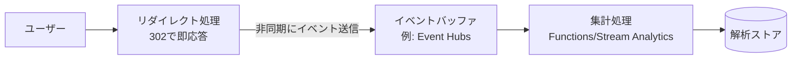
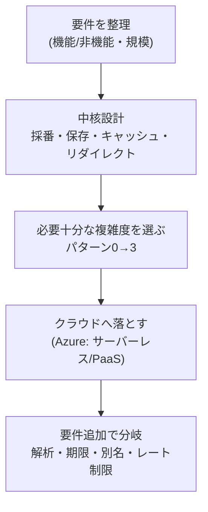

> システム設計シリーズ 第一弾「URLショートナー」
> [00 概要](00_overview.md) ／ [01 中核設計](01_core_vendor_neutral.md) ／ [02 複雑度の進化](02_complexity_evolution.md) ／ [03 Azure構成例](03_azure_mapping.md) ／ **04 拡張トピックと参考リンク(本記事)**

[03](03_azure_mapping.md)まででコア設計とAzureマッピングが揃いました。本記事は、[00](00_overview.md)で「任意」とした機能要件を足したときに**設計がどう分岐するか**の勘所と、深掘り用の良質なリンク集です。

:::message
ここで挙げる各トピックは、それ単独で1記事書ける深さがあります。本記事は「**要件が一段増えると、どこに新しい難所が生まれるか**」の地図を示すに留め、厳密な実装や数値の断定は外部の良質な資料に委ねます。
:::

## 1. 解析（クリック計測）

「どのリンクが何回・どこから踏まれたか」を取りたい、という要件です。ここで[01](01_core_vendor_neutral.md)のリダイレクト意味論が効いてきます。

- **301（恒久）はキャッシュされてサーバに来ない** → 計測できない
- **302（一時）なら毎クリックがサーバを通る** → 計測点を確保できる

したがって解析が要件なら**302前提**になります。問題は、計測をリダイレクトの**ホットパスに同期で挟むと遅くなる**こと。原則は「**計測を critical path から外す**」です（参考：[AlgoMaster](https://algomaster.io/learn/system-design-interviews/design-url-shortener) "Decouple from the critical path using buffered counting"）。

- リダイレクトは**即座に302を返す**（ユーザーを待たせない）
- クリックイベントは**非同期にキュー/イベントストリームへ流す**（Azureなら Event Hubs が定番の入口）
- 後段で**バッファリングして集計**（Functions や Stream Analytics）し、解析ストアに書く

ポイントは「読みの速さ（リダイレクト）」と「計測の確実さ」を**経路を分けて両立**させることです。

## 2. レート制限 / 不正URL対策

短縮**作成API**は濫用されやすい入口です。

- **レート制限**：1ユーザー/IPあたりの作成回数を制限し、スパム的な大量生成を防ぐ。[03](03_azure_mapping.md)の構成では、入口の **API Management のポリシー**で制御するのが素直（公式に rate-limit 系ポリシーが用意されている。詳細は[APIMポリシーの公式Docs](https://learn.microsoft.com/en-us/azure/api-management/api-management-policies)を参照）
- **不正URL対策**：フィッシングやマルウェア配布に短縮URLが悪用される問題。作成時にURLをブロックリスト/評価サービスと照合する、といった対策が要件に応じて入る

:::message
レート制限そのものも定番の設計お題です（トークンバケット等のアルゴリズム選択）。本シリーズの次回以降で単独テーマとして扱う候補です。ここでは「**作成APIには入口で制限をかける**」という方針だけ押さえれば十分です。
:::

## 3. 有効期限（Expiration）

「一定期間後にリンクを失効させたい」という要件です。実装は**2つを組み合わせる**のが定石です（参考：[AlgoMaster](https://algomaster.io/learn/system-design-interviews/design-url-shortener) "Hybrid approach: passive check + active cleanup"）。

- **パッシブ（読取時チェック）**：リダイレクト時に有効期限を見て、切れていれば404/410を返す。期限切れデータが残っていても**ユーザーには見えない**
- **アクティブ（バッチ/自動削除）**：期限切れレコードを定期的に物理削除し、ストレージを回収する

Azureでは、**Cosmos DBの TTL（Time to Live）**を使うと、アイテム単位の有効期限でレコードを自動失効・削除でき、アクティブ側のバッチを自前で書かずに済むケースがあります（参考：[Cosmos DB TTL 公式Docs](https://learn.microsoft.com/en-us/azure/cosmos-db/time-to-live)）。要件次第でパッシブチェックと組み合わせます。

## 4. カスタムエイリアス（vanity URL）

`sho.rt/mybrand` のような任意文字列を指定できるようにする要件です。採番が「システムが決める」から「ユーザーが決める」に変わるため、新しい難所が生まれます。

- **一意制約**：指定された文字列が既に使われていないかを確認し、衝突なら拒否する（採番②③④が自動で保証していた一意性を、明示的にチェックする必要が出る）
- **予約語**：`admin`、`api`、`login` など、システムが使う/使いたいパスを予約してユーザーに取らせない
- **混在**：自動採番コードとカスタムエイリアスが**同じ名前空間**を共有するなら、両者の衝突も考慮する

[03](03_azure_mapping.md)の構成A（Cosmos DBの `id` にコードを格納）では、カスタムエイリアスをそのまま `id` にすれば、`id` の一意性制約がそのまま「別名の重複防止」として働きます。素直な設計です。

## まとめ：要件 → 複雑度 → 構成の地図

本シリーズの「型」を最後にもう一度まとめます。

- **URLショートナーの本質的な難所**は「採番」「read-heavyな読み経路」「リダイレクトの意味論」
- **正解は規模で動く**。MVPでは連番＋単一DBで十分。大きくなると分散ID/KGS・キャッシュ・レプリカ、そしてグローバル分散へ
- **Azure**では、サーバーレス（Functions+Cosmos+APIM+SWA）とPaaS/コンテナ（App Service/Container Apps+Redis+DB）の2スタイルが出発点。グローバル化はFront Door＋Cosmos DBのマルチリージョン＋整合性レベルの選択
- **任意要件**を足すたびに、計測経路・一意性・期限管理という新しい難所が現れる

この「要件から複雑度を逆算し、クラウドに落とす」型は、次のお題でもそのまま使えます。

## 厳選参考リンク

### 一般設計（ベンダー非依存）

- [Hello Interview「Design a URL Shortener Like Bitly」](https://www.hellointerview.com/learn/system-design/problem-breakdowns/bitly) — 採番（ハッシュ vs カウンタ）、301/302、CDN/エッジ、スケールまで段階的に解説。設計面接の定番教材
- [AlgoMaster「Design URL Shortener」](https://algomaster.io/learn/system-design-interviews/design-url-shortener) — ID生成の比較表、cache-aside、有効期限のハイブリッド、解析のデカップリングが簡潔にまとまる
- [systemdesign.one「URL Shortening System Design」](https://systemdesign.one/url-shortening-system-design) — 容量見積りや採番の数式まで踏み込みたいとき

### Azure 構成・実装

- [Microsoft Learn「AzUrlShortener」（公式OSS）](https://learn.microsoft.com/en-us/shows/azure-friday/azurlshortener-an-open-source-budget-friendly-url-shortener) — 低コストなサーバーレスURLショートナーのオープンソース実装。構成Aの生きた例
- [techcommunity「Serverless URL Shortener」](https://techcommunity.microsoft.com/blog/appsonazureblog/serverless-url-shortener/3754120) — Functions+Cosmos+APIM+SWA+AD B2C のサーバーレス構成を解説（Microsoft公式ブログ）
- [Eran Stiller「Build a Custom URL Shortener Using Azure Functions and Cosmos DB」](https://eranstiller.com/build-a-custom-url-shortener-using-azure-functions-and-cosmos-db) — Cosmos入出力バインディングでコードをほぼ書かずに実装する好例

### Azure 公式ドキュメント（深掘り用）

- [Cosmos DB: グローバル配布](https://learn.microsoft.com/en-us/azure/cosmos-db/distribute-data-globally) / [整合性レベル](https://learn.microsoft.com/en-us/azure/cosmos-db/consistency-levels) — マルチリージョン書き込みと整合性のトレードオフ
- [Cosmos DB: TTL（Time to Live）](https://learn.microsoft.com/en-us/azure/cosmos-db/time-to-live) — 有効期限の自動失効
- [Azure Front Door 概要](https://learn.microsoft.com/en-us/azure/frontdoor/front-door-overview) — エッジ配信・WAF・DDoS保護
- [Azure Cache for Redis 概要](https://learn.microsoft.com/en-us/azure/azure-cache-for-redis/cache-overview) — キャッシュのティアと可用性機能
- [API Management ポリシー](https://learn.microsoft.com/en-us/azure/api-management/api-management-policies) — レート制限・JWT検証などの入口制御

---

以上で第一弾「URLショートナー」は完結です。同じ型で次のお題（レートリミッタ、通知システムなど）も扱う予定です。最初の[00 概要](00_overview.md)に戻って、要件→複雑度→構成の流れをもう一度俯瞰すると、型が定着します。
